# Comparing IIT 4.0 Φ-structures across chemosensory stimuli in *C. elegans*

**Motivation.** *C. elegans* approaches some chemicals (attractants) and
avoids others (repellents). If we compute the IIT 4.0 **Φ-structure** of a core
neural circuit during each response: are the attractant Φ-structures more
similar to each other than the repellent ones?

**One obstacle.** A Φ-structure is not a graph. It is a **weighted hypergraph**:
its "edges" (relations) can bind three, four, or more distinctions at once.
Standard graph-similarity measures may not see that higher-order content, so
*measuring the distance between two Φ-structures* is a core methodological
problem.

**One solution.** An exact, brute-force distance: try every way of matching the
distinctions of one structure onto the other, score each matching, keep the
smallest. Defined in full under [The distance algorithm](#the-distance-algorithm),
implemented in [`src/gold_standard.py`](src/gold_standard.py). **Note that the
headline 4-neuron analysis does *not* use this approach** — 15 distinctions
means 15! ≈ 1.3 × 10¹² bijections to test. We thus use identity correspondence, which is
an upper bound. However, three of the six pipelines are small enough to brute-force; 
see [Exact vs. identity](#exact-vs-identity-what-the-minimisation-buys).

**Where things stand so far**. We are aiming at first establishing a positive control:
Chemical present vs chemical absent.

---

## SUMMARY (so far)

**Rationale.** IIT 4.0 predicts that phenomenologically similar experiences 
have similar Φ-structures. However, computing Φ-structures from neural data
is problematic since 
(1) the full set of causal neural connections that IIT requires
are beyond measurement (**limited sample/measurement problem**), and 
(2) the IIT computations required exceed current capabilities.
We thus aim to test this approach in a (very) small nervous system
where (1) connectivity is known and (2) IIT calculations are doable.

**Debable Issues.**
*(1) IIT 4.0 requires a complete interventional causal model over system states.
But here transition probability matrices (TPMs) are inferred from passive observations.*
We _do_ have [a complete interventional causal model of _C elegans_](https://pmc.ncbi.nlm.nih.gov/articles/PMC10632145/).
However, this model is based on pairwise data, and thus of limited use.
We thus follow a different approach in that we rely on the fact that,
given sufficiently large sampling, a passively observed TPM of a system will
converge toward the underlying "ground truth" TPM up to a certain
(floating point) precision. We validate sufficient sampling by randomly
dropping samples from our data, recomputing the TPM, and then comparing our 
original TPM with the TPM derived for a smaller sample size. This process then
gets repeated, dropping more and more samples in the process. As a result,
we can quantify convergence towards a "stable" TPM (given a fixed numerical precision).
Encouragingly, **the TPM we identified largely reproduces known effective connectivity.**
in our first pass so far largely reproduce the prediction from effective connectivity.
Note that while this approach suffers the general problem of limited (finite) samples
that all real-world data are characterized by, the same would be true for the
proper derivation of an interventional TPM (i.e., how many repeated interventions
do suffice?).

*(2) The candidate neuron sets are assumed rather than identified as IIT core complexes.*
While _C elegans_ has few neurons, these neurons are still too many to execute all
computations required by IIT. However, there are several proposals in the literature
that aim to **approximate** some of these computations instead, including how to
identify the core. The 4-neuron set that serves as a starting point here were derived 
in this fashion. Obviously, our analysis can be re-run in the future for all possible
alternative core candidates, or the entire _C elegans_ brain once feasible.
The important justification is that picking the _wrong_ core also likely will _fail_
to produce the predicted effect.

*(3) The other measured and unmeasured neurons are not causally marginalized as background.*
Doing so likely will remain challenging for most real-world neural observations.
However, since _C elegans_ connectivity (synaptic, extra-synaptic, functional, effective) is 
known. One could thus identify all inputs to the neurons under study and test whether their
activity states resembles a random probability distribution for each of the system states
under study. We have not done so, but it is encouraging that the TPM values we identified 
in our first pass so far largely reproduce the prediction from effective connectivity.

**The guide star.** One principle governs every analysis in this repository,
because the pipeline is estimation stacked on estimation (binarization, TPM,
state selection, unfolding, distance):

> **Estimation mistakes and noise are far more likely to *dilute* lawful
> relationships than to *manufacture* them.**

For a label-symmetric design, noise pushes contrasts toward zero; it does not
create them. Two working consequences: a **positive** finding under a noisy
estimate is conservative and stands on its own; a **null** is interpretable
only after it clears the split-half noise floor — otherwise it is information
about the estimate, not the worm. The one standing exception is kept in view:
selection effects (choosing a state, a window, or a threshold *because* it
scored well) can manufacture structure from noise, which is why every
selection step here is either paired within epochs, permutation-tested, or
fixed before the contrast is scored.

**Where it stands.** Three layers, in order of what is now established:

| layer | status |
|---|---|
| **Method** | An exact, brute-force Φ-structure distance with verified metric properties ([`src/gold_standard.py`](src/gold_standard.py)); handles relations of every degree natively; exact up to ~12 distinctions, upper-bounded by the identity mapping beyond that |
| **Stimulus detection** | The transition structure detects chemical-present-vs-absent emphatically once the preprocessing is right (TPM permutation *z* = +6.9 core / +35 sensory at the 20 s high-pass window). **Φ(t)** — every sample's state mapped to its Φ under one giant, well-conditioned TPM — detects the stimulus **offset** (sensory Φ drops below the pre-stimulus baseline after delivery ends: −0.32, *p* = 10⁻⁵, 6 of 8 animals, all classes) |
| **Chemical identity** | Not yet reached through any Φ-level quantity. The class signal exists in the raw traces (AWAL *d* = 0.72, *p* < 10⁻⁵) and survives binarization; it dies where the 16-state repertoire is collapsed — into one unfolding state, or into the scalar Φ. The condition-assigned structure comparison (1000 vs 0111, notebook 15) fails its noise floor at current data volume: the *states* are settled, the *structures* at them are not yet stable enough to compare |

**The two headline mechanisms, in one sentence each.** Φ under this TPM is
concentrated on the quiescent state 0000 (66.1 vs 0.4–2.0 for most active
states), so Φ(t) is effectively a rest-state-occupancy readout — sensory
activity *lowers* Φ, and the offset dip is that mechanism working (dip vs
Δ-occupancy of 0000: ρ = +0.99). And the TPM itself is the most robust object
in the pipeline — certified stable to ~2 decimals, drop-*k* error ∝ √k — while
the unfolding consumes ~4 decimals: a 1% TPM change moves the structure by
over half the full condition contrast (1.74 vs 3.17, ~150× amplification),
because relation
*membership* flips discontinuously while every φ value drifts smoothly. The
adopted position ([the precision convention](#the-precision-convention-certify-the-tpm-treat-it-as-ground-truth))
is that the TPM is ground truth at its certified precision, which licenses the
occupancy- and distinction-level analyses and withholds only
relation-membership-sensitive distances.

**The track record** — what was tried before this picture emerged, and what
each step taught — is preserved in full in
[The road here](#the-road-here--what-we-tried-and-what-it-taught-us).

## Quick start

Every notebook runs top-to-bottom in Google Colab with no setup. Click a badge,
then `Runtime > Run all`.

| Notebook | What it establishes | Colab |
|---|---|---|
| **01 — Data and TPM** | Loads the imaging data, binarizes it, builds transition matrices, measures the per-stimulus data budget | [](https://colab.research.google.com/github/maierav/iit4-celegans-phi-structure/blob/main/notebooks/01_data_and_tpm.ipynb) |
| **02 — Φ-structure** | Unfolds a Φ-structure in PyPhi and extracts it as a weighted hypergraph | [](https://colab.research.google.com/github/maierav/iit4-celegans-phi-structure/blob/main/notebooks/02_phi_structure.ipynb) |
| **03 — Similarity** | Scores the exact distance against cases with known answers; measures how it scales | [](https://colab.research.google.com/github/maierav/iit4-celegans-phi-structure/blob/main/notebooks/03_similarity.ipynb) |
| **04 — Toy examples** | Nine real Φ-structures from 3-unit networks, relations up to degree 4 | [](https://colab.research.google.com/github/maierav/iit4-celegans-phi-structure/blob/main/notebooks/04_toy_examples.ipynb) |
| **05 — PyPhi 2.0 example** | One comparison end to end: two structures from update rules, all 24 mappings drawn, cost broken down term by term | [](https://colab.research.google.com/github/maierav/iit4-celegans-phi-structure/blob/main/notebooks/05_pyphi2_example.ipynb) |
| **06 — The *C. elegans* comparison** | **The headline analysis.** Pooled per-stimulus TPMs, ten Φ-structures, permutation test | [](https://colab.research.google.com/github/maierav/iit4-celegans-phi-structure/blob/main/notebooks/06_celegans_pooled.ipynb) |
| **07 — Binarization and τ** | Verifies binarization against the reference notebook bit-for-bit; tests whether τ can be chosen by argmax φ_s | [](https://colab.research.google.com/github/maierav/iit4-celegans-phi-structure/blob/main/notebooks/07_binarization_and_tau.ipynb) |
| **08 — TPMs and the global route** | Compares the TPMs directly (no Φ); audits how much of each TPM the prior invents; runs 2- and 3-neuron substrates; builds the one-global-TPM alternative with enrichment-selected states | [](https://colab.research.google.com/github/maierav/iit4-celegans-phi-structure/blob/main/notebooks/08_tpm_distance_and_global.ipynb) |
| **09 — Response time courses** | PSTH-style ΔF/F₀ for all eight neurons, by stimulus and by class, one animal and all animals; the 60 s cycle-triggered average; the early/late window split | [](https://colab.research.google.com/github/maierav/iit4-celegans-phi-structure/blob/main/notebooks/09_raw_trace_responses.ipynb) |
| **10 — Positive control** | Noise floors for the global pipelines, the stimulus-vs-baseline positive control, the 3-neuron global TPM, and the flattening-method comparison that recovers the effect | [](https://colab.research.google.com/github/maierav/iit4-celegans-phi-structure/blob/main/notebooks/10_positive_control.ipynb) |
| **11 — Time courses and binarization** | Reproduces figures 26–29: each flattening method on single traces and on the 60 s cycle average, the response-latency measurement, the early/late window split, and the binarized PSTH | [](https://colab.research.google.com/github/maierav/iit4-celegans-phi-structure/blob/main/notebooks/11_timecourses_and_binarization.ipynb) |
| **12 — Φ as a time series** | One giant TPM from the entire dataset (~40k transitions, every row ≥1,648 obs), Φ for each of the 16 states, and Φ(t) by mapping each sample's state to its Φ — single-trial, grand-average, and by-class | [](https://colab.research.google.com/github/maierav/iit4-celegans-phi-structure/blob/main/notebooks/12_phi_timeseries.ipynb) |
| **13 — Robustness checks** | Median vs mean Φ(t), the explicit stimulus-vs-no-stimulus contrast across all 10 stimuli, raw-fluorescence mean/median, and TPM drop-k stability plus the fragility of the φ-per-state map | [](https://colab.research.google.com/github/maierav/iit4-celegans-phi-structure/blob/main/notebooks/13_robustness.ipynb) |
| **14 — State identification** | Which state is "stimulus" and which "no stimulus": paired occupancy distributions, rank–frequency by condition, enrichment ladder with Holm correction; names 1000 (AWCL alone) as baseline and 0111 (its complement) as stimulus | [](https://colab.research.google.com/github/maierav/iit4-celegans-phi-structure/blob/main/notebooks/14_state_identification.ipynb) |
| **16 — Connectivity vs literature** | Diagonal-matched comparison against the anatomical connectome (Cook 2019) and the effective/signal-propagation atlas (Randi 2023): ours agrees with the atlas on which pairs communicate (3 of 4, both naming ASEL↔AWAL strongest); anatomy is the outlier | [](https://colab.research.google.com/github/maierav/iit4-celegans-phi-structure/blob/main/notebooks/16_connectivity_vs_literature.ipynb) |
| **15 — Structure comparison** | The first condition-assigned structure comparison (1000 vs 0111) with the split-half noise floor defined and explained; fails at ratio 0.91 because half-data structures are unstable | [](https://colab.research.google.com/github/maierav/iit4-celegans-phi-structure/blob/main/notebooks/15_structure_comparison.ipynb) |

Locally:

```bash
git clone https://github.com/maierav/iit4-celegans-phi-structure.git
cd iit4-celegans-phi-structure
pip install -r requirements.txt
python notebooks/06_celegans_pooled.py
```

---

## Background in five definitions

A system in a state has a **cause-effect structure**. Unfolding it in IIT 4.0
gives:

1. **Distinction** — a subset of units (a *mechanism*) that specifies a cause
   and an effect over some *purview*, irreducibly. Its strength is **φ_d**.
2. **Relation** — a set of distinctions whose purviews overlap congruently.
   Its strength is **φ_r**. A relation over *k* distinctions has **degree
   *k***; *k* = 1 is a **self-relation**.
3. **Φ-structure** — the distinctions plus their relations, with all φ values.
4. **Φ** — the total: Σφ_d + Σφ_r.
5. **Distance** — how far apart two Φ-structures are. That is what this repo
   is about.

### One relation per set of distinctions

A subtlety that determines how a structure is keyed. In PyPhi a `Relation` is a
frozenset of distinctions carrying **one** φ_r. It also exposes `faces` — an
internal enumeration over cause/effect sides — but **every face inherits its
parent relation's φ_r**, so faces carry no independent information. Verified
empirically over 2,996 relations from random networks: within every relation,
all faces have identical φ.

So a Φ-structure is exactly:

```
φ_d : {distinction         -> value}
φ_r : {set of distinctions -> value}
```

with no choice of representation to make, and no flattening.

---

## The data: response time courses

Everything downstream — binarization, the TPM, the Φ-structures — is a
transformation of these traces. So they come first.

Eight neurons are analysed throughout: the **core quartet** AIBL, AVEL, AVAL,
RIML (the tentative main complex identified in the reference work) and the
**chemosensory quartet** ASEL, ASER, AWAL, AWCL. All eight are present in all
eight recordings at confidence 1.0, with ~1% missing frames.

### Class-averaged responses

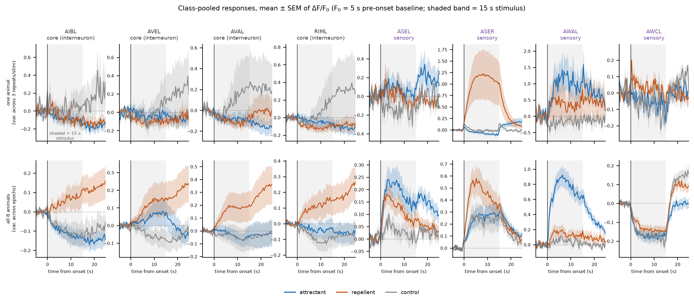

Mean ± SEM of ΔF/F₀, where F₀ is the mean of the 5 s before each onset. Top row:
one animal, variance across the 3 repeats of each stimulus. Bottom row: all 8
animals, variance across all 24 epochs of each stimulus.
[Vector PDF](figures/fig20_psth_classes.pdf) · per-stimulus versions:
[one animal](figures/fig21_psth_stimuli_one.pdf),
[all animals](figures/fig21_psth_stimuli_all.pdf)

Testing one value per epoch — mean ΔF/F₀ over the 15 s presentation —
attractant against repellent, Holm-corrected across the eight neurons:

| neuron | attractant | repellent | control | Cohen's *d* | *p* (Holm) |
|---|---|---|---|---|---|
| **AWAL** (sensory) | **0.703** | 0.128 | 0.037 | **+0.72** | **< 10⁻⁵** |
| **AIBL** (core) | −0.100 | 0.052 | −0.088 | **−0.41** | **0.0003** |
| AVAL (core) | −0.028 | 0.150 | −0.041 | −0.27 | 0.15 |
| ASER (sensory) | 0.235 | 0.425 | 0.221 | −0.24 | 0.56 |
| RIML (core) | −0.030 | 0.099 | −0.081 | −0.24 | 0.29 |
| AWCL (sensory) | −0.159 | −0.124 | −0.160 | −0.18 | 0.24 |
| ASEL (sensory) | 0.179 | 0.115 | 0.029 | +0.17 | 1.00 |
| AVEL (core) | 0.043 | 0.098 | −0.046 | −0.09 | 1.00 |

**The class distinction is present in the fluorescence.** AWAL responds to
attractant odours ~5× more strongly than to repellents, matching AWA's known
role; AIBL runs the other way. Three further observations. **One animal is not
enough** — with 12 epochs per class nothing survives correction, and several
single-animal effect signs disagree with the pooled ones. **Control responses
are not zero** (AWCL ≈ −0.23), so "control" means *vehicle*, not *nothing*. And
**the sensory quartet carries much larger responses** than the core quartet:
peak |ΔF/F₀| of 0.92 (AWAL) and 0.58 (ASER) against 0.14–0.20.

### Two response windows, not one

The stimulus design is periodic at **exactly 60.0 s** (sd 0.11 s across 232
inter-onset intervals), so the whole cycle can be averaged: the 15 s
presentation *and* the 45 s that follows it.

Cross-correlating each neuron against a stimulus-present indicator gives very
different latencies for the two groups:

| group | peak latency |
|---|---|
| sensory (ASEL, ASER, AWAL) | **1.1 – 2.6 s** |
| core (AVAL, AVEL, AIBL, RIML) | **43.9 – 46.9 s** |

AWCL is the one exception, peaking at 19.5 s. The core latencies are ambiguous
modulo the 60 s period — +46 s is also −14 s — but either reading puts them
outside the presentation window. Averaging the full cycle resolves it:

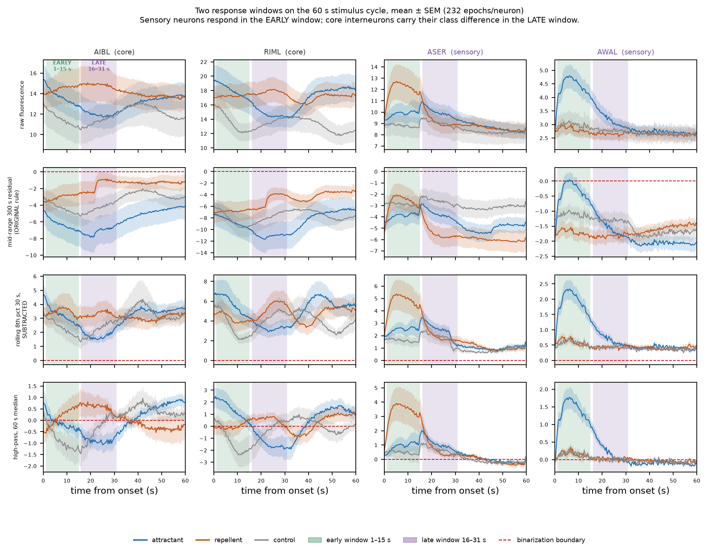

Rows are the four representations (raw plus the three flattenings below); columns
are neurons; shading marks the two windows. [Vector PDF](figures/fig28_two_windows.pdf) · single-trial version:
[fig26](figures/fig26_flattening_timecourses.pdf) · all five methods on the
cycle: [fig27](figures/fig27_cycle_by_method.pdf)

Sensory neurons rise within seconds of onset and decay at offset — the **early
window (1–15 s)** captures them. The core interneurons show no onset-locked
transient but do separate by class later in the cycle, in a **late window
(16–31 s)**. Splitting the contrast by window makes this quantitative:

| | early 1–15 s | late 16–31 s |
|---|---|---|
| core quartet, mean \|*d*\| | 0.22 | **0.39** |
| sensory quartet, mean \|*d*\| | **0.34** | 0.32 |

So a single 15 s window is the right choice for the sensory neurons and the
wrong one for the core quartet. This is a design finding, not a preprocessing
detail: the two populations carry stimulus information on different timescales.

## From fluorescence to discrete states

IIT 4.0 requires discrete states. Every result below depends on how the
continuous traces become bits, and that step turns out to matter more than any
later choice.

### The original rule, and what it does

The reference implementation thresholds each neuron at the **mid-range** of a
moving window: `(max + min) / 2` over 300 s, centred on each sample. Our
implementation is bit-for-bit identical to it across all 8 recordings.

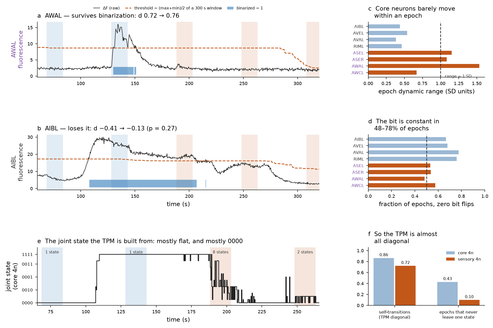

[Vector PDF](figures/fig24_binarization_outcome.pdf)

Panels a and b show why the rule treats the two neuron groups so differently.
**AWAL** is phasic — near-silent baseline, sharp transient, rapid decay — so the
threshold sits below its peak and each response becomes a clean, epoch-locked 1.
**AIBL** is tonic and drifting: it ramps up and stays elevated across *several*
presentations, the threshold rides up with it, and the resulting bit is one long
run spanning epochs of different stimuli. The bit cannot tell consecutive
stimuli apart.

| | core quartet | sensory quartet |
|---|---|---|
| epoch dynamic range | 0.38 – 0.54 SD | 0.67 – 1.54 SD |
| epochs with **zero** bit flips | 67 – 78% | 48 – 58% |
| **time** spent in runs longer than the 60 s stimulus interval | **59 – 71%** | 35 – 59% |

The core neurons spend most of their recorded time inside a binary run longer
than the interval between stimuli. The consequence for IIT is direct: **86% of
core-quartet transitions are self-transitions** and **43% of epochs never leave a
single joint state**, so the TPM is almost all diagonal and stimulus-evoked
deflections never become transitions.

### Detrending, and what the field does

The standard in calcium imaging is not a mid-range threshold but a **rolling
low-percentile baseline** — CaImAn uses the 8th percentile over a sliding window
by default, and the recommended window is 15–30 s, comparable to the
inter-event interval. The mid-range is outlier-driven by construction, and 300 s
is 5–20× longer than that convention.

Three flattenings are compared throughout:

| method | definition | preserves decreases | states/epoch (core) |
|---|---|---|---|
| mid-range 300 s | `x − (max+min)/2` | yes (69% of samples < 0) | 2.4 |
| rolling 8th pct, 30 s | `x − pctl₈` | yes (48%) | 5.7 |
| **high-pass, 60 s median** | `x − median` | yes (48%) | **9.5** |

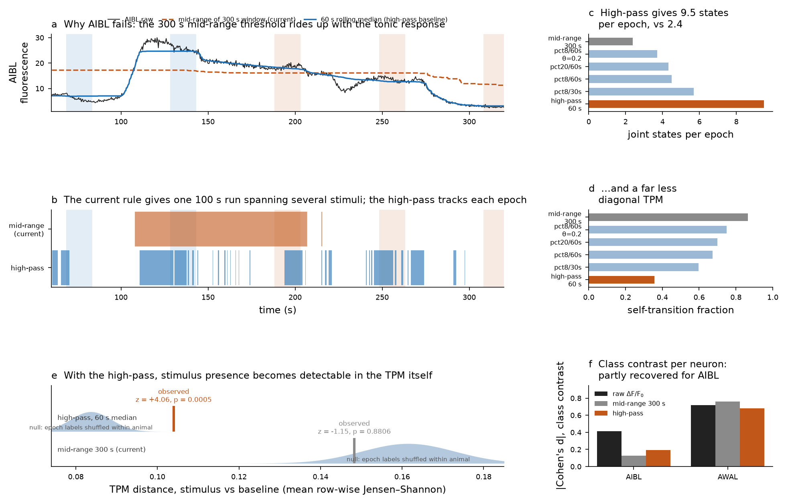

*Reading note: the state-dynamics panels of this figure (states per epoch,
self-transition fraction) are computed on the **core quartet only**; sensory
values differ (see the table below and `results/` CSVs).*

[Vector PDF](figures/fig25_binarization_schemes.pdf)

Two caveats found in testing these. **A ratio-based ΔF/F₀ is undefined for
AWAL**, whose fluorescence reaches exactly 0 in three recordings (160 samples in
one), making a percentile baseline of 0 and the ratio infinite; the subtractive
form `x − F₀` is well defined everywhere and is what is used here. And **the
ratio form cannot represent decreases** — with F₀ at the 8th percentile only
**3.8%** of AIBL samples fall below it, so a response that is a *dip* binarizes
to a constant 1 and AIBL's class effect flips sign (*d* = −0.41 → +0.03). Both
are reasons to prefer subtraction over division for this substrate.

### The binarized PSTH

The question that matters is whether a response visible in the continuous trace
survives thresholding.

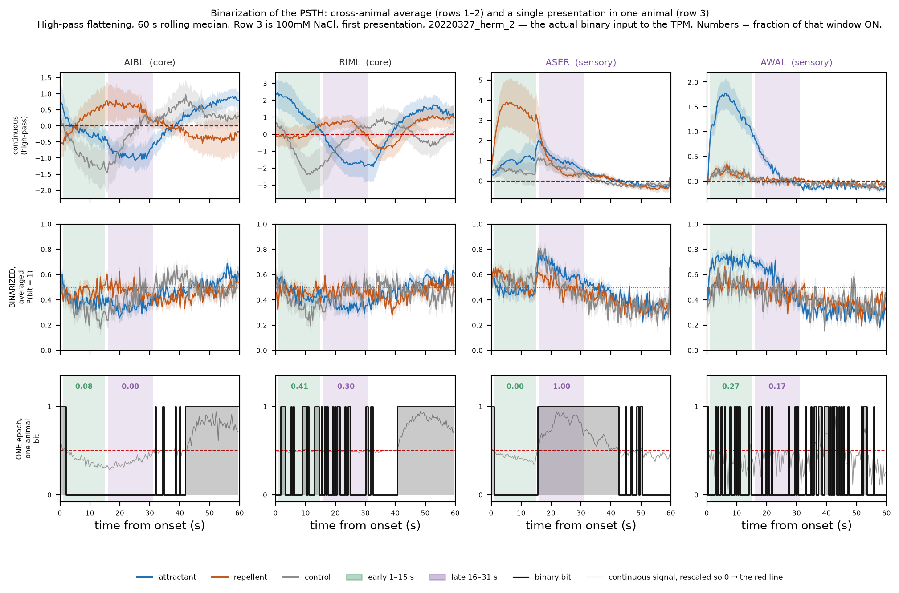

Top: continuous high-pass signal. Middle: the same epochs **binarized first,
then averaged** — P(bit = 1) across 232 epochs, which is what the state
distribution actually looks like. Bottom: **one presentation in one animal**
(100 mM NaCl, first repeat, 20220327_herm_2) — the actual binary input to a TPM,
with the continuous signal rescaled so its zero crossing coincides with the bit
flip. [Vector PDF](figures/fig29_binarized_psth.pdf)

The averaged binary traces (middle row) track the continuous ones: ASER and AWAL
show clear elevation through the early window, AIBL and RIML show late-window
class separation. The single-trial row shows how coarse one epoch is — AIBL's bit
is ON for 8% of the early window and 0% of the late one, and the state sequence
is a handful of flips, not a smooth response.

Quantitatively, thresholding costs little and in the late window costs nothing
at all:

| window | mean \|*d*\| continuous | mean \|*d*\| binarized | retained |
|---|---|---|---|
| early 1–15 s | 0.28 | 0.20 | 73% |
| **late 16–31 s** | 0.35 | **0.42** | **121%** |

In the late window binarization *increases* the mean class contrast, and six of
eight neurons separate the classes significantly after thresholding (AIBL
*p* = 0.001, AVAL 0.010, RIML 0.011, ASEL 0.0002, ASER 0.007, AWAL 0.003).
**Binarization is not where the class signal is lost.**

### Does the choice of rule change what IIT sees? Yes

Shuffling stimulus/baseline epoch labels *within* each animal — holding data
volume and animal identity fixed — and measuring the TPM distance between the
two conditions:

| flattening | observed | null | *z* | *p* |
|---|---|---|---|---|
| mid-range 300 s | 0.1483 | 0.1615 ± 0.0114 | −1.15 | 0.88 |
| **high-pass, 60 s median** | 0.1040 | 0.0837 ± 0.0050 | **+4.06** | **0.0005** |

**With the high-pass, stimulus presence becomes detectable in the transition
structure itself.** With the original rule it is not.

### How fast should the high-pass window be?

The 60 s window above is still slow relative to the response. A slow window makes
the bit encode *level* — an elevated response is uniformly "up" — rather than
fluctuation about a local reference, which is what a transition matrix needs.
Sweeping the window from 3 s to 300 s:

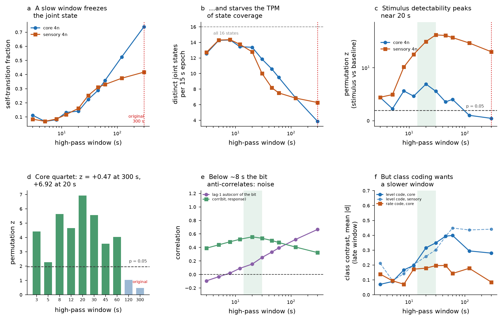

[Vector PDF](figures/fig30_window_sweep.pdf) ·
[`results/window_sweep_tpm_permutation.csv`](results/window_sweep_tpm_permutation.csv)

| window | self-transitions (core) | states/epoch (core) | TPM permutation *z* (core) |
|---|---|---|---|
| 300 s (original scale) | 0.74 | 3.9 | **+0.47** (*p* = 0.30) |
| 120 s | 0.53 | 6.9 | +1.04 (*p* = 0.15) |
| 60 s | 0.36 | 9.5 | +4.04 |
| 30 s | 0.22 | 11.9 | +5.57 |
| **20 s** | **0.14** | **13.4** | **+6.92** |
| 8 s | 0.08 | 14.3 | +5.63 |
| 3 s | 0.11 | 12.6 | +4.41 |

Detectability peaks near **20 s** and falls off in both directions, so the
window is a genuine optimum rather than a monotone "faster is better". Two
independent checks bound it from below. The **lag-1 autocorrelation of the bit**
turns *negative* below ~8 s (−0.09 at 3 s), meaning consecutive samples
anti-correlate — alternating noise, not dynamics. And the **correlation between
the bit and the underlying response** peaks at 20 s (0.56) and declines at both
extremes. A window of 15–30 s is also what the calcium-imaging convention
recommends, for the same reason: it is comparable to the inter-event interval.

There is one genuine tension. The *class* contrast under a level code prefers a
**slower** window (core mean |*d*| peaks at 0.40 near 45–60 s and falls to 0.32
at 20 s), because class information in these neurons lives in slow amplitude
differences. So no single window optimises both the class contrast and the
transition dynamics; 20 s is chosen here for the dynamics, since that is what
IIT consumes.

### The binarized responses at the settled window

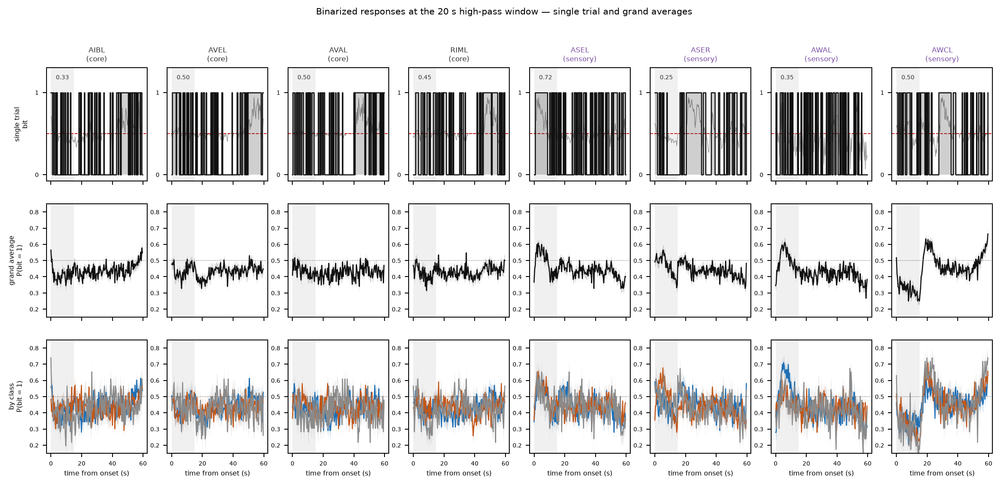

Single-trial bits (top; grey trace = continuous signal rescaled so its zero maps
to the threshold), grand-average P(bit = 1) over all 232 epochs (middle), and
by class (bottom), for all eight neurons
([`notebooks/12`](notebooks/12_phi_timeseries.ipynb)). The sensory bits track
their continuous responses — AWAL's attractant selectivity and AWCL's OFF
rebound are visible after thresholding — while the core bits fluctuate without
onset-locking, consistent with their slow, class-dependent coding.

## Φ as a time series

A different use of the same machinery
([`notebooks/12`](notebooks/12_phi_timeseries.ipynb)): build **one TPM from the
entire dataset**, compute Φ for **each of the 16 states**, and map every sample
of the binarized recording to the Φ of its state — a Φ(t) that can be
epoch-averaged like a PSTH, with no structure distance needed.

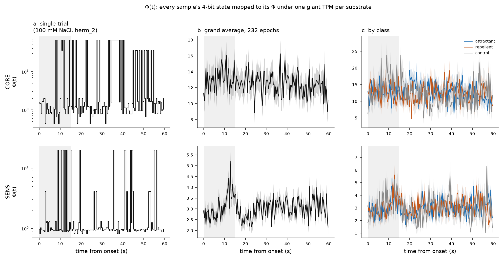

What it shows ([`results/phi_by_state_giant_tpm.csv`](results/phi_by_state_giant_tpm.csv)):
Φ is concentrated on one or two states — 0000 at 66.1 and 1111 at 35.8 (core),
0000 at 19.8 and 0111 at 4.1 (sensory) — with everything else at 0.4–2. Φ(t)
correlates at 0.97 (core) / 0.87 (sensory) with a plain indicator of being in the
top-2 states, so it is effectively a state-occupancy readout passed through the
Φ values. The apparent stimulus-locked ramp in the sensory grand average does not
survive an epoch-label permutation (stim − base: core z = +0.91, p = 0.36;
sensory z = +0.60, p = 0.56), and the class contrast on stimulus-window Φ is
null as well ([`results/phi_timeseries_tests.csv`](results/phi_timeseries_tests.csv)).
The construction itself is sound and cheap; what limits it here is that Φ puts
nearly all its mass on the baseline state, so Φ(t) inherits the noise of that
state's occupancy.

**Adding the pre-stimulus baseline changes the reading.** With a −15 s window and
state rasters drawn above each trace (black = bit ON, so 0000 is a white column):

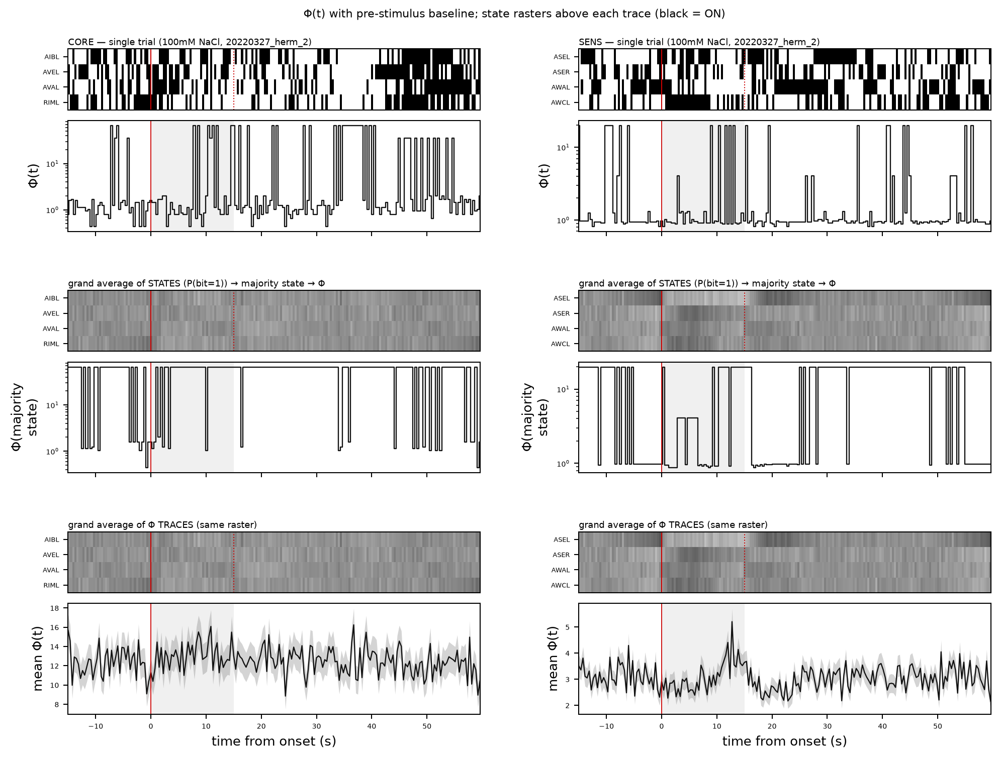

Stimulus-window Φ does not differ from the pre-stimulus baseline on either
substrate (sensory −0.04, *p* = 0.66; core +0.67, *p* = 0.22; paired Wilcoxon,
n = 232). But the **post-offset window (16–31 s) is significantly below baseline
on the sensory substrate**: −0.32, *p* = 10⁻⁵, negative in 6 of 8 animals, and
present in every class *including control* — an OFF-event signature, not a
chemical one ([`results/phi_windows_with_pre.csv`](results/phi_windows_with_pre.csv),
[`results/phi_offset_dip_per_animal.csv`](results/phi_offset_dip_per_animal.csv)).
The raster shows the mechanism: after offset the OFF-responding sensory neurons
(the dark ASEL band at 16–30 s) push the system out of the high-Φ rest state
0000. **Sensory activity lowers Φ here**, because Φ is concentrated on the
quiescent state. This is the first Φ-level quantity in the project that
distinguishes a stimulus event from baseline — at the offset, and in the
direction opposite to intuition.

**The dip does not carry chemical identity, and its mechanism is fully
resolved.** Testing the dip magnitude by class
([`results/phi_dip_class_test.csv`](results/phi_dip_class_test.csv)):

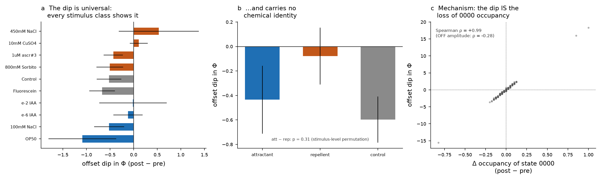

Every class shows the dip — control's is the *largest* (−0.60, vs attractant
−0.44 and repellent −0.08) — and the attractant-vs-repellent contrast is null
under the stimulus-level permutation (*p* = 0.31). The mechanism panel closes
the question of what Φ(t) measures here: the per-epoch dip correlates at
**ρ = +0.99** with the change in 0000 occupancy. Φ(t) analysis under this TPM
*is* occupancy analysis of the rest state, scaled by one large constant; the
sensory OFF-transient amplitude predicts the dip (ρ = −0.28) because a bigger
OFF-response means less time in 0000. The scalar Φ collapses the 16-state
repertoire to essentially one informative bit — in-0000 or not. Any route to
chemical identity through IIT will need the per-state **structure** (which
distinctions and relations exist in each state), not the scalar.

### The Φ unfolding, not the binarization, is where the effect is lost

With the window optimised, the same permutation test can be run at both levels
on the same epochs:

| substrate | window | TPM-level *z* | Φ-structure *z* |
|---|---|---|---|
| core 4n | 20 s | **+6.92** (*p* = 0.001) | +0.53 (*p* = 0.36) |
| core 4n | 60 s | **+4.04** (*p* = 0.001) | +1.58 (*p* = 0.0498) |
| sensory 4n | 20 s | **+35.3** (*p* = 0.001) | −0.38 (*p* = 0.65) |
| sensory 4n | 60 s | **+42.7** (*p* = 0.001) | −3.02 (*p* = 0.995) |

[`results/tpm_vs_phi_by_window.csv`](results/tpm_vs_phi_by_window.csv)

**The transition matrix distinguishes stimulus from baseline emphatically at
every window tested. The Φ-structure computed from that same matrix does not.**
This relocates the problem for the third time and, unlike the previous two
relocations, it points at the theory-facing step rather than at preprocessing.
Three candidate explanations, none yet distinguished. First, both conditions
usually unfold at the **same** state — 0000 for the core quartet at both windows
and for the sensory quartet at 20 s — so the only channel through which the
condition can act is the transition probabilities, not the state. (The one
exception, the sensory quartet at 60 s, selects 0111 for stimulus and 1000 for
baseline, and is also the configuration with the most negative *z*.) Second, the
structures are dominated by thousands of relations of similar φ — 4829 against
5159 for the core quartet at 20 s — so a distance summed over all of them is
mostly summing near-identical terms. Third, normalising each structure to unit Φ
discards precisely the amplitude difference the TPM test detects.

### Robustness: median, all stimuli, raw traces, and TPM stability

Four checks in [`notebooks/13`](notebooks/13_robustness.ipynb).

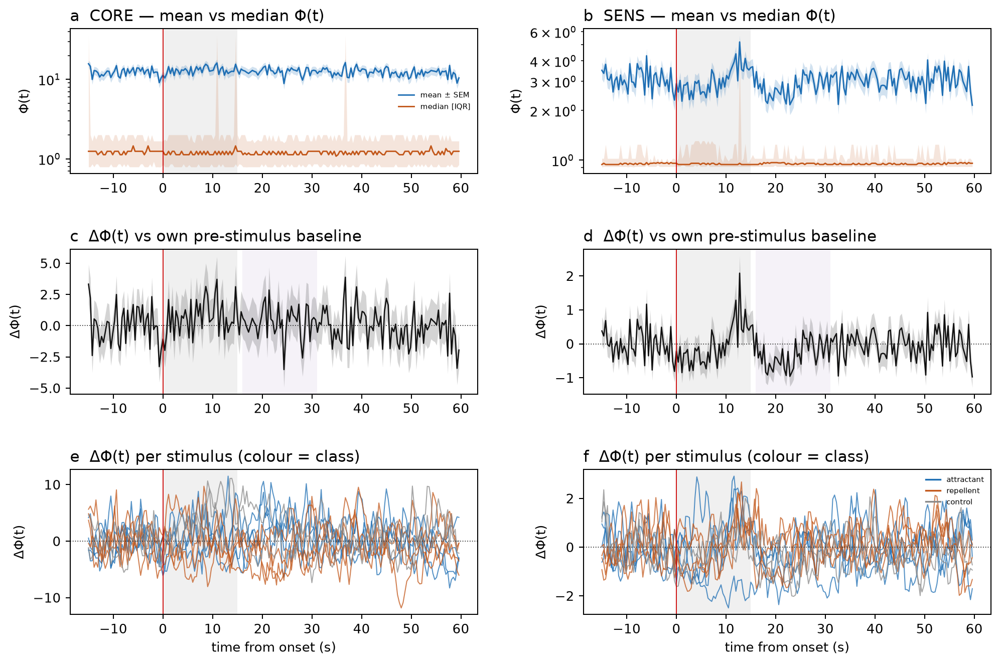

**Median vs mean.** The median Φ(t) is flat at ~1 while the mean carries all the
structure ([fig38](figures/fig38_phi_median_rasters.png) shows both under the
state rasters). That is exactly what the top-2-state mechanism predicts: the
high-Φ states occupy 16–21% of samples, so the median sits in the low-Φ bulk at
every time point. For a quantity carried by a minority of samples the mean is
the appropriate statistic; the flat median *confirms* the mechanism.

**All stimuli, stimulus vs no stimulus.** Baseline-correcting every epoch
against its own pre-stimulus window and pooling all 10 stimuli (panels c–f):
no stimulus-window effect (core +0.67, *p* = 0.22; sensory −0.04, *p* = 0.66)
and the sensory post-offset dip at −0.32, *p* = 10⁻⁵
([`results/phi_on_off_contrast.csv`](results/phi_on_off_contrast.csv)). The
per-stimulus traces show the dip in every class.

**Raw fluorescence, mean and median.**

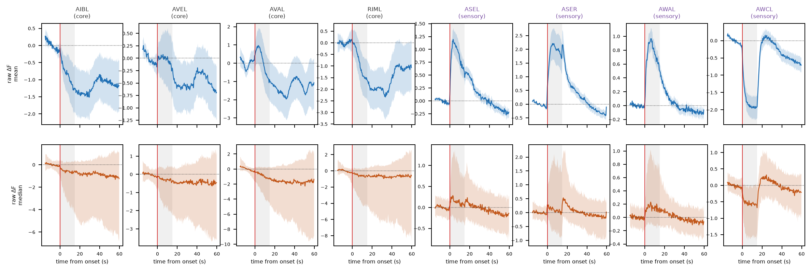

Mean and median agree on every response shape (sensory ON transients, AWCL's
OFF rebound, the slow core declines), so the Φ-level story is not driven by
outlier epochs at the fluorescence level either. The wide IQRs on the core
neurons show their epoch-to-epoch variability is intrinsic, not induced by the
processing.

**TPM stability under dropout.**

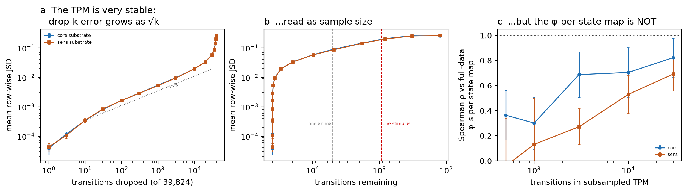

Dropping *k* random transitions of the 39,824 and comparing to the full TPM:
the error grows as √k and stays below JSD 0.01 until ~3,000 transitions are
removed ([`results/tpm_stability_dropout.csv`](results/tpm_stability_dropout.csv)).
The giant TPM is the most robust object in the pipeline. **But the φ-per-state
map built from it is not**: subsampled to 30k transitions (75% of the data) the
per-state φ ranking correlates only ρ = 0.82 (core) / 0.69 (sensory) with the
full-data map, and at one-stimulus scale (~1,000 transitions) ρ = 0.30 / 0.13
([`results/tpm_stability_phi.csv`](results/tpm_stability_phi.csv)). Φ inherits
none of the TPM's √k robustness — it is a highly nonlinear readout that
amplifies small row perturbations. Any per-stimulus or per-condition Φ
comparison must budget for this instability, not the TPM's.

## Naming the states: which is "stimulus", which is "no stimulus"?

The Φ(t) thread ends by answering its own selection problem
([`notebooks/14`](notebooks/14_state_identification.ipynb)): compare the
occupancy distribution over the 16 states between the stimulus window and each
epoch's own pre-stimulus window, paired per epoch (n = 232), medians as well as
means, Holm-corrected across states.

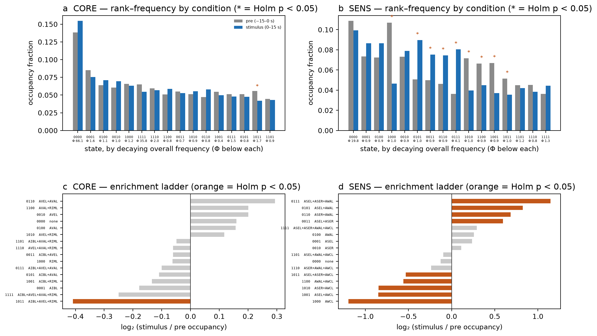

The distributions differ decisively on the sensory substrate (JSD permutation
*z* = +18.2) and mildly on the core (*z* = +2.4)
([`results/state_distribution_test.csv`](results/state_distribution_test.csv)).
And the winners are bit-interpretable
([`results/state_enrichment.csv`](results/state_enrichment.csv)):

| condition | state | composition | occupancy shift | Holm *p* |
|---|---|---|---|---|
| **no stimulus** | 1000 | **AWCL alone ON** | 0.107 → 0.047 (log₂ −1.20) | 3 × 10⁻²² |
| **stimulus** | 0111 | **ASEL+ASER+AWAL ON, AWCL OFF** | 0.036 → 0.081 (log₂ +1.15) | 4 × 10⁻¹³ |

The two named states are exact complements, and the whole enrichment ladder
follows the same rule: every baseline-enriched state has AWCL ON; every
stimulus-enriched state has AWCL OFF with ON cells among ASEL/ASER/AWAL. AWCL
is an OFF cell — odour removal activates it — so the ladder reads as
chemosensory biology straight off the state labels. Nine of sixteen sensory
states shift significantly after Holm correction; medians agree with means on
every one of them.

**The consequential row is the one that does not move.** 0000 — the
argmax-occupancy state at which *every* earlier per-condition Φ-structure was
unfolded — shows no condition shift at all (sensory *p* = 0.50, core
*p* = 0.33), and core 1111 does not either. The states that carry the condition
(1000, 0111) have Φ of only 0.97 and 4.08 under the giant TPM. So the earlier
null results were computed at precisely the state the condition never touches,
while the informative states were invisible to a scalar dominated by 0000's
Φ = 66. The next step writes itself: compare the **Φ-structures of 1000 and
0111** — condition-assigned, well-estimated (both rows have >1,600
observations), and small enough that the gold-standard distance is exact.

## The structure comparison, and what "noise floor" means

### The noise floor, defined

Every distance this repository reports is judged against a **split-half noise
floor**, and the logic deserves to be explicit because it decides what counts
as a result.

A distance between two Φ-structures — say 3.2 — carries no meaning on its own.
The structures are *estimates*, built from finite data through a nonlinear
pipeline (binarize → count transitions → smooth → unfold). Two estimates of the
**same** structure, from different animals, will not be identical; the question
is never "is the distance nonzero?" but "is it larger than the distance between
two estimates of the same thing?" The noise floor is that reference:

1. Split the 8 animals into two disjoint halves A and B. All 35 balanced
   4-vs-4 splits are used.
2. Run the identical pipeline on each half; unfold the **same state** in both.
   D(state_A, state_B) is pure **estimation noise** — same condition, same
   state, same pipeline; the only difference is which animals supplied the
   data.
3. Measure the **signal** — D(condition₁, condition₂) — *within* one half, so
   signal and noise are computed at the same data volume. (Comparing full-data
   signal to half-data noise would flatter the signal, since noise shrinks
   with data.)
4. Test whether signal exceeds noise (one-sided Mann–Whitney over the split
   ensemble). A ratio near 1 means the condition contrast is indistinguishable
   from re-measuring the same condition — the instrument cannot resolve the
   question at this data volume, and any p-value computed from the contrast
   alone would be uninterpretable.

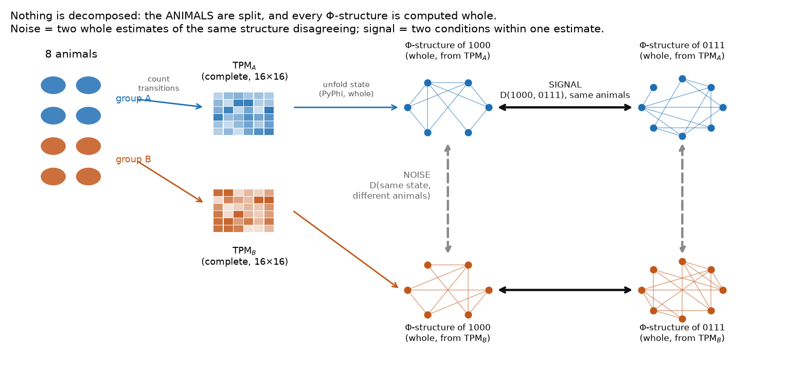

**A point worth stating twice, because the name "split-half" invites a
misreading: no Φ-structure is ever decomposed.** The structure is holistic and
undecomposable, and every one in this analysis is unfolded whole by PyPhi. What
is split is the *set of animals* used to estimate the TPM. The structure is a
deterministic function of an empirically *estimated* input, so it inherits that
input's sampling uncertainty — two whole structures of the same state, built
from disjoint animals, disagree exactly to the extent the TPM estimate moves.
The noise floor measures that inherited uncertainty without cutting anything
apart.

This is test–retest reliability applied to Φ-structures: **a measure cannot
distinguish two conditions by less than it differs from itself.** It is the
check that reframed the original class comparison (ratio 1.06/0.96 — see
[The road here](#the-road-here--what-we-tried-and-what-it-taught-us)), the
positive control, and now the state-level comparison below.

### 1000 vs 0111: the first condition-assigned structure comparison

Notebook 14 named the states; [`notebooks/15`](notebooks/15_structure_comparison.ipynb)
compares their structures under the giant TPM.

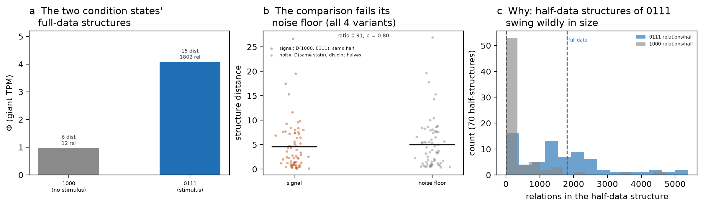

The full-data structures look dramatically different — 1000 gives Φ = 0.97
with 6 distinctions and 12 relations; 0111 gives Φ = 4.08 with 15 distinctions
and 1,802 relations; D = 3.17. (With 15 distinctions the exact minimisation is
infeasible at 15!, so distances use the canonical-label correspondence — an
upper bound, exact when the minimum is at the identity; both structures live on
the same four neurons, so the labels are shared.)

**But the comparison fails its noise floor**: signal/noise ratio 0.91
(*p* = 0.80), and no variant rescues it — unit-Φ normalisation 0.93,
distinctions-only 0.62, both together 0.88
([`results/structure_1000_vs_0111.csv`](results/structure_1000_vs_0111.csv)).

Panel c shows why, and it is the φ-fragility of notebook 13 made concrete: at
half-data volume the 0111 structure swings between **5 and 15 distinctions and
7 and 5,385 relations** across splits
([`results/structure_split_sizes.csv`](results/structure_split_sizes.csv)).
The object is not yet stable enough to compare. The occupancy statistics that
named the states are rock-solid (Holm p = 10⁻²²); the *structures* at those
states are not — which cleanly separates what this dataset can support
(state-level, occupancy-level inference) from what it cannot yet
(structure-level inference), and says the binding constraint is per-condition
data volume, not the contrast itself.

### Is the floor inter-animal variability? No — and the isogenic argument makes this sharper

A fair objection: the animals are isogenic clones with one shared anatomical
connectome, so if that connectome is the causal model, why should the TPM's
robustness *between animals* matter at all? The premise is testable, and it
**passes**: splitting the same animals' recording *time* in half (every animal
on both sides, ~20k transitions per side) produces the same noise as splitting
by *animal* — ratio between/within = 1.07 (state 1000) and 1.22 (state 0111),
neither significant
([`results/within_vs_between_animal_noise.csv`](results/within_vs_between_animal_noise.csv)).
Animal identity contributes essentially nothing; pooling across clones is fully
justified.

But this makes the noise floor *more* binding, not less. The floor was never
inter-individual variability to be argued away — it is **finite-sample error in
the mechanism probabilities**, and it would be present for a single animal
measured twice. A shared causal graph fixes *which* mechanisms exist; it does
not supply their conditional probabilities, which must still be estimated from
finite transitions and then pass through a thresholded, nonlinear unfolding.
The SCM-licensed factorization was also tested — estimating node-wise
mechanisms P(nodeᵢ | joint state), 64 parameters instead of 240 — and it
reproduces the full-data structures almost exactly while leaving the
split-half ratio unchanged (0.894 vs 0.914,
[`results/scm_nodewise_comparison.csv`](results/scm_nodewise_comparison.csv)).
The instability lives in the unfolding — distinctions near the φ ≈ 0 boundary
winking in and out under tiny TPM perturbations — not in the parameter count.

### Stable TPM, unstable structure: the hierarchy that reconciles everything

Two further objections sharpen the picture (tested in
[`notebooks/15`](notebooks/15_structure_comparison.ipynb)):

*"If the TPM is stable, don't we have a good statistical description?"* Yes —
and it is verified: TPMs from disjoint animal halves agree to **JSD 0.08**. But
stability does not propagate through the unfolding. The structures unfolded
from those near-identical TPMs sit D ≈ 8 apart, and across splits the structure
error does not even correlate with the TPM error (ρ = +0.03,
[`results/tpm_vs_structure_amplification.csv`](results/tpm_vs_structure_amplification.csv)).
The unfolding is a thresholded, discontinuous function: a mechanism whose φ
crosses zero appears or vanishes wholesale, taking its relations with it.

*"But the average-state and Φ(t) series are robust — surely we are not just
analyzing noise?"* Correct, and both observations coexist in one measured
hierarchy — the median relative deviation of a half-data estimate from the
full-data value
([`results/stability_hierarchy.csv`](results/stability_hierarchy.csv)):

| readout | half-vs-full deviation |
|---|---|
| TPM transition probabilities | **7%** |
| occupancy profile (r across halves) | **r = 0.97** |
| offset dip (sign across 24 half-cohorts) | **20/24 negative** |
| φ_s of the dominant state | 43% |
| Σφ of the 0111 structure | 60% |
| relation count of the 0111 structure | 43% |

Everything that excited us — the state rasters, the Φ(t) grand averages, the
offset dip — lives in the top half of this table and **is** robust. The
structure comparison lives in the bottom half. Neither observation refutes the
other; they sit at different levels, separated by the unfolding's
discontinuity.

### The concern in one experiment: ~150× amplification

Stated plainly: **yes, very small differences in the TPM can cause very large
differences in the Φ-structure**, and the size of the effect is now measured
under controlled conditions rather than inferred from animal splits
([`results/perturbation_sweep.csv`](results/perturbation_sweep.csv)).

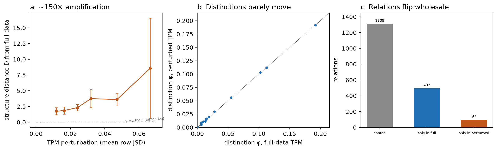

Each row of the full-data TPM is multinomially resampled at a chosen sample
size, giving a perturbed TPM whose distance from the original is *known*. At
the smallest perturbation tested — mean row JSD 0.012, a ~1% change — the 0111
structure moves by D = 1.74 (over half the full stimulus-vs-baseline
contrast of 3.17), and its relation count swings between 913 and 2,747. The measured
amplification is **~150×**.

The traced minimal pair shows *where* the discontinuity lives. All 15
distinctions survive the perturbation with a median |Δφ| of **0.0012** — the
distinction level is as smooth as the TPM itself (panel b). But **590 of
~1,800 relations flip existence** (panel c): whether a relation exists depends
on discrete congruence and overlap conditions among purviews, and a tiny
repertoire shift can flip those conditions without meaningfully changing any
φ. The Φ-structure is continuous in its weights but discontinuous in its
*membership*, and the membership carries most of the distance.

Three consequences. The noise floor is not pessimism about the data — it is
this amplification acting on unavoidable sampling error. Any robust structure
comparison must regularise relation membership (a φ-threshold with its margin
chosen by exactly this perturbation analysis) or stay at the distinction
level, which is demonstrably stable. And the fragility is not IIT failing — it
is the analysis inheriting the theory's own sharp existence conditions, which
were designed for exactly-known TPMs, not estimated ones.

### Our connectivity vs the literature

The effective sensitivity matrix, set against the two published connectivities
of the same four neurons ([`notebooks/16`](notebooks/16_connectivity_vs_literature.ipynb)):
**anatomy** (synaptic contact counts, Cook et al. 2019 hermaphrodite
connectome, via OpenWorm's c302 edge list) and the **signal-propagation atlas**
(Randi et al. 2023 — single-neuron optogenetic activation with whole-brain
imaging; wild-type scalar amplitudes from
`leiferlab/worm-functional-connectivity`). On terminology: the atlas *is* the
field's effective-connectivity reference — the Leifer group's own follow-up
(Dvali et al., arXiv:2412.14498) describes its edges as effective connections,
causal and perturbation-derived, including polysynaptic and extrasynaptic
routes. No separate Granger/DCM-style whole-brain dataset with neuron identity
exists for *C. elegans*.

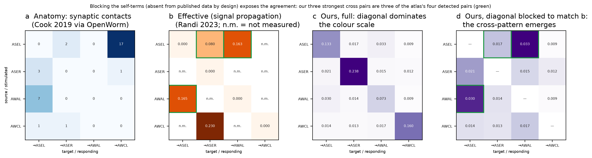

**Did we get lucky? No — the agreement sits on a plateau, and the window was
chosen by an independent criterion.** If the pattern agreement were an
accident of preprocessing, it should collapse under parameter changes. Sweeping
both axes ([`results/agreement_robustness.csv`](results/agreement_robustness.csv)):

| high-pass window (τ = 0.37 s) | top-4 overlap | reciprocal = ASEL↔AWAL |
|---|---|---|
| 5–10 s | 1/4 (chance ≈ 1.3) | no |
| **20–30 s** | **3/4** | **yes** |
| 60–300 s | 2/4 | yes |

| lag τ (window = 20 s) | top-4 overlap | reciprocal = ASEL↔AWAL |
|---|---|---|
| **0.37–0.75 s** | **3/4** | **yes** |
| 1.5 s | 1/4 | no |
| 3 s | 2/4 | yes |
| 6 s | 1/4 | no |

The full agreement holds on a 20–30 s × 0.37–0.75 s plateau and degrades
toward chance away from it — fast windows turn the bits into noise, slow ones
re-freeze the tonic cells, long lags lose the interaction. And the operating
point was **not** chosen to match the atlas: the 20 s window was fixed by
stimulus-present-vs-absent detection (sensory *z* = +35, the sweep's peak
region) before this comparison existed. Two independent selection criteria —
one internal (stimulus detection), one external (agreement with optogenetic
perturbation) — pick the same operating point, which is the opposite of luck.
The honest residue: the ASEL↔AWAL reciprocal identification is robust across
every window ≥ 20 s, while the 3/4 overlap is the more parameter-sensitive
statistic; both are quoted with their plateau.

**Anatomy split by synapse type.** The Cook et al. edge list distinguishes
chemical synapses (directed) from gap junctions (electrical):

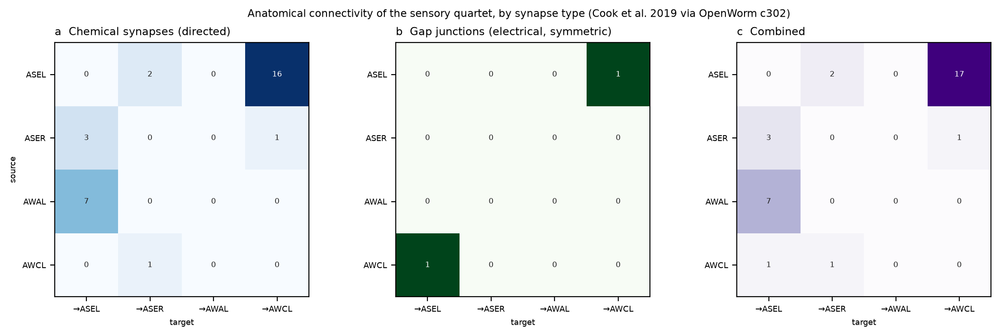

Within the quartet the wiring is almost entirely chemical (30 of 32 contacts);
the only gap junction is **ASEL–AWCL** (1 contact each way), sitting inside the
quartet's heaviest chemical pathway. AWAL receives **no** anatomical input
within the quartet in *either* synapse class — yet ASEL↔AWAL is the strongest
reciprocal pair in both the effective atlas and our matrix, so whatever
carries that communication (contralateral routes, extrasynaptic signalling, or
common drive) is invisible to the quartet's own anatomy entirely
([`results/anatomy_chemical_quartet.csv`](results/anatomy_chemical_quartet.csv),
[`results/anatomy_electrical_quartet.csv`](results/anatomy_electrical_quartet.csv)).

**On timescale.** The lag at which "an effect follows" is not ~20 ms anywhere
in this comparison — that figure belongs to electrophysiology (spike
transmission at chemical synapses; gap junctions are faster still). Everything
here is calcium imaging, where the reporter itself sets the clock: GCaMP
rise/decay is on the order of hundreds of milliseconds to seconds, so
imaging-based functional/effective connectivity works at lags of **~0.5–2 s**
(the Randi atlas reads evoked responses over ~30 s windows after stimulation;
cross-correlation studies of calcium dynamics report peak lags of ~0.6–1.5 s;
fast two-photon work resolves ~100 ms at best). Our τ = one sampling interval
= **375 ms** sits squarely in this imaging regime — comparable by
construction, since we and the atlas read the same reporter. All of these are
upper bounds on the underlying synaptic delays (~ms), which calcium imaging
cannot resolve.

**The comparison is only fair with the diagonal blocked** (panel d). The
published matrices carry structural zeros on the diagonal — anatomy has no
self-synapses, and the atlas cannot report a neuron's self-activation as
propagation — while our largest entries are exactly the self-terms
(0.073–0.238). On a shared colour scale our diagonal absorbs the entire
dynamic range and the cross-pattern renders as uniformly near-white. Masking
it is not cosmetic; it matches the support of the matrices being compared.

**With the diagonal matched, ours and the atlas agree on the pattern:**

* Our three strongest cross pairs — ASEL→ASER, ASEL→AWAL, AWAL→ASEL — are
  three of the atlas's four detected pairs (green boxes; hypergeometric
  *P*(≥3 of 4) = 0.067 against chance pair-picking).
* Both matrices name **ASEL↔AWAL** the strongest reciprocal pair — over zero
  direct anatomical synapses in the ASEL→AWAL direction, so both measurements
  independently see the same extrasynaptic/indirect route that anatomy misses.
* Amplitudes do not track (ρ = −0.40, n = 4) — expected across a forced-peak
  regime vs a passive-association regime. The agreement is in *which* pairs
  communicate, not in how much.
* The one genuine disagreement is AWCL→ASER: the atlas's strongest quartet
  edge, our near-floor entry — plausibly a route that optogenetic forcing of
  AWCL recruits but natural AWCL fluctuations at one 375 ms lag do not.

This is a nontrivial external validation of the TPM estimate: a matrix built
from passive binarized dynamics in 8 animals recovers the communication
pattern that direct optogenetic perturbation measures — while **anatomy is the
outlier** (its strongest edge, ASEL→AWCL at 17 contacts, is undetected by the
atlas and near-floor for us; ρ(ours, anatomy) ≈ 0.0), exactly the
structure-function dissociation the atlas paper itself reports
([`results/functional_agreement.csv`](results/functional_agreement.csv),
[`results/connectivity_three_way.csv`](results/connectivity_three_way.csv)).

Caveats, stated: one lateral quartet (L cells only, contralateral routes
invisible), the atlas measures 4 of the 12 directed pairs, amplitude
agreement is untestable at n = 4, and our matrix is regime- and
preprocessing-specific by construction
([`results/anatomical_weights_quartet.csv`](results/anatomical_weights_quartet.csv),
[`results/functional_atlas_quartet.csv`](results/functional_atlas_quartet.csv)).

### The precision convention: certify the TPM, treat it as ground truth

A methodological proposal worth recording as the project's position: *declare a
floating-point precision for the transition probabilities, certify by
subsampling that the TPM is stable at that precision, and treat it as ground
truth at that precision — the nonlinearity of the unfolding is a feature of
IIT 4.0, not a bug, and real-world data always rests on such conventions (as
the choices of τ and binarization already do).* Two further points come with
it: the null assumption is "you are so far from truth you should find
nothing," so a positive finding works *for* the analysis; and stability under
leave-out is evidence the estimate is near truth.

The convention is coherent, and both of its halves are now measured
([`results/precision_convention.csv`](results/precision_convention.csv)):

**What the data certify: ~2 decimals.** Median binomial SE per entry is 0.005;
half-data estimates round to the same value as the full data for 92% of the
256 entries at 1 decimal, 55% at 2, 7% at 3.

**What the unfolding needs: ~4 decimals.** Rounding the full-data TPM to its
*own certified precision* — a re-representation the convention treats as
identity — moves the 0111 structure by D = 2.47 and the 1000-vs-0111 contrast
itself by 32% (3.17 → 2.16). The structure stabilises only at 4 decimals
(D ≤ 0.04, relation count restored). The membership discontinuities live in
decimals 3–4, below what 39,824 transitions can pin down; closing the gap by
data alone needs ~9,400× more transitions (binomial SE ∝ 1/√n), roughly four
years of continuous recording
([`results/precision_gap.csv`](results/precision_gap.csv)).

**So the convention is adopted — with its scope set by that measurement.**
Every readout stable at the certified precision may treat the TPM as ground
truth: occupancy profiles, Φ(t) grand averages, the offset dip, and the
distinction-level φ values (median |Δφ| = 0.0012 under perturbation). That
licenses exactly the analyses that succeeded. What it does not license is the
one readout that consumes precision the data cannot certify — relation
*membership* — which is where the structure distance failed.

**The null-logic point is the project's guide star** — stated at the top of
this README: estimation noise dilutes lawful relationships rather than
manufacturing them. A *positive* finding under a noisy estimate is
conservative — had 1000-vs-0111 cleared its floor, it would stand. The noise
floor gates the interpretation of **nulls only**: it blocks the claim that an
absent effect is information about the worm rather than about the estimate.
Nothing more.

### Which connectivity? The one the data defines

On the question of *which* connectome to use as a constraint — synaptic,
extrasynaptic, functional, effective, which need not agree — there is a
principled answer available before consulting any atlas: **the estimated TPM
already defines a mechanism-level effective connectivity.** The sensitivity
matrix S[j→i] = mean |ΔP(neuron i ON next)| when neuron j's bit flips
([`results/effective_sensitivity_sens.csv`](results/effective_sensitivity_sens.csv)):

|  | →ASEL | →ASER | →AWAL | →AWCL |
|---|---|---|---|---|
| **ASEL** | **0.133** | 0.017 | 0.033 | 0.009 |
| **ASER** | 0.021 | **0.238** | 0.015 | 0.012 |
| **AWAL** | 0.030 | 0.014 | **0.073** | 0.009 |
| **AWCL** | 0.014 | 0.013 | 0.017 | **0.160** |

Self-terms are strong and reliably estimated (SNR 6–12 against split-half SD);
all twelve cross-terms are weak (0.009–0.033), two with SNR < 2
([`results/effective_sensitivity_snr.csv`](results/effective_sensitivity_snr.csv)).
This matrix is defined at exactly the level PyPhi consumes — mechanisms, these
neurons, this preprocessing — which the anatomical connectomes are not. Its
near-diagonal shape says two things at once: the sensory quartet behaves as
four weakly coupled units (consistent with their anatomy — these four are not
densely synaptically interconnected), and the structure fragility has a
located cause, since the distinctions the unfolding thresholds in and out are
built precisely on those weak, marginally-estimated cross-mechanisms.

One door the SCM framing genuinely reopens: the anatomical connectome as a
*sparsity constraint* (a connectivity matrix pruning which mechanisms PyPhi
considers). That was set aside early for the interneuron quartet, but for the
sensory quartet — whose members are not densely interconnected — an anatomy-
derived CM would zero exactly the flickering spurious mechanisms. It is the
one use of connectivity this project has not yet tried.

## The distance algorithm

It is called the **gold standard** (or "brute force") because it evaluates the
definition directly, with no approximation.

### The idea in one paragraph

Two Φ-structures have no shared labels — there is no *a priori* reason
distinction `a` in one corresponds to distinction `p` in the other. So we try
**every possible pairing**. For a given pairing the cost is a sum of absolute
differences: every matched distinction contributes |φ_d − φ_d′|, every matched
relation contributes |φ_r − φ_r′|, and anything left unmatched contributes its
full φ (compared against zero). The distance is the **smallest cost over all
pairings**.

### Formally

Let *M* be a bijection between the distinctions of S₁ and those of S₂. If the
structures have different numbers of distinctions, the smaller side is padded
with **null distinctions** carrying φ_d = 0 and no relations, so *M* is always a
bijection. Write *M(S)* = { *M(a)* : *a* ∈ *S* } for the induced image of a set.

$$
D(S_1, S_2; M) \;=\; \underbrace{\sum_{a} \bigl| \varphi_d^{1}(a) - \varphi_d^{2}(M(a)) \bigr|}_{\text{distinctions}}
\;+\; \underbrace{\sum_{S \in \varphi_r^{1}} \bigl| \varphi_r^{1}(S) - \varphi_r^{2}(M(S)) \bigr|}_{\text{relations of } S_1}
\;+\; \underbrace{\sum_{\substack{T \in \varphi_r^{2} \\ M^{-1}(T) \notin \varphi_r^{1}}} \varphi_r^{2}(T)}_{\text{unmatched relations of } S_2}
$$

$$
\boxed{\;D(S_1, S_2) \;=\; \min_{M} \; D(S_1, S_2; M)\;}
$$

Missing entries read as zero, so the third term is really just |0 − φ_r²(T)| —
"unmatched structure is charged in full" is the same rule applied against an
absent partner, not a separate one.

### The one property that makes this structural

**The relation mapping is not free — it is induced by the distinction mapping.**
Once *M* pairs the distinctions, relation {a, b} *must* be compared against
relation {M(a), M(b)}, whatever φ_r happens to sit there. Relations are never
matched to each other independently.

This is what makes *D* a distance between **structures** rather than between two
bags of numbers:

| structure | shape | φ_d values | φ_r values |
|---|---|---|---|
| X | path a—b—c | 0.3, 0.3, 0.3 | 0.10, 0.10 |
| W | edge p—q + self-loop on p | 0.3, 0.3, 0.3 | 0.10, 0.10 |

Identical multisets of φ values, genuinely different topology. Matching
relations independently (best-to-best) returns **0.0** — "identical". The gold
standard returns **0.2**.

### Higher-order relations need no special handling

A relation of any degree is one key in `φ_r`. The cost function never inspects a
key's size; it relabels the key through the bijection and subtracts. Degree 2
and degree 7 go through the same line of code. Perturbing one relation by +0.01
moves the distance by exactly 0.01 **at every degree**:

| degree of perturbed relation | 1 | 2 | 3 | 4 | 5 |
|---|---|---|---|---|---|
| resulting distance | 0.01 | 0.01 | 0.01 | 0.01 | 0.01 |

The measure is **exactly as discriminating as isomorphism**: *D*(X, Y) = 0 if
and only if X and Y are identical after some relabelling of distinctions.
Checked against an independent brute-force isomorphism test over 400 random
pairs — no false identities, no false differences.

### Worked example


**Str1** has 3 distinctions and 3 relations — one self-relation {b}, one
pairwise {a,b}, and one **degree-3 relation {a,b,c}** that binds all three at
once. **Str2** has 3 distinctions and 2 relations, both of degree ≤ 2. With 3
distinctions there are 3! = 6 bijections; all are scored and the smallest wins.

Under the winning mapping `a→p, b→r, c→q`:

| term | value |
|---|---|
| φ_d a→p, b→r, c→q | 0.02 + 0.02 + 0.10 |
| φ_r {b}→{r} — self-relation, no partner | 0.07 |
| φ_r {a,b}→{p,r} | 0.02 |
| **φ_r {a,b,c}→{p,q,r} — degree-3, no partner in Str2** | **0.09** |
| unmatched {p} in Str2 | 0.09 |
| **total** | **0.410  ← minimum** |

The next-best mapping scores 0.430 and the worst 0.870, so the minimisation is
doing real work rather than choosing among ties. The degree-3 relation
contributes 0.09 directly — a pairwise-only representation has nowhere to store
it, nor the two self-relations, and reports **0.16** for this pair against the
correct 0.41. Note also that |ΔΦ| = 0.23 is a strict
lower bound here: the two structures differ in ways total Φ cannot see.
[Vector PDF](figures/fig07_algorithm.pdf)

### Verified properties

Every row below is produced by
[`src/verify_properties.py`](src/verify_properties.py). Run it and the table
regenerates:

```bash
PYTHONPATH=src python src/verify_properties.py     # writes results/verified_properties.csv
```

These are empirical checks on random structures, not proofs.

| property | n tested | violations |
|---|---|---|
| identity, *D*(X, X) = 0 | 50 | 0 |
| symmetry, \|*D*(X,Y) − *D*(Y,X)\| | 200 | 0 (max 6.7 × 10⁻¹⁶) |
| triangle inequality | 200 triples | 0 |
| *D* = 0 ⟺ isomorphic | 400 | 0 false identities, 0 false differences |
| bounds \|ΔΦ\| ≤ *D* ≤ Φ₁+Φ₂ | 200 | 0 |
| degree-agnostic (+0.01 moves *D* by 0.01) | degrees 1–5 | 0 |
| relation mapping is induced, not free | 1 | 0 |

The isomorphism check uses an **independent** brute-force test — it searches
relabellings for literal equality, never calling the distance — so agreement
between the two is meaningful rather than circular.

### Cost, and when it stops being practical

The search is over bijections between **distinctions** — *n*! where
*n* = max(N_dist₁, N_dist₂). It is **not** over 2ⁿ mechanisms, and not over
relations: relations come along free once *M* is fixed.

Measured by [`src/verify_properties.py`](src/verify_properties.py), which writes
`results/measured_cost.csv` with the machine spec attached to every row:

| N_dist | bijections | seconds (one distance) |
|---|---|---|
| 3 | 6 | <0.0001 |
| 4 | 24 | 0.0001 |
| 6 | 720 | 0.013 |
| 8 | 40,320 | 1.73 |
| 9 | 362,880 | 20.3 |

**Measured on:** macOS 26.6.2, Apple Silicon (arm64), 12 physical cores,
64 GiB RAM, Python 3.12.13, NumPy 2.5.2 — **single-core, pure Python, no
parallelism and no JIT**. The implementation makes no attempt at speed; a
compiled or parallel version would shift these numbers, but not the factorial
growth.

Extrapolating the measured 20.3 s at *n* = 9 by the factorial: *n* = 10 is
roughly 3 minutes, *n* = 12 roughly 7 hours. Practical ceiling: **n ≈ 9** for a
single distance, **n ≈ 8** for a full pairwise matrix.

The factorial search **cannot** be replaced by optimal assignment. Assignment is
exact only for a cost that is **linear** in the pairing, and the relation term
is not: relation {a, b} is scored against {M(a), M(b)}, so its contribution
depends on two assignment decisions at once. Measured over 400 random pairs,
Hungarian on the distinction term alone overshoots the exact distance in **85%**
of cases (mean excess 0.392, max 1.466) — also produced by
`src/verify_properties.py`.


Bijections searched against distinction count (a) and measured runtime of one
exact distance (b). [Vector PDF](figures/fig06_scaling.pdf)

### Using it

```python
from src.gold_standard import gold_standard_distance, phi_of

# a Φ-structure: (φ_d by distinction, φ_r by SET of distinctions)
S1 = ({"a": 0.30, "b": 0.20},
      {frozenset({"a", "b"}): 0.12, frozenset({"b"}): 0.07})
S2 = ({"p": 0.28, "q": 0.05},
      {frozenset({"p"}): 0.09})

gold_standard_distance(S1, S2)                       # -> 0.44999999999999996
gold_standard_distance(S1, S2, return_mapping=True)  # -> (0.45, {'a': 'p', 'b': 'q'})
phi_of(S1)                                           # -> 0.69  (Σφ_d + Σφ_r)
```

---

## Validation on structures PyPhi actually produces

### Nine real Φ-structures

[`notebooks/04`](notebooks/04_toy_examples.ipynb) unfolds nine Φ-structures from
five 3-unit networks (AND-OR-XOR, all-XOR, all-AND, all-OR, majority).

**Higher-order relations are common, not exotic.** 10 of the 25 states surveyed
contain a relation of degree ≥ 3, and degree-4 relations appear throughout.
Across the nine structures used: 217 relations, of which **86 are degree > 2**
and **126 have no pairwise form** at all.

Two controlled perturbations isolate higher-order content. `all-XOR[000]` has
4 distinctions and 15 relations, exactly one of degree 4 (φ_r = 0.5):

| test | \|ΔΦ\| | pairwise-only | gold standard |
|---|---|---|---|
| **A** delete the degree-4 relation | 0.5 | **0.0** | 0.5 |
| **B** move its φ_r to a degree-2 relation (Φ preserved) | **0.0** | 0.5 | 1.0 |
| **C** all-XOR[000] vs all-XOR[101] | 2.5 | 0.375 | 2.5 |
| **D** all-XOR[000] vs all-XOR[011] — *isomorphic* | 0.0 | 0.0 | **0.0** |
| **E** AND-OR-XOR[101] vs [111] | 0.223 | 1.703 | 3.129 |

Test **A** is the clean demonstration of the pairwise blind spot: the
representation has nowhere to store a degree-4 relation, so deleting it changes
nothing it can see. Test **B** is sharper — the same φ_r is *moved* from degree
4 to degree 2, so Φ is unchanged and |ΔΦ| reports 0, while the exact distance
charges the loss at one degree and the gain at the other.

Over the full 9 × 9 matrix (7 distinctions max, 5040 bijections per pair, 2.8 s):
the diagonal is zero, the matrix symmetric, the triangle inequality holds on all
**729** ordered triples, and **every** off-diagonal zero was confirmed a genuine
isomorphism by an independent brute-force test.


All nine structures against each other (a); the relation degrees they contain
(b); the three measures on the five tests (c).
[Vector PDF](figures/fig10_toy_examples.pdf)

### A single comparison, end to end on PyPhi 2.0

[`notebooks/05`](notebooks/05_pyphi2_example.ipynb) does one comparison
completely from scratch: two update rules in, one distance out, with every
intermediate step drawn.

**On PyPhi 2.0.** It is not on PyPI — the latest release there is 1.2.0 — so the
notebook installs from the `2.0` branch. It needs Python ≥ 3.13, drops the
`graphillion` dependency, and replaces `Network`/`Subsystem`/`phi_structure()`
with `Substrate` → `System` → `.ces()`. Its installed default formalism is
`IIT_4_0_2023`, matching the rest of this repo, and it **reproduces the pinned
branch's numbers exactly**. (The 2026 refinement, `pyphi.iit4_2026`, adds an
intrinsic-information requirement under which deterministic systems give
φ_s = 0 — relevant when comparing against published values.)

| | rule | state | Φ | distinctions | relations |
|---|---|---|---|---|---|
| Structure 1 | A=OR(B,C), B=AND(A,C), C=XOR(A,B) | 101 | 4.792 | 4 | 15 (degrees 1–4) |
| Structure 2 | each unit = XOR of the other two | 011 | 7.000 | 4 | 11 (degrees 2–4) |


Node area is φ_d, edge and loop width are φ_r, orange shading marks a relation
of degree ≥ 3. [Vector PDF](figures/fig11_two_structures.pdf)

All 4! = 24 bijections are scored and the smallest is the distance. Their costs
genuinely differ — the minimisation is doing work, not picking among ties.


*D* = **3.8141**, via `A→AB, C→AC, AC→BC, ABC→ABC`. This is not the mapping that
best matches φ_d values pairwise: relations are carried along by the distinction
mapping, so a locally worse pairing can win by placing the relations better.
[Vector PDF](figures/fig12_mapping_search.pdf)


Of the total 3.8141: **0.783** from distinctions and **3.032** from relations,
splitting by degree as 0.803 (self), 1.212 (pairwise), 0.780 (degree 3), 0.237
(degree 4). **27% comes from relations of degree > 2** — content no pairwise
representation could hold. |ΔΦ| = 2.208 would understate the difference by 42%.
[Vector PDF](figures/fig13_cost_breakdown.pdf)

---

## Scaling beyond the exact distance

Past ~9 distinctions the exact search must be replaced by an estimate. The
project's parallel line of work does this with **optimal transport**, which
brackets the exact value:

$$d_{\mathrm{OT}} \;\le\; d_{\mathrm{exact}} \;\le\; \Delta_{\mu^*}$$

Both bounds are cheap even when the exact search is intractable.

That approach folds each relation's φ_r onto its participating distinctions
(**Φ-folds**: divide φ_r by the number of distinctions the relation joins, add
each share to those distinctions) so the hypergraph becomes a flat vector OT can
consume. The exact distance never needs this step — which is why higher-order
relations require no special handling there.

**Two versions of Φ-folds exist, and the difference matters.**

* A **scalar fold** — one value per distinction — is degenerate: a filled
  triangle (three pairwise relations at 0.1 plus a degree-3 at 0.3) and an empty
  triangle (three pairwise at 0.2) fold to the *identical* vector, distance 0
  where the exact distance gives 0.6. Solving symbolically, folds coincide
  whenever each pairwise φ_r in the empty structure equals `e + t/3`. Every
  member of that family also has identical Φ, so |ΔΦ| is blind to it too.
* The **per-degree fold (manuscript Eq 40–43)** folds separately for each
  relation degree *k*, giving a vector of per-degree contributions. This
  resolves the degeneracy: the same filled/empty pair scores **0.6000**,
  matching the exact distance.

Only the per-degree version should be used. Measured over 800 random pairs, it
is a genuine **lower bound** — never above the exact distance — and tight:
**74.8% of pairs agree exactly**, r = 0.991, mean ratio 0.973. Residual loss
comes from discarding *which* distinctions a relation joins; recovering that
would need Gromov–Wasserstein.


Per-degree folding scores the filled/empty pair correctly (a); across 800 random
pairs it is exact on 75% and never exceeds the exact distance (b).
[Vector PDF](figures/fig09_writeup_check.pdf) ·
[scalar-fold diagnostics](figures/fig08_phi_folds.pdf)

### One equation to amend

Manuscript Eq 38 writes the relation term as a sum over *r* ∈ R₁ only. Read
literally that makes the distance **asymmetric** — 285 of 300 random pairs —
because relations present in R₂ with no preimage in R₁ are never charged. It
also contradicts the manuscript's own worked examples: Example 1 charges
|φ_r − φ′_r| when one side has no relation, and Eq 10 explicitly includes
φ_r⁽²⁾(p). The examples use the **union** R₁ ∪ μ⁻¹(R₂), which is what
`src/gold_standard.py` implements and what reproduces Eq 10's 0.4500 exactly.

### What upstream PyPhi already provides

PyPhi has a `feature/ces-distance` branch. Its HEAD is from **December 2020** —
it predates IIT 4.0 — and it registers two CES measures:

* `EMD` — earth-mover's distance in **concept space**, expanding each concept's
  cause and effect repertoires onto a shared purview and summing the two
  repertoire EMDs.
* `SUM_SMALL_PHI` — the signed scalar difference of summed φ.

Neither is a Φ-structure distance in the sense used here. Both operate on
**distinctions only** — the word "relation" does not appear in that module — so
all the higher-order content this repo concerns is invisible to them. Both
survive into the `2.0` branch under a renamed module (`pyphi/metrics/` →
`pyphi/measures/`), still typed over `Distinctions`, with `SUM_SMALL_PHI` the
configured default.

The `EMD` measure is worth noting as prior art for the transport route: it is
optimal transport over concepts with a repertoire-based ground metric, which is
the shape a Gromov–Wasserstein estimate would take with a ground metric defined
over distinctions *and* relations.

### Other candidate directions

* **Topological.** Treat the CES as a filtered simplicial complex and compare
  persistence diagrams. Handles all degrees natively, relabeling-invariant.
* **Gromov–Wasserstein** directly between hypergraphs, preserving *which*
  distinctions each relation joins.
* **Hypergraph kernels.** Weisfeiler–Leman-style refinement on the incidence
  structure, yielding a positive-definite similarity.

---

## Where to go next

Updated after the precision-convention and amplification analyses; earlier
versions of this list are superseded as their items were carried out (the
binarization attack became notebooks 11–12 and the offset dip; "run the
condition-assigned structure comparison" became notebook 15).

1. **Stabilise relation membership with a perturbation-calibrated φ-threshold.**
   The amplification analysis locates the fragility precisely: distinctions are
   smooth (median |Δφ| = 0.0012 under a 1% TPM perturbation) while relations
   flip existence wholesale (590 of ~1,800). The fix it implies: keep only
   relations that survive multinomial resampling at the data's own certified
   precision (the machinery of
   [`results/perturbation_sweep.csv`](results/perturbation_sweep.csv) run as a
   filter), then re-measure split-half stability of the thresholded structures.
   Only if that passes does the 1000-vs-0111 comparison get a second, decisive
   run.
2. **Chase the offset dip's identity dependence at the state level.** The dip
   itself is class-blind, but the *states visited* during the post-offset window
   need not be: ASER's and AWCL's OFF-transients are salt- and odour-specific in
   the raw traces. A per-class occupancy profile of the post-offset window is a
   two-line analysis on existing tensors — and it lives entirely at the
   occupancy level the precision convention certifies.
3. **A positive control for any structure-level quantity.** Same discipline as
   before: no class test is interpretable until stimulus-present-vs-absent
   separates in the same quantity. The TPM already passes (*z* = +6.9/+35); the
   thresholded structures of item 1 must pass it before any identity question.
4. **The distinction-level distance as the fallback.** If thresholded relations
   still fail their floor, the distinction level is certified-stable and the
   gold-standard distance restricted to distinctions is exact and instant at
   these sizes. It is a weaker instrument (no higher-order content) but an
   honest one at current data volume.

## The road here — what we tried and what it taught us

Everything in this section is retained deliberately: the project learned more
from its null results and its failed shortcuts than from anything that worked
on the first try.

For orientation, this was the headline card as it stood at the end of the
original class-comparison campaign (superseded by the current summary at the
top of this README):

| | |
|---|---|
| **Goal** | Test whether attractant Φ-structures resemble each other more than repellent ones do |
| **Distance** | Exact minimum over all bijections between distinctions ("gold standard") |
| **Why not simpler** | \|ΔΦ\| is a scalar and collapses distinct structures; a pairwise-only representation cannot see relations binding >2 distinctions |
| **Cost** | *n*! where *n* = number of distinctions. Practical to *n* ≈ 9 |
| **Result** | Not supported — and more fundamentally, **no signal above the noise floor** (signal-to-noise 1.06 and 0.96) |
| **Why** | Two structures for the *same* stimulus, from different animals, differ as much as two different stimuli |
| **Robustness** | Null across 7 pipelines, 4 state rules, 2 choices of τ, at the TPM level with no Φ, and under exact minimisation wherever computable |
| **Positive control** | **Fails** under the original binarization (ratio 0.95, p = 0.75). Under a high-pass flattening, stimulus presence becomes detectable in the TPM (*z* = +4.06, p = 0.0005) |
| **Where the signal is** | Two timescales: sensory neurons in an **early** window (1–15 s), core interneurons in a **late** one (16–31 s). Binarization is *not* the lossy step |
 Each subsection is unchanged from when it was the live state
of the analysis; the summary table says what each one taught.

| step | what it taught |
|---|---|
| Connectivity matrix omitted | The published matrix had a sink node (φ_s = 0 silently) and an edge absent from its own source table; PyPhi runs without one |
| Per-stimulus TPMs, pooled epochs | 43% of the 4-neuron TPM was smoothing prior, not data; state coverage ~5 of 16 per epoch |
| Six class-comparison pipelines | All null — and the split-half noise floor equalled the between-stimulus distance, so no pair of stimuli separated |
| Exact vs identity minimisation | The identity bound is loose (suboptimal on 40–93% of pairs) but every exact p moved *further* from significance |
| Positive control (chemical present vs absent) | Failed on every substrate under the original binarization — the instrument, not the biology, was the limit |
| Better TPM conditioning | Made signal-to-noise *worse*: conditioning concentrates structures rather than separating them |
| Mid-range 300 s binarization | The threshold tracked slow drift, freezing the core quartet into runs longer than the inter-stimulus interval |
| Original 60 s high-pass | First stimulus detection at the TPM level — and the discovery that the Φ unfolding, not preprocessing, loses the effect |
| Scalar Φ(t) on the giant TPM | Detects the delivery event (offset dip) but is a rest-state-occupancy readout — one informative bit, class-blind |
| Argmax-occupancy state selection | Every early per-condition structure was unfolded at 0000, now shown to be exactly the state the condition never touches |
| 1000-vs-0111 structure comparison | States settle by statistics; the structures at them fail their noise floor — membership fragility, not absent contrast |
| Precision audit | The data certify ~2 decimals; the unfolding consumes ~4; the gap is the whole story of the structure-level nulls |

### The original class comparison

Run in [`notebooks/06`](notebooks/06_celegans_pooled.ipynb).

**The data.** Eight isogenic hermaphrodites, whole-brain NeuroPAL 2-photon
imaging at 2.667 Hz, 4979 frames (~31 min) each, from
[chemosensory-data.worm.world](https://chemosensory-data.worm.world/index.html).
Ten stimuli × 3 repeats per animal: four attractants (100 mM NaCl, e-2 IAA,
e-6 IAA, OP50), four repellents (450 mM NaCl, 1 µM ascr#3, 10 mM CuSO₄, 800 mM
sorbitol), two controls (buffer, fluorescein).

### No connectivity matrix

PyPhi is given the TPM alone, so it assumes full connectivity. The functional
matrix previously used made the system not strongly connected — one neuron was a
sink under either edge orientation — which short-circuits PyPhi to
`NullSystemIrreducibilityAnalysis` and forces φ_s = 0.

A saturated graph is a null assumption, not a neutral one: it lets every
mechanism have every other in its purview. Filling in known connectivity is
worth revisiting, but it is not a small change, because it first requires
answering **which connectivity**:

* **Anatomical** — the synaptic wiring diagram. Static and well characterised in
  *C. elegans*, but a synapse is not a constraint on cause-effect power in the
  sense PyPhi needs.
* **Functional** — correlational, and defined *pairwise*. PyPhi's `cm` is also
  pairwise, so this fits mechanically, but correlation is not causation and a
  functional matrix estimated from the same traces used to build the TPM is not
  independent of it.
* **Effective** — closest to what IIT wants, and also **only ever estimated
  pairwise** in practice. A cause-effect structure has higher-order constraint
  that no pairwise effective-connectivity estimate can express, so this is a
  representational mismatch rather than a data-availability problem.

And whichever is chosen, functional and effective connectivity **change
dynamically** — plausibly with the stimulus itself. A single static `cm` shared
across all ten stimuli would then be wrong in a way that varies by condition,
which is arguably worse than the saturated assumption because the error is
correlated with the contrast of interest.

Left as-is for now, and flagged rather than resolved.

### Temporal grain: τ = one sampling interval

Transitions are counted between **consecutive frames** — τ = 1 sample =
0.375 s, the native acquisition rate. Three reasons:

1. **Data.** Coarse-graining time discards samples we cannot spare. At τ = 1 a
   40-frame epoch yields 39 transitions; at τ = 8 (3 s) it yields 32, an 18%
   loss across the dataset.
2. **Plausibility.** The only consciousness we can reason about from the inside
   is our own, and the integration window relevant to an experience — say the
   positive valence of an attractant — is very unlikely to be on the order of
   seconds.
3. **Scope.** The published argument for selecting τ by `argmax φ_s` was made
   for single-animal, single-session TPMs. It does not transfer
   straightforwardly to a TPM concatenated across animals and sessions, which
   is what is built here.

[`notebooks/07`](notebooks/07_binarization_and_tau.ipynb) implements the
argmax-φ_s selection anyway and shows it is **not identifiable at this data
volume**: widening epochs from 15 s to 30 s shifts τ* by a mean of 11.2 s with
0 of 10 stimuli agreeing, so τ* is tracking the window rather than the
dynamics. **Selecting τ properly is left for future runs** with more samples per
epoch.

**Caveat, stated plainly.** The temporal grain here is somewhat arbitrary — as
is the choice of binarization. Analysis of experimental data always rests on
auxiliary assumptions, and sometimes those assumptions are known to be imperfect
rather than merely unverified. Both are recorded here so a reader can judge what
rests on them.

### Epochs pooled across animals

An epoch is a **15 s window from each stimulus onset** — matching the stimulus
presentation duration used in the reference notebook. Onsets are 60 s apart, so
epochs never overlap and never span two stimuli; the 45 s between them is
discarded.

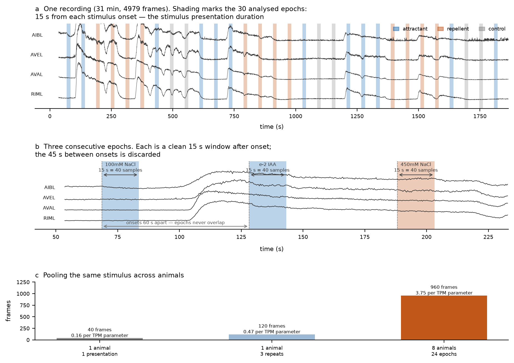

A full recording with all 30 analysed epochs shaded (a); three consecutive
epochs at native resolution, showing that each is a clean post-onset window
inside its inter-onset interval (b); and what pooling buys (c).
[Vector PDF](figures/fig16_epochs.pdf)

A 4-unit system has a 16 × 16 TPM — **256 parameters**. One epoch in one animal
gives 40 frames, 0.16 per parameter. Pooling the same stimulus across all 8
animals gives **24 epochs, 960 frames**, 3.75 per parameter.

What pooling assumes is that the 8 animals are interchangeable replicates of one
system. They are isogenic hermaphrodites imaged under one protocol, which is the
strongest available version of that assumption — but it is still an assumption.
It discards between-animal variation and **removes the within-class variance
estimate** that repeated animals would have supplied. The split-half noise floor
below recovers part of what pooling hides.

### The TPM, and how one state is chosen

Both steps are worth spelling out, because the second is the weakest link in
the whole pipeline.

**Building the TPM.** For each stimulus, every transition observed inside any of
its 24 epochs is tallied into a 16 × 16 count matrix — `C[a,b]` = number of
times state *a* was followed τ frames later by state *b*. Rows are normalised to
probabilities with **Laplace smoothing**, α = 0.5:

```
P[a,b] = (C[a,b] + α) / Σ_b (C[a,b] + α)
```

**What the per-stimulus TPM represents.** Because *C. elegans* anatomical
connectivity is static, a TPM that changes with the chemical is best read as an
estimate of **dynamic effective connectivity** — how causal influence among
these four neurons is reconfigured by the stimulus, not how the wiring changes.
Since the selected state is the same (0000) for all ten stimuli, the
Φ-structures differ *only* because the effective causal networks differ. That
reading is consistent with the dynamic-effective-connectivity literature, and it
is the reading under which the whole comparison makes sense.

**The smoothing is a real violation of IIT, not a technicality.** With 960 frames
against 256 parameters, some rows have **zero** observed transitions — states
never visited in any epoch of that stimulus (0–5 of 16 rows, depending on
stimulus). Unsmoothed those rows are undefined and PyPhi cannot proceed;
smoothed, they become the uniform prior. But IIT derives cause–effect power
*from the TPM*, so wherever the TPM is prior rather than data, the resulting
distinctions and relations describe an assumption rather than the system.

Measured across the whole matrix — prior mass αK against observed mass per row —
**the prior supplies a mean of 43% of the probability mass at 4 neurons.** That
is not regularisation; it is invention. The fix is a smaller substrate:

| neurons | states | params | mean invented mass | unvisited rows |
|---|---|---|---|---|
| 4 | 16 | 256 | **43%** | 0–5 |
| 3 | 8 | 64 | 19% | 0–2 |
| 2 | 4 | 16 | **2%** | 0 |

Both smaller substrates were run end to end ([`notebooks/08`](notebooks/08_tpm_distance_and_global.ipynb)).
Reducing the invented mass from 43% to 2% changes the numbers substantially — Φ
falls from 78–383 to 2.7–3.6 — but not the conclusion: 3 neurons gives
p = 0.11 and 2 neurons p = 0.12, both with the sign *opposite* to the
hypothesis.

**Choosing the state.** A Φ-structure is defined for a system **in a particular
state** — IIT 4.0 is state-dependent, and there is no such thing as "the
Φ-structure of this TPM". One of the 16 states has to be picked per stimulus.

The rule used is **argmax occupancy**: the state the system spent the most epoch
frames in. For all ten stimuli that is **0000** — all four neurons below
threshold — occupying 42–71% of frames.

**Two things are wrong with this, and neither is hidden:**

1. **0000 is the baseline, not the response.** The most-occupied state during a
   stimulus epoch is the quiescent one, so what gets characterised is closer to
   "this circuit at rest under this chemical" than "the response to this
   chemical".
2. **The choice matters enormously.** Across the 16 states of the *same* TPM,
   Φ spans **0.8 to 233.3 — a 278× range** — with distinction counts from 1 to
   15. Different states of one TPM are genuinely different structures.

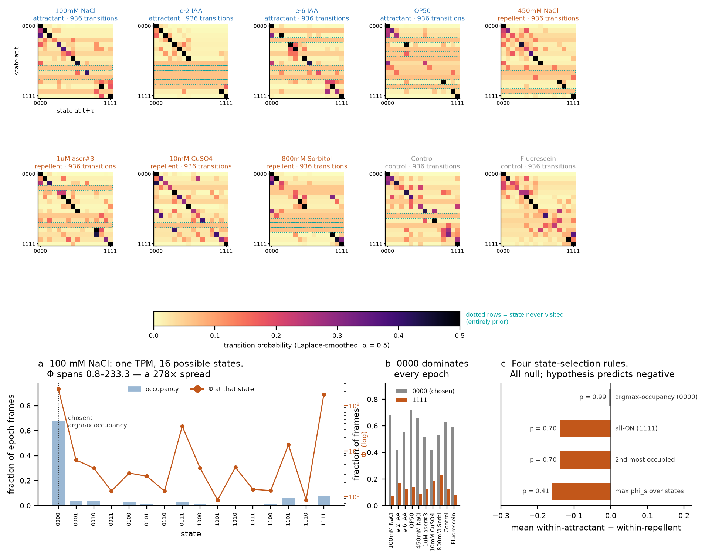

All ten pooled TPMs (rows 1–2), with dotted lines marking prior-only rows.
Below: Φ against occupancy across all 16 states of one TPM (a), how far 0000
dominates every epoch (b), and the class contrast under four different
state-selection rules (c).
[Vector PDF](figures/fig18_tpms_and_state_choice.pdf)

**Does the conclusion depend on the rule?** No. Four rules, each re-run through
the full pipeline:

| rule | state(s) used | difference | p |
|---|---|---|---|
| argmax occupancy | 0000 | −0.004 | 0.99 |
| all-ON | 1111 | −0.139 | 0.70 |
| 2nd most occupied | 1111 | −0.139 | 0.70 |
| max φ_s over visited states | 0000, 1111 | −0.159 | 0.41 |

The hypothesis predicts a *negative* difference, and all four rules produce one
— but none comes close to significance, and the largest (−0.159 at p = 0.41)
still sits well inside its permutation null. So the **null is robust to the state choice**
even though the Φ *values* are extremely sensitive to it. Choosing a state that
reflects the response rather than the baseline remains a real open item — see
[where to go next](#where-to-go-next).

### What is being compared: four neurons, two substrates

Every Φ-structure here is over a **4-unit substrate**, so it has at most
2⁴−1 = 15 distinctions. Two substrates are analysed **separately** and are never
compared to each other:

| substrate | neurons | why |
|---|---|---|
| interneurons | AIBL, AVEL, AVAL, RIML | the tentative *main complex* in awake animals (Kitazono et al. 2023); the set the project's earlier notebooks used |
| sensory | ASEL, ASER, AWAL, AWCL | amphid chemosensory neurons — ASEL/ASER for salt, AWAL/AWCL for attractant odour — the set the project's aim names |

These are **two independent tests of the same hypothesis on the same
recordings**, not a decomposition of one analysis. If the effect were real it
should appear, with the same sign, in a substrate carrying the relevant
information. Running both is a robustness check, and their disagreement is
itself a result.

This is **not** an attempt to explain a Φ-structure effect in terms of raw
neural activity. That inference would be treacherous — the map from traces to
Φ-structure runs through binarization, a TPM and the full IIT unfolding, and is
nowhere near linear. No such claim is made.

### What the distinction labels mean

Distinctions are keyed by the **mechanism** they are over: `AIBL·AVEL` is the
distinction whose mechanism is the pair {AIBL, AVEL}. This is not a reduction, a
deduplication, or a relabelling trick — labels do not affect a Φ-structure and
nothing here changes one.

With 4 neurons there are exactly **15 possible mechanisms**, the 15 non-empty
subsets. Each structure has 13–15 distinctions drawn from that same fixed set,
with no duplicates. So pairing `AIBL·AVEL ↔ AIBL·AVEL` across two structures is
**one specific bijection out of the 15! available** — the one that maps each
mechanism to itself.

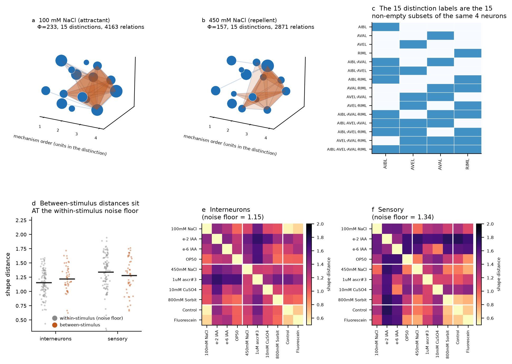

Two real pooled Φ-structures in 3D (a, b): node size is φ_d, positions are
grouped by mechanism order, lines are pairwise relations and orange shading
marks relations of degree ≥ 3. Panel (c) is the label question made concrete —
the 15 distinction labels are exactly the 15 non-empty subsets of the four
neurons. Panels (d–f) are the noise-floor result, below.
[Vector PDF](figures/fig17_structures_and_labels.pdf)

### Exact vs. identity: what the minimisation buys

**The headline 4-neuron analysis does not brute-force the minimum.** The exact
distance minimises over all bijections between distinctions; the pooled
per-stimulus structures have 13–15 distinctions, so 15! ≈ 1.3 × 10¹² mappings —
far past the *n* ≈ 9 ceiling. The identity correspondence is used instead,
justified by the shared substrate: with the same four neurons throughout,
`AIBL·AVEL` denotes the same mechanism in every structure.

**That is an upper bound, and a loose one.** `notebooks/06` scores 2000 random
relabellings of one real pair (100 mM NaCl vs 450 mM NaCl, interneurons): the
identity mapping scores **1.1213** and beats **99.5%** of them (random min
0.7903, mean 1.4871, max 1.6987) — but it is **not the minimum**, since
relabellings reach 0.7903.

Three of the six pipelines *are* small enough to brute-force, so the
minimisation was actually run on them:

| pipeline | distinctions | bijections | identity *p* | **exact *p*** | identity overestimates | mean excess |
|---|---|---|---|---|---|---|
| per-stimulus, 2 neurons | 3 | 6 | 0.12 | **0.60** | 40% of pairs | 0.040 |
| per-stimulus, 3 neurons | 7 | 5,040 | 0.11 | **0.18** | 93% of pairs | 0.120 |
| global TPM, top-1 | 9 | 362,880 | 0.74 | **0.84** | 84% of pairs | 0.040 |
| per-stimulus, 4 neurons | 13–15 | 1.3 × 10¹² | 0.99 | *not computed* | — | — |

Reproduced by [`notebooks/08`](notebooks/08_tpm_distance_and_global.ipynb),
written to `results/exact_vs_identity.csv`.

Three things follow. **First, the bound is genuinely loose** — the identity map
is suboptimal on 40–93% of pairs, so these are not near-exact numbers.
**Second, the minimisation moves every *p* further from significance**, not
closer; the sign of the class contrast is preserved in all three cases, so the
null is not an artefact of using a single bijection. **Third, the cost is real
but not prohibitive at these sizes** — 9 distinctions took 94 s for a full 10 ×
10 matrix with per-state caching (there are only ~14 distinct states, so exact
distances are cached per state pair rather than per stimulus pair). The
4-neuron per-stimulus pipeline is the one case where the exact value is out of
reach, and its distances remain upper bounds.

This is a further argument for the smaller substrates and the global TPM: they
are better conditioned *and* they let the distance be computed as defined.

Φ varies several-fold across stimuli without tracking class, so distances are
reported after scaling each structure to unit Φ — comparing **shape**
independent of magnitude.

### Do the TPMs themselves separate the classes? No

Before asking whether Φ-structures differ by class, ask whether the transition
matrices do. If the effect exists at all it should be visible one level down,
without any IIT machinery.

| TPM distance | within-attractant | within-repellent | difference | p |
|---|---|---|---|---|
| L1, all rows | 0.619 | 0.597 | +0.022 | 0.75 |
| Jensen–Shannon, all rows | 0.318 | 0.315 | +0.003 | 0.93 |
| L1, observed rows only | 0.565 | 0.599 | −0.033 | 0.64 |
| Jensen–Shannon, observed rows only | 0.309 | 0.323 | −0.015 | 0.63 |

("observed rows only" restricts to states where *both* stimuli actually recorded
transitions — the comparison that does not lean on the prior.)

**The null is upstream of Φ.** It is not that the Φ-structure distance fails to
see a real difference in the TPMs; the TPMs do not differ by class either. Any
account of why the analysis is null has to start here.

### The alternative: one global TPM, stimulus-specific states

If anatomical connectivity dominates the causal Markov chain and is static, the
more defensible object is a **single TPM for the whole dataset**, with stimuli
distinguished by *which state* they drive the system into rather than by each
having its own transition matrix.

This is much better conditioned: **156 observations per parameter, no unvisited
rows, and 0.3% invented mass** against 3.7 / 0–5 / 43% for the per-stimulus
matrices.

The difficulty is the state criterion — 0000 dominates every stimulus *and* the
baseline, so "most frequent" would assign every stimulus the same state and
every distance would be zero. Instead each stimulus gets the state most
**enriched during its epochs relative to a non-stimulated baseline** (the ~45 s
between the end of one epoch and the next onset):

```
enrichment(state) = log₂( P(state | stimulus) / P(state | baseline) )
```

This does what it was designed to. The selected states are `0011`, `1000`,
`1001`, `1010`, `1100`, `1101` — **neither 0000 nor 1111 is ever chosen**, since
both dominate the baseline too. Enrichments run 1.1–2.4 bits.

One structural limitation, and it is not marginal: with a single TPM the
structure is a pure function of the state, so **two stimuli selecting the same
state get distance exactly zero**. Three stimuli land on `1101` and two on each
of `1100` and `1001`, giving **5 zero-distance pairs — 3 of them
attractant/repellent cross-class pairs** (100 mM NaCl–800 mM Sorbitol, e-6
IAA–800 mM Sorbitol, OP50–450 mM NaCl), one attractant/attractant, one
control/repellent. Since 3 of the 24 cross-class pairs are forced to zero, the
top-1 contrast is partly an artefact of the state collapse rather than a
measurement. A top-*k* profile (a weighted mixture of each stimulus's *k* most
enriched states) removes the degeneracy entirely — 0 zero-distance pairs at
k ≥ 2 — which is why top-3 rather than top-1 is the version to read.
Per-pair detail in [`results/global_tpm_zero_pairs.csv`](results/global_tpm_zero_pairs.csv).

Also null: p = 0.74 (top-1), 0.97 (top-2), 0.79 (top-3).

### Six approaches, all null

| approach | invented TPM mass | difference | p | mapping |
|---|---|---|---|---|
| per-stimulus TPM, 4 neurons | 43% | −0.004 | 0.99 | identity (upper bound) |
| per-stimulus TPM, 3 neurons | 19% | +0.280 | 0.11 | identity — **exact: +0.182, p = 0.18** |
| per-stimulus TPM, 2 neurons | 2% | +0.117 | 0.12 | identity — **exact: +0.038, p = 0.60** |
| global TPM, top-1 enriched state | 0.3% | −0.054 | 0.74 |ᵈ identity — **exact: −0.016, p = 0.84** |
| global TPM, top-2 enriched states | 0.3% | +0.005 | 0.97 | identity (upper bound) |
| global TPM, top-3 enriched states | 0.3% | −0.097 | 0.79 | identity (upper bound) |

ᵈ degenerate: 3 of 24 cross-class pairs forced to zero by shared states — read
top-2/top-3 instead.

The hypothesis predicts a negative difference; the sign splits 3–3 and the
smallest p is 0.11. Spanning invented mass from 0.3% to 43% and both TPM
philosophies without moving the result is informative: the conclusion is not an
artefact of the smoothing or of the per-stimulus TPM choice. Where the exact
minimisation is computable it moves every p *further* from significance, so it
is not an artefact of the single-bijection shortcut either
([Exact vs. identity](#exact-vs-identity-what-the-minimisation-buys)).

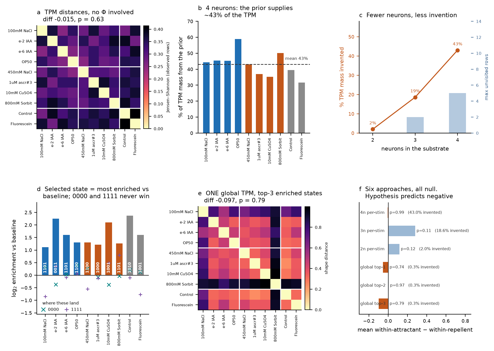

TPM-level distances with no Φ involved (a); how much of each per-stimulus TPM is
prior rather than data (b); how that falls with substrate size (c); the
enrichment criterion eliminating both baseline-dominant states (d); the
global-TPM distance matrix (e); and all six approaches (f).
[Vector PDF](figures/fig19_tpm_distances_and_global.pdf)

### The noise floor — the result that matters most

Before asking whether *classes* differ, ask whether **anything** does. Split the
8 animals into two halves, build a structure for the **same** stimulus from
each, and measure the distance. That is pure sampling noise.

| substrate | between-stimulus | within-stimulus (noise floor) | ratio |
|---|---|---|---|
| interneurons | 1.220 | 1.154 | **1.06** |
| sensory | 1.280 | 1.340 | **0.96** |

**There is no signal above the noise.** Comparing different stimuli gives
distances no larger than comparing the same stimulus against itself across
animals. This governs everything else: it is not that attractants and repellents
fail to separate — **no pair of stimuli separates** beyond what resampling the
animals produces.

### The class test

Reported for completeness; given the noise floor a null was expected.

| substrate | within-attractant | within-repellent | difference | p |
|---|---|---|---|---|
| interneurons | 1.258 | 1.262 | **−0.004** | 0.99 |
| sensory | 1.515 | 1.185 | **+0.330** | 0.25 |

The hypothesis predicts a *negative* difference. The interneuron contrast is
essentially zero; the sensory contrast has the wrong sign for the hypothesis and
is not significant. The two substrates disagree, and dropping any single
stimulus moves the interneuron contrast between −0.10 and +0.11.

Φ does not separate the classes either — it varies several-fold with controls
interleaved among the extremes.


Φ per stimulus (a); the permutation nulls (b, c); **the noise-floor comparison
(d)** — the panel that carries the result; jackknife instability (e); and every
stimulus lying on the identity line when its mean between-stimulus distance is
plotted against its own noise floor (f).
[Vector PDF](figures/fig14_pooled_celegans.pdf)

### Does the measure detect anything?

This is the section that reframes everything above it. Run in
[`notebooks/09`](notebooks/09_raw_trace_responses.ipynb) and
[`notebooks/10`](notebooks/10_positive_control.ipynb).

### The positive control fails

> Under the **original** mid-range binarization. See
> [Does the choice of rule change what IIT sees?](#does-the-choice-of-rule-change-what-iit-sees-yes)
> for the high-pass result, where the same contrast becomes detectable.

Every other analysis here discards the ~45 s between the end of one epoch and
the next onset — **three times more data than it keeps**. That window is a
stimulus-*absent* condition, so comparing it against the stimulus-present
condition is a much larger contrast than attractant vs repellent, and it makes a
positive control.

The design is matched: **signal** = *D*(stimulus, baseline) within one half of the
animals; **noise** = *D*(stimulus, stimulus) and *D*(baseline, baseline) across
the two halves — same condition, different animals, so pure sampling error.

| substrate | signal | noise | ratio | *p* (signal > noise) |
|---|---|---|---|---|
| 4 neurons | 0.812 | 0.851 | **0.95** | 0.75 |
| 3 neurons | 0.236 | 0.247 | **0.95** | 0.38 |

**The measure cannot detect the presence of a chemical.** Not attractant vs
repellent — chemical vs *no chemical*, on 3× more data, with both substrates
giving ratio 0.95.

This is the finding that governs how everything else here should be read. An
instrument that fails its positive control cannot support a conclusion that two
stimulus classes evoke similar Φ-structures. The class nulls in
[`notebooks/06`](notebooks/06_celegans_pooled.ipynb) and
[`notebooks/08`](notebooks/08_tpm_distance_and_global.ipynb) characterise the
*measure at this data volume*, not the worm.

### Better conditioning makes it worse

The global TPM is far better conditioned than the per-stimulus matrices — 0.3%
invented mass against 43%, no data-free rows. It does have a lower noise floor.
But its between-stimulus distances fall further still:

| pipeline | invented mass | between | within (noise) | ratio |
|---|---|---|---|---|
| per-stimulus TPM, 4 neurons | 43% | 1.220 | 1.154 | **1.06** |
| global TPM, 4 neurons | 0.3% | 0.380 | 0.636 | **0.60** |
| global TPM, 3 neurons | 0.08% | 0.121 | 0.365 | **0.33** |

The relationship runs the wrong way: **the better-conditioned the pipeline, the
worse its signal-to-noise.** Conditioning concentrates the structures rather than
separating them, so the failure is not one that better TPM estimation fixes.

The 3-neuron global TPM is nonetheless the best-conditioned configuration in the
repo — 622 observations per parameter, 0.08% invented mass, 3–4 distinctions so
the **exact** minimisation is essentially free — **1.0 ms** for the full 10 × 10
matrix, because the 45 stimulus pairs collapse to 9 distinct state pairs
(identity −0.037 p = 0.63; exact −0.010 p = 0.73). It is worth knowing that the best-conditioned, exactly-computable
pipeline available is also null.

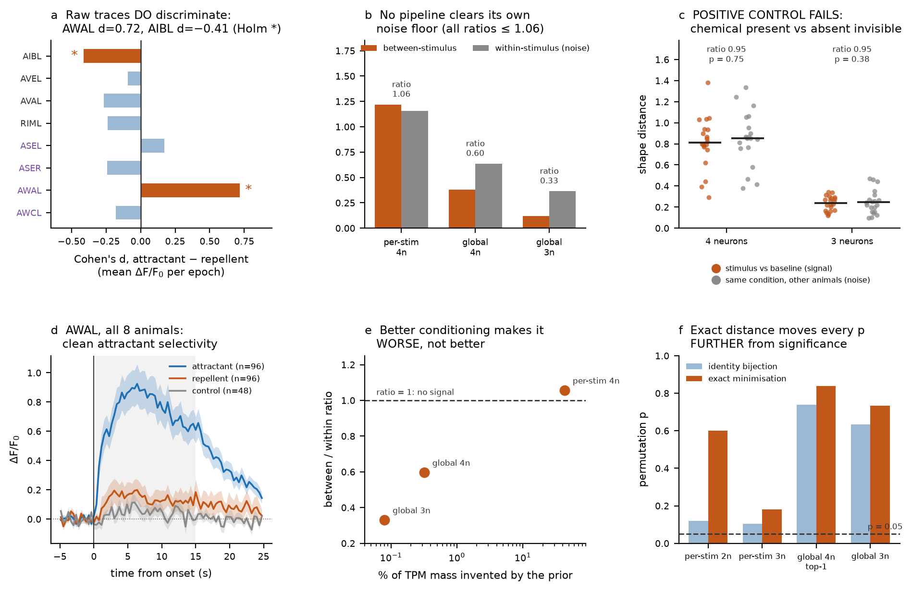

Raw-trace class discrimination per neuron (a); signal-to-noise for the three Φ
pipelines (b); **the positive control (c)** — the panel that carries the result;
AWAL's attractant selectivity (d); conditioning against signal-to-noise (e); and
what the exact minimisation costs in *p* (f).
[Vector PDF](figures/fig22_control_and_snr.pdf)

### What this means for the project

The Φ-structure distance is sound — metric properties verified, higher-order
relations handled natively, exact where computable. What these data cannot do is
exercise it. Read as a **methods contribution** the repository is complete: it
delivers a defensible distance between IIT 4.0 Φ-structures, demonstrates that
scalar and pairwise measures are blind to content it sees, and quantifies the
data volume it requires — roughly, more than 8 animals × 30 presentations of
15 s at 2.7 Hz on 4 binarized neurons can supply.

## Repository layout

```
notebooks/     01–15 as both .ipynb (Colab) and .py (paired via jupytext)
src/
  gold_standard.py    THE DISTANCE — exact min-over-bijections, verified
  ces_hypergraph.py   data loading, TPM construction, PyPhi extraction
figures/       fig01–fig42 as vector PDF + preview PNG
results/       TPMs, extracted hypergraphs (JSON), distance matrices,
               permutation tests, stability/precision audits (CSV)
data/          downloaded recordings (gitignored)
```

## Reproducibility

* PyPhi is pinned to commit **`b78d0e3`** on the `feature/iit-4.0` branch for
  notebooks 01–04 and 06–15; notebook 05 uses the `2.0` branch. Each notebook
  installs what it needs.
* Figures are vector PDF with editable text (`pdf.fonttype = 42`).
* Every numeric claim in this README is recomputed from the committed notebooks
  before being written here.
* **macOS/Apple Silicon note:** the `graphillion` wheel the pinned branch
  depends on is linked against Homebrew GCC's `libgomp`. If `import pyphi` fails
  with a `libgomp.1.dylib` error, rebuild from source — `CC=clang CXX=clang++
  pip install --no-binary :all: --force-reinstall graphillion` — which drops
  OpenMP cleanly. Colab and Linux are unaffected. PyPhi 2.0 drops this
  dependency entirely.

## Where to start reading

| you want to… | go to |
|---|---|
| the current state in one screen | [If you read nothing else](#if-you-read-nothing-else) |
| the project's decision rule | the guide star, top of this README |
| see the raw neural responses | [The data: response time courses](#the-data-response-time-courses) / [`notebooks/09`](notebooks/09_raw_trace_responses.ipynb) |
| the settled preprocessing (20 s high-pass) | [How fast should the high-pass window be?](#how-fast-should-the-high-pass-window-be) / [`notebooks/11`](notebooks/11_timecourses_and_binarization.ipynb) |
| **the positive Φ-level result** (offset dip) | [Φ as a time series](#φ-as-a-time-series) / [`notebooks/12`](notebooks/12_phi_timeseries.ipynb) |
| which state is "stimulus", which "no stimulus" | [Naming the states](#naming-the-states-which-is-stimulus-which-is-no-stimulus) / [`notebooks/14`](notebooks/14_state_identification.ipynb) |
| the structure comparison and the noise floor | [The structure comparison](#the-structure-comparison-and-what-noise-floor-means) / [`notebooks/15`](notebooks/15_structure_comparison.ipynb) |
| understand the distance | [The distance algorithm](#the-distance-algorithm) |
| use the distance | [`src/gold_standard.py`](src/gold_standard.py) |
| see one comparison drawn step by step | [`notebooks/05`](notebooks/05_pyphi2_example.ipynb) |
| the original class comparison and every dead end | [The road here](#the-road-here--what-we-tried-and-what-it-taught-us) |
| reproduce every figure | `notebooks/01` → … → `15` |

## Sources

* IIT 4.0: Albantakis et al. (2023), *PLOS Comput Biol* 19(10): e1011465
* PyPhi: Mayner et al. (2018), *PLOS Comput Biol* 14(7): e1006343
* Data: [chemosensory-data.worm.world](https://chemosensory-data.worm.world/index.html)
* Preprocessing conventions and the argmax-φ_s prescription for τ: *Applying IIT
  to Your Data* (Maier & Ikeda), and the reference Colab notebook it accompanies
* Functional connectivity: [funconn.princeton.edu](https://funconn.princeton.edu/)

* Cook, S. J. *et al.* (2019). Whole-animal connectomes of both *Caenorhabditis
  elegans* sexes. *Nature* 571, 63–71. (Synapse counts via OpenWorm `c302`,
  `herm_full_edgelist.csv`.)
* Randi, F., Sharma, A. K., Dvali, S. & Leifer, A. M. (2023). Neural signal
  propagation atlas of *Caenorhabditis elegans*. *Nature* 623, 406–414. (Scalar
  functional amplitudes from `leiferlab/worm-functional-connectivity`,
  wild-type atlas.)
