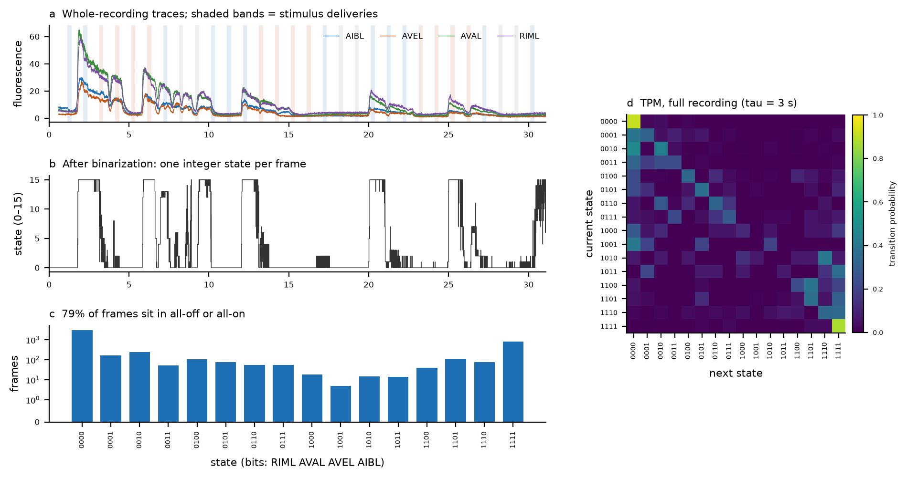
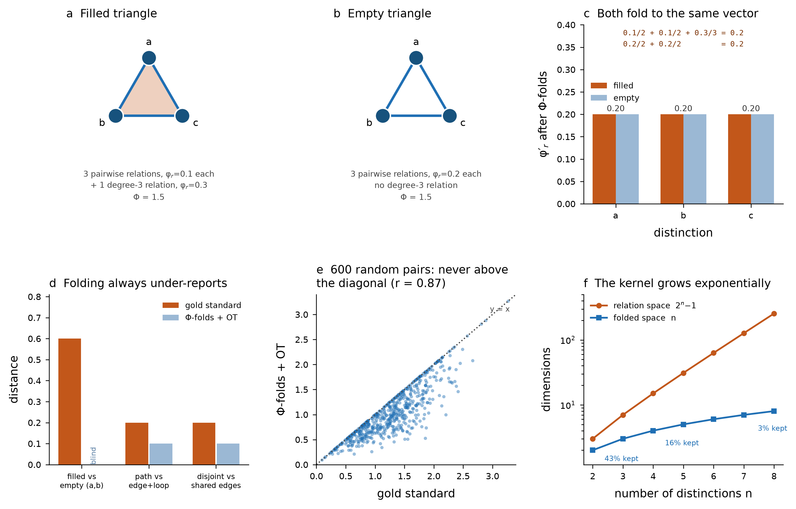

# Comparing IIT 4.0 Φ-structures across chemosensory stimuli in *C. elegans*

**The question.** *C. elegans* responds to some chemicals by approaching them
(attractants) and others by avoiding them (repellents). If we compute the IIT
4.0 **Φ-structure** of a small neural circuit during each response, are the
Φ-structures for attractants more similar to each other than those for
repellents?

**The obstacle.** A Φ-structure is not a graph. It is closer to a **weighted
hypergraph**: its "edges" (relations) can join three, four, or more distinctions
at once. Standard graph-similarity measures cannot see that higher-order
content, so *measuring the distance between two Φ-structures* is the core
methodological problem — and the reason this repository exists.

**The answer we use** is an exact, brute-force distance: try every way of
matching the distinctions of one structure onto the other, score each matching,
and keep the smallest score. It is defined in full in
[The distance algorithm](#the-distance-algorithm) below and implemented in
[`src/gold_standard.py`](src/gold_standard.py).

**Status.** The distance algorithm is settled, implemented, and verified against
the project's formal write-up. The pipeline is audited and reproducible, and
**the attractant-vs-repellent comparison has now been run**
([`notebooks/06`](notebooks/06_celegans_pooled.ipynb)): both blockers were
resolved by dropping the connectivity matrix and pooling epochs across animals.
**The hypothesis is not supported** — attractant Φ-structures are not more
similar to each other than repellent ones, the sign of the effect is not stable
across neuron sets, and the design is underpowered for the contrast. Details
under [The result](#the-result).

---

## If you read nothing else

| | |
|---|---|
| **Goal** | Test whether attractant Φ-structures resemble each other more than repellent ones do |
| **Distance** | Exact minimum over all bijections between distinctions ("gold standard") |
| **Why not simpler** | \|ΔΦ\| is a scalar and collapses distinct structures; a pairwise-only representation cannot see relations that join >2 distinctions |
| **Cost** | *n*! where *n* = number of distinctions. Practical to *n* ≈ 9. Real worm structures have 3 → trivial |
| **Blocker** | One stimulus epoch supplies 120 frames for a 256-parameter TPM; ~5 of 16 states are visited |
| **Result** | Not supported. Interneurons p = 0.38 (wrong direction), sensory p = 0.72; sign flips between neuron sets |
| **Why** | 4 stimuli per class = 6 within-class pairs; the permutation null is as wide as the effect |

---

## Quick start

Every notebook runs top-to-bottom in Google Colab with no setup. Click a badge,
then `Runtime > Run all`.

| Notebook | What it establishes | Colab |
|---|---|---|
| **01 — Data and TPM** | Loads the imaging data, reproduces the original binarization and transition matrix, and measures the per-stimulus data budget | [](https://colab.research.google.com/github/maierav/iit4-celegans-phi-structure/blob/main/notebooks/01_data_and_tpm.ipynb) |
| **02 — Φ-structure** | Unfolds the Φ-structure in PyPhi, diagnoses the connectivity defect that zeroes φ_s, extracts the hypergraph | [](https://colab.research.google.com/github/maierav/iit4-celegans-phi-structure/blob/main/notebooks/02_phi_structure.ipynb) |
| **03 — Similarity** | Scores the exact distance against cases with known answers, alongside the two measures tried earlier; measures how it scales | [](https://colab.research.google.com/github/maierav/iit4-celegans-phi-structure/blob/main/notebooks/03_similarity.ipynb) |
| **04 — Toy examples** | Unfolds nine real Φ-structures from 3-unit networks (relations up to degree 4) and exercises the distance on them | [](https://colab.research.google.com/github/maierav/iit4-celegans-phi-structure/blob/main/notebooks/04_toy_examples.ipynb) |
| **05 — PyPhi 2.0 example** | One comparison end to end on **PyPhi 2.0**: two structures built from update rules, all 24 mappings drawn, the cost broken down term by term | [](https://colab.research.google.com/github/maierav/iit4-celegans-phi-structure/blob/main/notebooks/05_pyphi2_example.ipynb) |
| **06 — The *C. elegans* comparison** | **The headline analysis.** Pooled per-stimulus TPMs, no connectivity matrix, ten Φ-structures, permutation test on the attractant-vs-repellent contrast | [](https://colab.research.google.com/github/maierav/iit4-celegans-phi-structure/blob/main/notebooks/06_celegans_pooled.ipynb) |

Locally:

```bash
git clone https://github.com/maierav/iit4-celegans-phi-structure.git
cd iit4-celegans-phi-structure
pip install -r requirements.txt
python notebooks/01_data_and_tpm.py    # or open the .ipynb
```

Every figure below is regenerated by these notebooks. Vector PDFs are in
[`figures/`](figures); the PNGs shown here are for GitHub preview only.

---

## Background in five definitions

If you are new to IIT, this is enough to read the rest.

* **TPM (transition probability matrix).** The probability of the system moving
  from each state to each other state. With 4 binary neurons there are
  2⁴ = 16 states, so the TPM is 16×16 = **256 numbers to estimate from data**.
* **Distinction.** A subset of units (a *mechanism*) that specifies a cause and
  an effect over some set of units (its *purviews*), with integrated information
  **φ_d**. Think: "this group of neurons, in this state, makes a difference."
  Note a distinction has **two** purviews — one on the cause side, one on the
  effect side.
* **Relation.** An irreducible overlap between the purviews of a *set* of
  distinctions, with integrated information **φ_r**. A relation over *k*
  distinctions is a **degree-*k* relation**. A **self-relation** is the overlap
  between a single distinction's own cause and effect purviews (*k* = 1).
* **Φ-structure** (also *cause–effect structure*, CES). All distinctions plus
  all relations. **Φ = Σφ_d + Σφ_r.**
* **Why it is a hypergraph.** A degree-2 relation is an ordinary edge. Degree-3
  and higher relations bind three or more distinctions *at once* and cannot be
  decomposed into pairwise edges without loss. Most Φ-structure plots draw only
  distinctions and pairwise relations, but the object itself is
  higher-dimensional.

### One relation per set of distinctions

Worth stating explicitly, because it makes the algorithm below much simpler than
it first appears, and because it is easy to get wrong from PyPhi's output.

In PyPhi, `Relation` is a `frozenset` **of distinctions** carrying a single
`phi` value, and relations are enumerated one per *combination* of distinctions
(`pyphi/relations.py`, `all_relations`). So:

> **A set of distinctions has at most one relation, with exactly one φ_r.**

PyPhi additionally exposes **faces**, an internal enumeration over the
cause/effect *sides* of each distinction. One relation can have several faces —
but every face inherits its parent's φ (`RelationFace(mice, phi=self.phi)`), so
faces carry **no independent information**. Verified empirically over 2,996
relations across 416 states of random 2- and 3-node networks: zero cases of one
distinction-set carrying two relations, and zero cases of faces within a
relation differing in φ.

**Consequence:** index φ_r by the set of distinctions, and sum φ_r over
*relations*, not faces. Only that choice satisfies Φ = Σφ_d + Σφ_r. In the worm
structure below, summing over relations gives 0.36776 and reproduces
Φ = 0.73917 exactly; summing over faces gives 0.38447 and does not.

---

## The distance algorithm

This is the heart of the project. It is called the **gold standard** (or
"brute force") because it evaluates the definition directly, with no
approximation.

### The idea in one paragraph

Two Φ-structures have no shared labels — there is no *a priori* reason distinction
`a` in one corresponds to distinction `p` in the other. So we try **every
possible pairing**. For a given pairing, the cost is just a sum of absolute
differences: every matched distinction contributes |φ_d − φ_d′|, every matched
relation contributes |φ_r − φ_r′|, and anything left unmatched contributes its
full φ (i.e. it is compared against zero). The distance is the **smallest cost
over all pairings**.

### Formally

A Φ-structure is a pair **S = (φ_d, φ_r)**:

```
φ_d : {distinction        -> φ_d value}
φ_r : {set of distinctions -> φ_r value}      # a set of size 1 = self-relation
```

Let *M* be a bijection between the distinctions of S₁ and those of S₂. If the
structures have different numbers of distinctions, the smaller side is padded
with **null distinctions** carrying φ_d = 0 and no relations, so *M* is always a
bijection. Write *M(S)* = { *M(a)* : *a* ∈ *S* } for the induced image of a set.

$$
D(S_1, S_2; M) \;=\; \underbrace{\sum_{a} \bigl| \varphi_d^{1}(a) - \varphi_d^{2}(M(a)) \bigr|}_{\text{distinctions}}
\;+\; \underbrace{\sum_{S \in \varphi_r^{1}} \bigl| \varphi_r^{1}(S) - \varphi_r^{2}(M(S)) \bigr|}_{\text{relations of } S_1}
\;+\; \underbrace{\sum_{\substack{T \in \varphi_r^{2} \\ M^{-1}(T) \notin \varphi_r^{1}}} \varphi_r^{2}(T)}_{\text{unmatched relations of } S_2}
$$

$$
\boxed{\;D(S_1, S_2) \;=\; \min_{M} \; D(S_1, S_2; M)\;}
$$

Missing entries read as zero, so the third term is really just
|0 − φ_r²(T)| — "unmatched structure is charged in full" is not a separate rule,
it is the same rule applied against an absent partner.

### Higher-order relations need no special handling

Worth stating plainly, because the project's slide deck spends two slides on a
construction (**Φ-folds**) that flattens the hypergraph — and that construction
is **not** part of this algorithm.

A relation of any degree is one key in `φ_r`. The cost function never inspects a
key's size; it relabels the key through the bijection and subtracts. Degree 2
and degree 7 go through the same line of code. Perturbing one relation by +0.01
moves the distance by exactly 0.01 **at every degree**:

| degree of perturbed relation | 1 | 2 | 3 | 4 | 5 |
|---|---|---|---|---|---|
| resulting distance | 0.01 | 0.01 | 0.01 | 0.01 | 0.01 |

Φ-folds belongs to the *optimal-transport* route, not here. OT needs a flat
vector per distinction, so the hypergraph has to be collapsed before it can be
consumed; that collapse is lossy (see
[Scaling beyond the exact distance](#scaling-beyond-the-exact-distance)). The
exact distance never collapses anything, so it pays no such price.

The measure is also **exactly as discriminating as isomorphism**:
*d*(X, Y) = 0 if and only if X and Y are identical after some relabelling of
distinctions. Checked against an independent brute-force isomorphism test over
400 random pairs — no false identities, no false differences. Two structures
whose degree-3 relations overlap in two distinctions versus one are correctly
separated (0.2); two that differ only by a relabelling correctly score 0.

### The one property that makes this structural

**The relation mapping is not free — it is induced by the distinction mapping.**
Once *M* pairs the distinctions, relation {a, b} *must* be compared against
relation {M(a), M(b)}, whatever φ_r happens to sit there. Relations are never
matched to each other independently.

This is what makes *D* a distance between **structures** rather than between two
bags of numbers. Counter-example, computed with this repo's code:

| structure | shape | φ_d values | φ_r values |
|---|---|---|---|
| X | path a—b—c | 0.3, 0.3, 0.3 | 0.10, 0.10 |
| W | edge p—q + self-loop on p | 0.3, 0.3, 0.3 | 0.10, 0.10 |

Identical multisets of φ values, genuinely different topology. Matching
relations independently (best-to-best) returns **0.0** — "identical". The gold
standard returns **0.2**. Conversely, structures that really are isomorphic
(a path relabelled) correctly return **0.0**.

### Worked example

The Case-2 example from the project slides, with every term shown:


Str1 has 2 distinctions, a pairwise relation {a,b}, and a self-relation {b}.
Str2 has 2 distinctions and a self-relation {p}. With 2 distinctions there are
2! = 2 bijections:

| term | M1 (a→p, b→q) | M2 (a→q, b→p) |
|---|---|---|
| distinctions | \|0.30−0.28\| = 0.02 | \|0.30−0.05\| = 0.25 |
| | \|0.20−0.05\| = 0.15 | \|0.20−0.28\| = 0.08 |
| relation {a,b} | \|0.12−0\| = 0.12 | \|0.12−0\| = 0.12 |
| relation {b} | \|0.07−0\| = 0.07 | \|0.07−0.09\| = 0.02 |
| unmatched in Str2 | 0.09 (self-relation {p}) | — |
| **total** | **0.45  ← minimum** | 0.47 |

**D(Str1, Str2) = 0.45.** Note M2 matches the self-relation almost perfectly
(0.02) and still loses: the minimum is over the *total*, so the terms cannot be
optimised separately. [Vector PDF](figures/fig07_algorithm.pdf)

### Cost, and when it stops being practical

The search is over bijections between **distinctions** — *n*! where
*n* = max(N_dist₁, N_dist₂). It is **not** over 2ⁿ mechanisms, and not over
relations: relations come along free once *M* is fixed. Measured, single-core,
pure Python:

| N_dist | bijections | time (one distance) |
|---|---|---|
| 3 | 6 | <0.001 s |
| 4 | 24 | 0.0002 s |
| 6 | 720 | 0.013 s |
| 8 | 40,320 | 1.7 s |
| 9 | 362,880 | 22 s |
| 10 | 3.6 M | ~8 min |
| 12 | 479 M | ~18 h |

Measured single-core in pure Python by `notebooks/03`; the last two rows are
extrapolated. Practical ceiling: *n* ≈ 9 for a single distance, *n* ≈ 8 for a
full pairwise matrix. **The real *C. elegans* structures have 3 distinctions
(3! = 6), so the exact distance is instant** — no approximation needed here.

The factorial search cannot be replaced by optimal assignment. Assignment is
exact only for a cost that is **linear** in the pairing, and the relation term
is not: relation {a, b} is scored against {M(a), M(b)}, so its contribution
depends on two assignment decisions at once. Measured over 400 random pairs,
Hungarian on the distinction term alone overshoots the exact distance in **50%**
of cases (mean excess 0.27, max 1.11).

For larger systems, the project's optimal-transport work brackets the exact
value: *d*<sub>OT</sub> ≤ *d*<sub>exact</sub> ≤ Δ<sub>μ*</sub>, with both bounds
cheap to compute. This repo implements the exact distance only.

### Verified properties

Empirical, not proofs — checked under both plain and degree-tagged relation
keys:

| property | result |
|---|---|
| identity, *D*(X, X) = 0 | exact, 50/50 |
| symmetry, \|*D*(X,Y) − *D*(Y,X)\| | 0 violations / 200 random pairs |
| triangle inequality | 0 violations / 200 random triples (median slack −1.57) |

The stronger property *D*(X, Y) = 0 **iff** X and Y are isomorphic is verified
under [Higher-order relations need no special handling](#higher-order-relations-need-no-special-handling)
above.

### Using it

```python
from src.gold_standard import gold_standard_distance, phi_of

# a Φ-structure: (φ_d by distinction, φ_r by SET of distinctions)
S1 = ({"a": 0.30, "b": 0.20},
      {frozenset({"a", "b"}): 0.12, frozenset({"b"}): 0.07})
S2 = ({"p": 0.28, "q": 0.05},
      {frozenset({"p"}): 0.09})

gold_standard_distance(S1, S2)                       # -> 0.44999999999999996
gold_standard_distance(S1, S2, return_mapping=True)  # -> (0.45, {'a': 'p', 'b': 'q'})
phi_of(S1)                                           # -> 0.69  (Σφ_d + Σφ_r)
```

(The distance is a sum of floats, so expect the usual binary-float tail; round
for display.)

Guard against a runaway search with `budget=`, or check first with
`is_feasible(S1, S2)` / `n_permutations(S1, S2)`.

---

## The data

Whole-brain NeuroPAL imaging from
[chemosensory-data.worm.world](https://chemosensory-data.worm.world/index.html)
— 189 identified neurons per animal, 4979 frames at ~2.667 Hz (31 minutes),
with 10 chemical stimuli each delivered 3 times.

| | |
|---|---|
| **Attractants** | 100 mM NaCl, 10⁻² IAA, 10⁻⁶ IAA, OP50 (bacterial food) |
| **Repellents** | 450 mM NaCl, 1 µM ascr#3, 10 mM CuSO₄, 800 mM sorbitol |
| **Controls** | buffer, fluorescein |

This repo uses 8 hermaphrodite recordings; 22 hermaphrodite and 25 male
recordings exist.

### Figure 1 — the raw material



Fluorescence traces for the four analyzed neurons with stimulus deliveries
shaded (a); the binarized 16-state series (b); state occupancy (c); and the
resulting transition matrix (d). Panel (c) is the first warning sign: **79% of
all frames sit in just two states** (all-off or all-on), so most of the 16×16
TPM is estimated from very few observations.
[Vector PDF](figures/fig01_traces_and_tpm.pdf)

---

## Finding 1 — the per-stimulus data budget is the binding constraint

The project needs a Φ-structure **per stimulus**, which means a TPM built from
that stimulus's frames alone. The arithmetic:

| | |
|---|---|
| Parameters in a 4-neuron TPM | **256** |
| Frames available per stimulus (3 repeats × ~15 s) | **120** |
| Distinct states actually visited per epoch, mean of 16 | **~5** |

### Figure 2 — the sampling problem


Each dot in (a) is one stimulus epoch in one recording (8 recordings × 10
stimuli). No epoch comes close to visiting all 16 states. Panel (b) contrasts
full-recording occupancy against a single stimulus. Panel (c) is the decisive
diagnostic: **the two control conditions score *higher* than every attractant**.
If state-space coverage tracked stimulus salience, controls should be at the
bottom. That ordering is what noise looks like, not biology.
[Vector PDF](figures/fig02_epoch_budget.pdf)

**Consequence.** Any per-stimulus Φ-structure built from a single epoch is
mostly an artifact of which states happened not to occur. This is why the
attractant-vs-repellent comparison cannot yet be run honestly.

**The fix.** Pool epochs of the same stimulus *class* across all recordings:
8 recordings × 4 stimuli = **32 epochs per class** (96 individual presentations,
since each epoch pools 3 repeats), **3840 frames** — about **15 frames per TPM
parameter** instead of 0.5. This trades per-animal resolution for a TPM that can
be trusted. Notebook 01 prints the pooled budget per class.

---

## Finding 2 — the published Φ values do not mean what they appear to mean

PyPhi requires the system graph to be **strongly connected** (every unit
reachable from every other). If it is not, PyPhi short-circuits: it returns a
`NullSystemIrreducibilityAnalysis`, reason `NO_STRONG_CONNECTIVITY`, and
system-level φ_s = 0 — while still printing a nonzero Φ summed over
distinctions and relations it computed anyway.

The connectivity matrix in the original pipeline has **AIBL as a sink** (no
outgoing edges), so this short-circuit fires. Reproduced exactly:

| Connectivity | Strongly connected | Φ reported | System analysis | φ_s |
|---|---|---|---|---|
| As published | ✗ | 0.37367 | `NullSystemIrreducibilityAnalysis` | 0.0 |
| CM derived from the stated table | ✗ | 0.15836 | `NullSystemIrreducibilityAnalysis` | 0.0 |
| Minimal strongly connected repair | ✓ | 0.10612 | `SystemIrreducibilityAnalysis` | −0.00057 |
| No connectivity constraint (all-to-all) | ✓ | 0.73917 | `SystemIrreducibilityAnalysis` | −0.03917 |

There is a second, independent issue. The **binary** matrix handed to PyPhi
asserts an **AVEL → RIML** connection that the notebook's own stated table does
not contain. (The `pd.DataFrame` built from a dict of columns does *not*
introduce a transposition — read as rows=source/cols=target it reproduces the
table edge-for-edge; notebook 02 checks this explicitly.) That spurious edge is
what separates the first two rows of the table above. Removing it does not
rescue the computation: AIBL is a sink either way.

### Figure 3 — the connectivity defect


As published (a), the matrix derived from the stated connectivity table (b),
and a minimal repair that closes the cycles (c). In (b) the graph still splits
into three strongly connected components: `{AIBL}`, `{AVAL, AVEL}`, `{RIML}`.
[Vector PDF](figures/fig03_connectivity.pdf)

---

## Finding 3 — the Φ-structure really is higher-order

Unfolding the Φ-structure from real data (all-to-all connectivity, the only
variant here that yields an irreducible system) gives Φ = 0.73917 from
**3 distinctions and 5 relations**:

| relation (set of distinctions) | degree | φ_r |
|---|---|---|
| {AIBL} — self-relation | 1 | 0.35847 |
| {AIBL, AIBL·AVAL} | 2 | 0.00553 |
| {AIBL·AVAL, AIBL·AVEL} | 2 | 0.00188 |
| {AIBL, AIBL·AVEL} | 2 | 0.00094 |
| **{AIBL, AIBL·AVAL, AIBL·AVEL}** | **3** | **0.00094** |

Σφ_d = 0.37141, Σφ_r = 0.36776, Φ = 0.73917 exactly.

Two of the five relations have **no pairwise equivalent**: the degree-3 relation
(it binds all three distinctions at once) and the self-relation (it has only one
distinction to sit on). A representation keyed by ordered *pairs* of
distinctions can store neither. Because the self-relation is by far the largest
single contribution in the structure — 0.358, roughly half of Φ — those two
carry **0.359 of the 0.368 total φ_r, or 98% of the relational mass**.

### Figure 4 — the hypergraph, and what a pairwise view loses


The Φ-structure drawn at the **relation** level (a): node area ∝ φ_d, blue lines
are pairwise relations, the orange loop is the self-relation on AIBL and the
orange fill is the degree-3 relation. Relations by degree (b). What a pairwise
keying can and cannot hold (c).
[Vector PDF](figures/fig04_phi_structure.pdf)

---

## Finding 4 — why the two earlier measures were abandoned

Before the gold standard, two measures were tried. Both are tested here against
cases where the correct answer is known.

| Measure | Representation |
|---|---|
| \|ΔΦ\| | a single scalar |
| pairwise-only | discard every relation that is not degree 2, then match exactly |
| **gold standard** | every relation, at every degree (the algorithm above) |

Reported distance on each test — **0.0 means the measure cannot tell the two
structures apart**:

| Test | \|ΔΦ\| | pairwise-only | gold standard |
|---|---|---|---|
| Same Φ, different content | **0.0** | 0.4 | 0.4 |
| One extra degree-3 relation | 0.1 | **0.0** | 0.1 |
| Degree-2 → degree-3, Φ preserved | **0.0** | 0.1 | 0.2 |

Recomputed at the relation level by `notebooks/03`; the numbers live in
[`results/measure_comparison.csv`](results/measure_comparison.csv).

* **Measure 1 is blind whenever Φ is preserved.** Not hypothetical: the project's
  own toy models produced two 5-unit structures with *exactly* equal Φ
  (2.1779535637765157) and 10 distinctions each, differing in which units
  carried them.
* **A pairwise-only representation is blind to higher-order structure by
  construction.** Keying relations by ordered *pairs* leaves nowhere to put a
  relation binding three distinctions — nor a self-relation. On the real worm
  structure that discards 2 of 5 relations and 98% of the φ_r mass.
* **Both were tried before the gold standard and are kept only for comparison.**
  `src/ces_hypergraph.py` retains them so `notebooks/03` can reproduce the tests
  above; nothing in the analysis path uses them.

### Figure 5 — where each measure breaks


Reported distance per test (a) — bars marked "blind" are exactly zero. The real
worm structure counted in relations (b), and the φ_r mass by relation degree
(c): the self-relation alone carries 97% of it.
[Vector PDF](figures/fig05_measure_failures.pdf)

### Figure 6 — how the exact distance scales


Bijections searched as a function of the distinction count (a) and the measured
runtime of one exact distance (b). The real worm structures sit at *n* = 3.
[Vector PDF](figures/fig06_scaling.pdf)

---

## Scaling beyond the exact distance

The gold standard is exact but factorial, so for systems larger than ~9
distinctions it must be replaced by an estimate. The project's parallel line of
work does this with **optimal transport**, which brackets the exact value:

$$d_{\mathrm{OT}} \;\le\; d_{\mathrm{exact}} \;\le\; \Delta_{\mu^*}$$

Both bounds are cheap even when the exact search is intractable.

That approach folds each relation's φ_r onto its participating distinctions
(**Φ-folds**: divide φ_r by the number of distinctions the relation joins, add
each share to those distinctions) so the hypergraph becomes a flat vector OT can
consume. The relation set is then discarded — after folding, a structure is just
n points (φ_d, φ′_r), which is why OT applies and why the exact distance does
not need this step.

**Two versions of Φ-folds exist, and the difference matters.**

* The **slide-deck version** folds each φ_r into a *single* scalar per
  distinction. This is degenerate: a filled triangle (three pairwise relations
  at 0.1 plus a degree-3 relation at 0.3) and an empty triangle (three pairwise
  at 0.2) fold to the *identical* vector — distance 0 where the exact distance
  gives 0.6. Solving symbolically, folds coincide whenever each pairwise φ_r in
  the empty structure equals `e + t/3`; the ÷3 on the triple cancels the
  pairwise deficit exactly. Every member of that family also has identical Φ,
  so |ΔΦ| is blind to it too.
* The **manuscript version (Eq 40–43)** folds **separately for each relation
  degree k**, giving a vector of per-degree contributions rather than one
  scalar. This resolves the degeneracy: the same filled/empty pair scores
  **0.6000**, matching the exact distance.

Only the manuscript version should be used. Two further properties measured
over 800 random pairs, both consistent with the manuscript:

* It is a genuine **lower bound** — never above the exact distance — and it is
  remarkably tight: **74.8% of pairs agree exactly**, r = 0.991, mean ratio
  0.973.
* Residual loss comes from discarding *which* distinctions a relation joins.
  Two structures whose relations are all degree ≤ 2 — two disjoint edges versus
  two edges sharing a vertex — are separated by the exact distance but can be
  under-reported by any fold. Recovering that would need Gromov–Wasserstein.

### Figure 8 — the scalar fold, and why it fails



Diagnostics for the **scalar** (slide-deck) fold. The filled and empty triangle
(a, b) collapse to the same vector (c); folding under-reports on higher-order
*and* purely pairwise differences (d); it never exceeds the exact distance (e);
and its kernel grows exponentially with the number of distinctions (f).
[Vector PDF](figures/fig08_phi_folds.pdf)

### Figure 9 — the manuscript's per-degree fold fixes it


Per-degree folding scores the filled/empty pair correctly (a). Across 800 random
pairs the manuscript's OT is exact on 75% and never exceeds the exact distance
(b). Panel (c) documents an equation-level typo — see below.
[Vector PDF](figures/fig09_writeup_check.pdf)

### One equation to amend

Eq 38 writes the relation term as a sum over *r* ∈ R₁ only. Read literally that
makes the distance **asymmetric** — 285 of 300 random pairs — because relations
present in R₂ with no preimage in R₁ are never charged. It also contradicts the
manuscript's own worked examples: Example 1 charges |φ_r − φ′_r| when one side
has no relation, and Eq 10 explicitly includes φ_r⁽²⁾(p). The examples use the
**union** R₁ ∪ μ⁻¹(R₂), which is what `src/gold_standard.py` implements and what
reproduces Eq 10's value of 0.4500 exactly.

**This repository implements the exact distance only** — for the *C. elegans*
structures (3 distinctions) no approximation is needed.

## The result

Run in [`notebooks/06`](notebooks/06_celegans_pooled.ipynb). Two changes made
the analysis possible, both of them deliberate trade-offs.

**No connectivity matrix.** PyPhi is given the TPM alone and assumes full
connectivity. This sidesteps the sink-node defect that previously forced
`NullSystemIrreducibilityAnalysis` and φ_s = 0. Φ is now well defined for every
stimulus. The cost is that the structures no longer encode anatomical
constraint — that is a modelling choice to revisit, not a bug.

**Epochs pooled across animals.** Each stimulus gets one TPM built from all 8
recordings × 3 repeats = **24 epochs, 960 frames**.

### Why pooling was necessary — and what it assumes

A 4-unit system has a 16 × 16 TPM: **256 parameters**. One stimulus epoch in one
animal supplies 3 repeats × ~40 samples = **120 frames**, or 0.47 frames per
parameter, and visits a mean of **5.0 of 16 states** — with *controls* scoring
higher (6.1) than attractants (4.7), the signature of noise rather than biology.
Any per-stimulus Φ-structure built that way is mostly an artefact of states
never observed.

Pooling raises this to 3.75 frames per parameter and **11–16 of 16 states
visited** (mean 13.4).

What it assumes is that the 8 animals are interchangeable replicates of one
system. They are isogenic hermaphrodites imaged under one protocol, which is the
strongest available version of that assumption — but it is still an assumption.
It discards genuine between-animal variation, cannot be checked from within the
pooled data, and **removes the within-class variance estimate that repeated
animals would have provided**: the only replication left is across the 4 stimuli
in each class. This is a stopgap that makes the question computable, not a
solution.

### On the distance used here

All ten pooled structures have **14–15 distinctions**. The exact search is 15! =
1.3 × 10¹² bijections — far past the n ≈ 9 ceiling.

It is not needed. Every structure is built over the **same four neurons**, so a
distinction labelled `AIBL·AVEL` denotes the same mechanism in all ten. The
correspondence is given by the data rather than searched for, and the identity
mapping is exactly the term the exact distance would evaluate. What is given up
is the guarantee that no *other* mapping scores lower — a guarantee that only
matters when comparing structures on different substrates.

Φ spans 92 to 734 across stimuli, so distances are also reported after scaling
each structure to unit Φ, which compares **shape** independent of magnitude.
Raw distance correlates with |ΔΦ| at r = 0.745; shape distance at r = 0.550.

### The answer


**The hypothesis is not supported.**

| neuron set | within-attractant | within-repellent | difference | p |
|---|---|---|---|---|
| interneurons (AIBL/AVEL/AVAL/RIML) | 1.335 | 1.167 | **+0.168** | 0.38 |
| sensory (ASEL/ASER/AWAL/AWCL) | 1.497 | 1.579 | **−0.083** | 0.72 |

The hypothesis predicts a *negative* difference. In the interneurons the effect
runs the wrong way and is not significant; in the sensory neurons it runs the
predicted way but is further still from significance. **The sign is not stable
between neuron sets**, and it is not stable within one either — dropping any
single stimulus moves the interneuron contrast between +0.02 and +0.29.

Φ itself does not separate the classes: it varies eight-fold across stimuli,
with OP50 (attractant, Φ = 734) and Control (Φ = 494) at the top.

**This is a null result, not evidence of absence.** Four stimuli per class give
six within-class pairs, and the permutation null has a standard deviation
comparable to the observed effect — only a very large effect could have reached
significance. The design is underpowered for this contrast.

### What would raise the power

1. **More stimuli per class.** The binding constraint is 4 stimuli, not 8 animals. Six to eight per class would roughly double the within-class pairs.
2. **Per-animal structures.** Pooling was forced by state coverage. Longer recordings, or a binarization that visits more states per epoch, would allow one structure per animal per stimulus — restoring a real within-class variance estimate and a far larger permutation space.
3. **A deliberately chosen state.** Every pooled TPM is evaluated at its most-occupied state, which is all-off for all ten stimuli. A state reflecting the *response* rather than the baseline may separate classes better.

---

## Worked examples on real Φ-structures

`notebooks/04` unfolds nine Φ-structures with PyPhi from five 3-unit networks
(AND-OR-XOR, all-XOR, all-AND, all-OR, majority) and runs the distance on them.
Nothing here is a hand-written dictionary of φ values.

**Higher-order relations are common, not exotic.** 10 of the 25 states surveyed
contain a relation of degree ≥ 3, and degree-4 relations appear throughout.
Across the nine structures used: 217 relations, of which **86 are degree > 2**
and **126 have no pairwise form** at all (degree 1 or > 2).

Two controlled perturbations isolate higher-order content. `all-XOR[000]` has
4 distinctions and 15 relations, exactly one of degree 4 (φ_r = 0.5):

| test | \|ΔΦ\| | pairwise-only | gold standard |
|---|---|---|---|
| **A** delete the degree-4 relation | 0.5 | **0.0** | 0.5 |
| **B** move its φ_r to a degree-2 relation (Φ preserved) | **0.0** | 0.5 | 1.0 |
| **C** all-XOR[000] vs all-XOR[101] | 2.5 | 0.375 | 2.5 |
| **D** all-XOR[000] vs all-XOR[011] — *isomorphic* | 0.0 | 0.0 | **0.0** |
| **E** AND-OR-XOR[101] vs [111] | 0.223 | 1.703 | 3.129 |

Test **A** is the clean demonstration: a pairwise-only representation has
nowhere to store a degree-4 relation, so deleting it changes nothing it can see.
Test **B** is sharper still — the same φ_r is *moved* from degree 4 to degree 2,
so Φ is unchanged and |ΔΦ| reports 0, while the exact distance charges the loss
at one degree and the gain at the other. Test **D** is a genuine isomorphism and
correctly scores 0.

Over the full 9 × 9 matrix (largest structure has 7 distinctions, 5040
bijections per pair, 2.8 s total): the diagonal is zero, the matrix is
symmetric, the triangle inequality holds on all **729** ordered triples, and
**every** off-diagonal zero was confirmed a genuine isomorphism by an
independent brute-force test. The bounds |ΔΦ| ≤ *D* ≤ Φ₁ + Φ₂ hold on every
pair.

### A single comparison, end to end on PyPhi 2.0

`notebooks/05` does one comparison completely from scratch: two update rules in,
one distance out, with every intermediate step drawn.

**On PyPhi 2.0.** It is not on PyPI — the latest release there is 1.2.0 — so the
notebook installs from the `2.0` branch. It needs Python ≥ 3.13, drops the
`graphillion` dependency, and replaces `Network`/`Subsystem`/`phi_structure()`
with `Substrate` → `System` → `.ces()`. Its installed default formalism is
`IIT_4_0_2023`, matching the rest of this repo, and it **reproduces the pinned
branch's numbers exactly**. (The 2026 refinement, selectable via
`pyphi.iit4_2026`, adds an intrinsic-information requirement under which
deterministic systems give φ_s = 0 — relevant when comparing against published
values.)

| | rule | state | Φ | distinctions | relations |
|---|---|---|---|---|---|
| Structure 1 | A=OR(B,C), B=AND(A,C), C=XOR(A,B) | 101 | 4.792 | 4 | 15 (degrees 1–4) |
| Structure 2 | each unit = XOR of the other two | 011 | 7.000 | 4 | 11 (degrees 2–4) |


Node area is φ_d, edge and loop width are φ_r, and orange shading marks a
relation of degree ≥ 3. [Vector PDF](figures/fig11_two_structures.pdf)

**The search.** Both have 4 distinctions, so all 4! = 24 bijections are scored
and the smallest is the distance. The costs genuinely differ — the minimisation
is doing work, not picking among ties.


*D* = **3.8141**, achieved by `A→AB, C→AC, AC→BC, ABC→ABC`. Note this is not the
mapping that best matches φ_d values pairwise: relations are carried along by
the distinction mapping, so a locally worse pairing can win by placing the
relations better. [Vector PDF](figures/fig12_mapping_search.pdf)

**Where the distance comes from.** Every term under the winning mapping:


Of the total 3.8141: **0.783** from distinctions and **3.032** from relations,
which splits by degree as 0.803 (self), 1.212 (pairwise), 0.780 (degree 3), and
0.237 (degree 4). **27% of the distance comes from relations of degree > 2** —
content no pairwise representation could hold. Meanwhile |ΔΦ| = 2.208 would
understate the difference by 42%, because it cannot see how the same total Φ is
distributed across degrees. [Vector PDF](figures/fig13_cost_breakdown.pdf)

---

### Figure 10 — the distance on real structures


All nine structures against each other (a); the relation degrees they contain
(b); and the three measures on the five tests (c), where bars marked "blind"
are exactly zero. [Vector PDF](figures/fig10_toy_examples.pdf)

---

### What upstream PyPhi already provides

PyPhi has a `feature/ces-distance` branch, and it is worth being explicit about
what it does and does not contain. Its HEAD is from **December 2020** — it
predates IIT 4.0 — and it registers two CES measures in `pyphi/metrics/ces.py`:

* `EMD` — earth-mover's distance in **concept space**, built from
  `emd_concept_distance`, which expands each concept's cause and effect
  repertoires onto a shared purview and sums the two repertoire EMDs.
* `SUM_SMALL_PHI` — literally `sum(c.phi for c in C1) - sum(c.phi for c in C2)`,
  the signed scalar difference.

Neither is a Φ-structure distance in the sense used here. Both operate on
**distinctions only**: relations never enter the cost, so all the higher-order
content this repo is concerned with is invisible to them. `SUM_SMALL_PHI` is
additionally the same scalar comparison shown to be degenerate above. The EMD
measure is nonetheless interesting as prior art for the transport route — it is
optimal transport over concepts with a repertoire-based ground metric, which is
the shape a Gromov–Wasserstein estimate would take if the ground metric were
defined over distinctions-plus-relations instead.

Both measures survive into the `2.0` branch — the module was renamed
`pyphi/metrics/` → `pyphi/measures/`, and `EMD` and `SUM_SMALL_PHI` are still
the two registered CES measures there, with `SUM_SMALL_PHI` the configured
default (`config.formalism.iit.ces_measure`). They are still typed over
`Distinctions`, and the word "relation" does not appear in that module: in 2.0
as in 2020, the built-in CES measures compare distinctions only. Comparing
Φ-structures *including* their relations is what `src/gold_standard.py` here is
for.

### Other candidate directions

* **Topological.** Treat the CES as a filtered simplicial complex and compare
  persistence diagrams. Handles all degrees natively, relabeling-invariant.
* **Gromov–Wasserstein** directly between hypergraphs, which preserves *which*
  distinctions each relation joins.
* **Hypergraph kernels.** Weisfeiler–Leman-style refinement on the incidence
  structure, yielding a positive-definite similarity.

---

## A scientific choice worth revisiting

The pipeline analyzes **AIBL, AVEL, AVAL, RIML**. These are an interneuron (AIB)
and premotor/ring interneurons (AVE, AVA, RIM) — the **locomotor command
circuit**, not sensory neurons. The project's stated aim is the "main sensory
neurons."

The canonical amphid chemosensory neurons are all present in these recordings at
full identification confidence: **ASEL/ASER** (salt), **AWA/AWC** (attractant
odor), **ASH** (polymodal nociceptor), **ADL/AWB** (repellents), **ASK**. Notebook
01 prints the availability table. Switching neuron sets changes what the
Φ-structures mean; the current four are kept for continuity with prior results.

---

## Full audit

12 findings, severity-ranked, in [`results/audit_findings.csv`](results/audit_findings.csv).
Beyond those above:

* Relations are computed before `resolve_congruence()`, so some may not survive
  congruence filtering (PyPhi emits a warning).
* The TPM-robustness check hardcodes `sampling_rate_exact = 1.0` while the TPM
  cell uses 2.667 Hz, making the binarization window 300 samples instead of 800
  — so the stability curve does not describe the TPM actually used.
* Binarization is non-causal (window centred on *t*, using future samples) and
  mid-range thresholded, so it is transient-sensitive. It is also applied to the
  whole recording before epoching rather than within epochs.

---

## Repository layout

```
notebooks/     01–06 as both .ipynb (Colab) and .py (paired via jupytext)
src/
  gold_standard.py    THE DISTANCE — exact min-over-bijections, verified
  ces_hypergraph.py   data loading, TPM construction, PyPhi extraction,
                      and the two earlier measures, kept so notebook 03
                      can reproduce the comparison tests
figures/       fig01–fig14 as vector PDF + preview PNG
results/       TPMs, extracted hypergraphs (JSON), audit tables (CSV),
               writeup_consistency.csv (this repo vs. the manuscript)
data/          downloaded recordings (gitignored)
```

## Reproducibility

* PyPhi is pinned to commit **`b78d0e3`** on the `feature/iit-4.0` branch (IIT
  4.0 is not on a release). Notebook 02 installs it.
* Figures are vector PDF with editable text (`pdf.fonttype = 42`).
* **macOS/Apple Silicon note:** the `graphillion` wheel PyPhi depends on is
  linked against Homebrew GCC's `libgomp`. If `import pyphi` fails with a
  `libgomp.1.dylib` error, rebuild from source — `CC=clang CXX=clang++ pip
  install --no-binary :all: --force-reinstall graphillion` — which drops OpenMP
  cleanly. Colab and Linux are unaffected.

* **PyPhi 2.0** changes the default formalism to the 2026 refinement of IIT 4.0,
  under which a system must also furnish itself a repertoire of alternatives —
  so deterministic systems return φ_s = 0 and published numbers move. Use
  `formalism="IIT_4_0_2023"` to stay comparable with the results here. 2.0 also
  adds analytical relation queries (`degree_spectrum()`, `maximal_faces()`,
  `distinction_importance()`) that answer structural questions in closed form
  without enumerating relations — directly useful for this project.

## Open questions for the next round

1. **Neuron set** — keep the interneuron quartet, or switch to the amphid
   sensory neurons the aim names?
2. **Pooling level** — per stimulus class (statistically sound, no within-class
   variance) or per stimulus (10 conditions, ~360 frames each)?
3. **Null model** — shuffled class labels, or phase-randomized surrogate traces?

*(The "which distance" question is closed: the gold standard above.)*

## Where to start reading

| you want to… | go to |
|---|---|
| understand the distance | [The distance algorithm](#the-distance-algorithm) |
| use the distance | [`src/gold_standard.py`](src/gold_standard.py) |
| know why the comparison hasn't run | [Finding 1](#finding-1--the-per-stimulus-data-budget-is-the-binding-constraint) |
| reproduce every figure | `notebooks/01` → `02` → … → `06` |
| see the distance on real structures | [`notebooks/04`](notebooks/04_toy_examples.ipynb) |
| see one comparison end to end | [`notebooks/05`](notebooks/05_pyphi2_example.ipynb) |
| **see the actual result** | [`notebooks/06`](notebooks/06_celegans_pooled.ipynb), or [The result](#the-result) |
| see all known problems | [`results/audit_findings.csv`](results/audit_findings.csv) |

## Sources

* IIT 4.0: Albantakis et al. (2023), *PLOS Comput Biol* 19(10): e1011465
* PyPhi: Mayner et al. (2018), *PLOS Comput Biol* 14(7): e1006343
* Data: [chemosensory-data.worm.world](https://chemosensory-data.worm.world/index.html)
* Functional connectivity: [funconn.princeton.edu](https://funconn.princeton.edu/)
