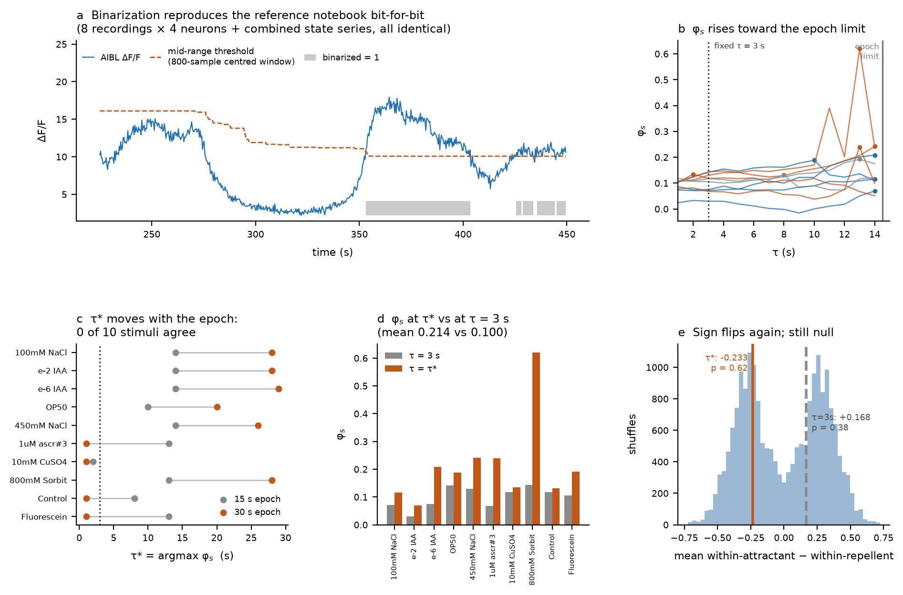

# Comparing IIT 4.0 Φ-structures across chemosensory stimuli in *C. elegans*

**The question.** *C. elegans* approaches some chemicals (attractants) and
avoids others (repellents). Computing the IIT 4.0 **Φ-structure** of a small
neural circuit during each response: are the attractant Φ-structures more
similar to each other than the repellent ones?

**The obstacle.** A Φ-structure is not a graph. It is a **weighted hypergraph**:
its "edges" (relations) can bind three, four, or more distinctions at once.
Standard graph-similarity measures cannot see that higher-order content, so
*measuring the distance between two Φ-structures* is the core methodological
problem — and the reason this repository exists.

**The method.** An exact, brute-force distance: try every way of matching the
distinctions of one structure onto the other, score each matching, keep the
smallest. Defined in full under [The distance algorithm](#the-distance-algorithm),
implemented in [`src/gold_standard.py`](src/gold_standard.py).

**The answer.** *Not supported* — and the reason is more informative than the
hypothesis test. **There is no signal above the noise floor at all:** two
Φ-structures built for the *same* stimulus from different animals differ as much
as two built for different stimuli. No pair of stimuli separates, so the class
contrast could not have been detected even if real. See
[The result](#the-result).

---

## If you read nothing else

| | |
|---|---|
| **Goal** | Test whether attractant Φ-structures resemble each other more than repellent ones do |
| **Distance** | Exact minimum over all bijections between distinctions ("gold standard") |
| **Why not simpler** | \|ΔΦ\| is a scalar and collapses distinct structures; a pairwise-only representation cannot see relations binding >2 distinctions |
| **Cost** | *n*! where *n* = number of distinctions. Practical to *n* ≈ 9 |
| **Result** | Not supported — and more fundamentally, **no signal above the noise floor** (signal-to-noise 1.06 and 0.96) |
| **Why** | Two structures for the *same* stimulus, from different animals, differ as much as two different stimuli |
| **Robustness** | Null across 6 pipelines (2/3/4 neurons, per-stimulus and global TPM, invented mass 0.3–43%), 4 state rules, 2 choices of τ, and at the TPM level with no Φ at all |
| **Next** | More stimuli per class, or per-animal structures — both raise the within-class pair count |

---

## Quick start

Every notebook runs top-to-bottom in Google Colab with no setup. Click a badge,
then `Runtime > Run all`.

| Notebook | What it establishes | Colab |
|---|---|---|
| **01 — Data and TPM** | Loads the imaging data, binarizes it, builds transition matrices, measures the per-stimulus data budget | [](https://colab.research.google.com/github/maierav/iit4-celegans-phi-structure/blob/main/notebooks/01_data_and_tpm.ipynb) |
| **02 — Φ-structure** | Unfolds a Φ-structure in PyPhi and extracts it as a weighted hypergraph | [](https://colab.research.google.com/github/maierav/iit4-celegans-phi-structure/blob/main/notebooks/02_phi_structure.ipynb) |
| **03 — Similarity** | Scores the exact distance against cases with known answers; measures how it scales | [](https://colab.research.google.com/github/maierav/iit4-celegans-phi-structure/blob/main/notebooks/03_similarity.ipynb) |
| **04 — Toy examples** | Nine real Φ-structures from 3-unit networks, relations up to degree 4 | [](https://colab.research.google.com/github/maierav/iit4-celegans-phi-structure/blob/main/notebooks/04_toy_examples.ipynb) |
| **05 — PyPhi 2.0 example** | One comparison end to end: two structures from update rules, all 24 mappings drawn, cost broken down term by term | [](https://colab.research.google.com/github/maierav/iit4-celegans-phi-structure/blob/main/notebooks/05_pyphi2_example.ipynb) |
| **06 — The *C. elegans* comparison** | **The headline analysis.** Pooled per-stimulus TPMs, ten Φ-structures, permutation test | [](https://colab.research.google.com/github/maierav/iit4-celegans-phi-structure/blob/main/notebooks/06_celegans_pooled.ipynb) |
| **07 — Binarization and τ** | Verifies binarization against the reference notebook bit-for-bit; tests whether τ can be chosen by argmax φ_s | [](https://colab.research.google.com/github/maierav/iit4-celegans-phi-structure/blob/main/notebooks/07_binarization_and_tau.ipynb) |
| **08 — TPMs and the global route** | Compares the TPMs directly (no Φ); audits how much of each TPM the prior invents; runs 2- and 3-neuron substrates; builds the one-global-TPM alternative with enrichment-selected states | [](https://colab.research.google.com/github/maierav/iit4-celegans-phi-structure/blob/main/notebooks/08_tpm_distance_and_global.ipynb) |

Locally:

```bash
git clone https://github.com/maierav/iit4-celegans-phi-structure.git
cd iit4-celegans-phi-structure
pip install -r requirements.txt
python notebooks/06_celegans_pooled.py
```

---

## Background in five definitions

A system in a state has a **cause-effect structure**. Unfolding it in IIT 4.0
gives:

1. **Distinction** — a subset of units (a *mechanism*) that specifies a cause
   and an effect over some *purview*, irreducibly. Its strength is **φ_d**.
2. **Relation** — a set of distinctions whose purviews overlap congruently.
   Its strength is **φ_r**. A relation over *k* distinctions has **degree
   *k***; *k* = 1 is a **self-relation**.
3. **Φ-structure** — the distinctions plus their relations, with all φ values.
4. **Φ** — the total: Σφ_d + Σφ_r.
5. **Distance** — how far apart two Φ-structures are. That is what this repo
   is about.

### One relation per set of distinctions

A subtlety that determines how a structure is keyed. In PyPhi a `Relation` is a
frozenset of distinctions carrying **one** φ_r. It also exposes `faces` — an
internal enumeration over cause/effect sides — but **every face inherits its
parent relation's φ_r**, so faces carry no independent information. Verified
empirically over 2,996 relations from random networks: within every relation,
all faces have identical φ.

So a Φ-structure is exactly:

```
φ_d : {distinction         -> value}
φ_r : {set of distinctions -> value}
```

with no choice of representation to make, and no flattening.

---

## The distance algorithm

It is called the **gold standard** (or "brute force") because it evaluates the
definition directly, with no approximation.

### The idea in one paragraph

Two Φ-structures have no shared labels — there is no *a priori* reason
distinction `a` in one corresponds to distinction `p` in the other. So we try
**every possible pairing**. For a given pairing the cost is a sum of absolute
differences: every matched distinction contributes |φ_d − φ_d′|, every matched
relation contributes |φ_r − φ_r′|, and anything left unmatched contributes its
full φ (compared against zero). The distance is the **smallest cost over all
pairings**.

### Formally

Let *M* be a bijection between the distinctions of S₁ and those of S₂. If the
structures have different numbers of distinctions, the smaller side is padded
with **null distinctions** carrying φ_d = 0 and no relations, so *M* is always a
bijection. Write *M(S)* = { *M(a)* : *a* ∈ *S* } for the induced image of a set.

$$
D(S_1, S_2; M) \;=\; \underbrace{\sum_{a} \bigl| \varphi_d^{1}(a) - \varphi_d^{2}(M(a)) \bigr|}_{\text{distinctions}}
\;+\; \underbrace{\sum_{S \in \varphi_r^{1}} \bigl| \varphi_r^{1}(S) - \varphi_r^{2}(M(S)) \bigr|}_{\text{relations of } S_1}
\;+\; \underbrace{\sum_{\substack{T \in \varphi_r^{2} \\ M^{-1}(T) \notin \varphi_r^{1}}} \varphi_r^{2}(T)}_{\text{unmatched relations of } S_2}
$$

$$
\boxed{\;D(S_1, S_2) \;=\; \min_{M} \; D(S_1, S_2; M)\;}
$$

Missing entries read as zero, so the third term is really just |0 − φ_r²(T)| —
"unmatched structure is charged in full" is the same rule applied against an
absent partner, not a separate one.

### The one property that makes this structural

**The relation mapping is not free — it is induced by the distinction mapping.**
Once *M* pairs the distinctions, relation {a, b} *must* be compared against
relation {M(a), M(b)}, whatever φ_r happens to sit there. Relations are never
matched to each other independently.

This is what makes *D* a distance between **structures** rather than between two
bags of numbers:

| structure | shape | φ_d values | φ_r values |
|---|---|---|---|
| X | path a—b—c | 0.3, 0.3, 0.3 | 0.10, 0.10 |
| W | edge p—q + self-loop on p | 0.3, 0.3, 0.3 | 0.10, 0.10 |

Identical multisets of φ values, genuinely different topology. Matching
relations independently (best-to-best) returns **0.0** — "identical". The gold
standard returns **0.2**.

### Higher-order relations need no special handling

A relation of any degree is one key in `φ_r`. The cost function never inspects a
key's size; it relabels the key through the bijection and subtracts. Degree 2
and degree 7 go through the same line of code. Perturbing one relation by +0.01
moves the distance by exactly 0.01 **at every degree**:

| degree of perturbed relation | 1 | 2 | 3 | 4 | 5 |
|---|---|---|---|---|---|
| resulting distance | 0.01 | 0.01 | 0.01 | 0.01 | 0.01 |

The measure is **exactly as discriminating as isomorphism**: *D*(X, Y) = 0 if
and only if X and Y are identical after some relabelling of distinctions.
Checked against an independent brute-force isomorphism test over 400 random
pairs — no false identities, no false differences.

### Worked example


**Str1** has 3 distinctions and 3 relations — one self-relation {b}, one
pairwise {a,b}, and one **degree-3 relation {a,b,c}** that binds all three at
once. **Str2** has 3 distinctions and 2 relations, both of degree ≤ 2. With 3
distinctions there are 3! = 6 bijections; all are scored and the smallest wins.

Under the winning mapping `a→p, b→r, c→q`:

| term | value |
|---|---|
| φ_d a→p, b→r, c→q | 0.02 + 0.02 + 0.10 |
| φ_r {b}→{r} — self-relation, no partner | 0.07 |
| φ_r {a,b}→{p,r} | 0.02 |
| **φ_r {a,b,c}→{p,q,r} — degree-3, no partner in Str2** | **0.09** |
| unmatched {p} in Str2 | 0.09 |
| **total** | **0.410  ← minimum** |

The next-best mapping scores 0.430 and the worst 0.870, so the minimisation is
doing real work rather than choosing among ties. The degree-3 relation
contributes 0.09 directly — a pairwise-only representation has nowhere to store
it, nor the two self-relations, and reports **0.16** for this pair against the
correct 0.41. Note also that |ΔΦ| = 0.23 is a strict
lower bound here: the two structures differ in ways total Φ cannot see.
[Vector PDF](figures/fig07_algorithm.pdf)

### Verified properties

Every row below is produced by
[`src/verify_properties.py`](src/verify_properties.py). Run it and the table
regenerates:

```bash
PYTHONPATH=src python src/verify_properties.py     # writes results/verified_properties.csv
```

These are empirical checks on random structures, not proofs.

| property | n tested | violations |
|---|---|---|
| identity, *D*(X, X) = 0 | 50 | 0 |
| symmetry, \|*D*(X,Y) − *D*(Y,X)\| | 200 | 0 (max 6.7 × 10⁻¹⁶) |
| triangle inequality | 200 triples | 0 |
| *D* = 0 ⟺ isomorphic | 400 | 0 false identities, 0 false differences |
| bounds \|ΔΦ\| ≤ *D* ≤ Φ₁+Φ₂ | 200 | 0 |
| degree-agnostic (+0.01 moves *D* by 0.01) | degrees 1–5 | 0 |
| relation mapping is induced, not free | 1 | 0 |

The isomorphism check uses an **independent** brute-force test — it searches
relabellings for literal equality, never calling the distance — so agreement
between the two is meaningful rather than circular.

### Cost, and when it stops being practical

The search is over bijections between **distinctions** — *n*! where
*n* = max(N_dist₁, N_dist₂). It is **not** over 2ⁿ mechanisms, and not over
relations: relations come along free once *M* is fixed.

Measured by [`src/verify_properties.py`](src/verify_properties.py), which writes
`results/measured_cost.csv` with the machine spec attached to every row:

| N_dist | bijections | seconds (one distance) |
|---|---|---|
| 3 | 6 | <0.0001 |
| 4 | 24 | 0.0001 |
| 6 | 720 | 0.013 |
| 8 | 40,320 | 1.73 |
| 9 | 362,880 | 20.3 |

**Measured on:** macOS 26.6.2, Apple Silicon (arm64), 12 physical cores,
64 GiB RAM, Python 3.12.13, NumPy 2.5.2 — **single-core, pure Python, no
parallelism and no JIT**. The implementation makes no attempt at speed; a
compiled or parallel version would shift these numbers, but not the factorial
growth.

Extrapolating the measured 20.3 s at *n* = 9 by the factorial: *n* = 10 is
roughly 3 minutes, *n* = 12 roughly 7 hours. Practical ceiling: **n ≈ 9** for a
single distance, **n ≈ 8** for a full pairwise matrix.

The factorial search **cannot** be replaced by optimal assignment. Assignment is
exact only for a cost that is **linear** in the pairing, and the relation term
is not: relation {a, b} is scored against {M(a), M(b)}, so its contribution
depends on two assignment decisions at once. Measured over 400 random pairs,
Hungarian on the distinction term alone overshoots the exact distance in **85%**
of cases (mean excess 0.392, max 1.466) — also produced by
`src/verify_properties.py`.


Bijections searched against distinction count (a) and measured runtime of one
exact distance (b). [Vector PDF](figures/fig06_scaling.pdf)

### Using it

```python
from src.gold_standard import gold_standard_distance, phi_of

# a Φ-structure: (φ_d by distinction, φ_r by SET of distinctions)
S1 = ({"a": 0.30, "b": 0.20},
      {frozenset({"a", "b"}): 0.12, frozenset({"b"}): 0.07})
S2 = ({"p": 0.28, "q": 0.05},
      {frozenset({"p"}): 0.09})

gold_standard_distance(S1, S2)                       # -> 0.44999999999999996
gold_standard_distance(S1, S2, return_mapping=True)  # -> (0.45, {'a': 'p', 'b': 'q'})
phi_of(S1)                                           # -> 0.69  (Σφ_d + Σφ_r)
```

---

## The result

Run in [`notebooks/06`](notebooks/06_celegans_pooled.ipynb).

**The data.** Eight isogenic hermaphrodites, whole-brain NeuroPAL 2-photon
imaging at 2.667 Hz, 4979 frames (~31 min) each, from
[chemosensory-data.worm.world](https://chemosensory-data.worm.world/index.html).
Ten stimuli × 3 repeats per animal: four attractants (100 mM NaCl, e-2 IAA,
e-6 IAA, OP50), four repellents (450 mM NaCl, 1 µM ascr#3, 10 mM CuSO₄, 800 mM
sorbitol), two controls (buffer, fluorescein).

### Preprocessing follows the reference implementation

Traces are binarized with a **mid-range threshold in an 800-sample window
centred on each sample** (300 s at 2.667 Hz), then the four binary traces are
packed into one integer state series with neuron *i* on bit *i*. This is
verified **bit-for-bit identical** to the reference notebook that defines the
project's state of the art — same sampling rate, same window, same threshold,
same output on all 8 recordings × 4 neurons *and* on the combined state series
([`notebooks/07`](notebooks/07_binarization_and_tau.ipynb)).

Two inherited properties worth stating plainly: the window is **centred**, so
the binarization uses future samples and is non-causal; and the **mid-range**
threshold is set by the two most extreme values in the window, making it
sensitive to transients rather than to the bulk of the distribution. Both are
kept for exact agreement with the reference.



The binarization on a stimulus response (a). Panels b–e concern τ, below.
[Vector PDF](figures/fig15_binarization_and_tau.pdf)

### Temporal grain: τ = one sampling interval

Transitions are counted between **consecutive frames** — τ = 1 sample =
0.375 s, the native acquisition rate. Three reasons:

1. **Data.** Coarse-graining time discards samples we cannot spare. At τ = 1 a
   40-frame epoch yields 39 transitions; at τ = 8 (3 s) it yields 32, an 18%
   loss across the dataset.
2. **Plausibility.** The only consciousness we can reason about from the inside
   is our own, and the integration window relevant to an experience — say the
   positive valence of an attractant — is very unlikely to be on the order of
   seconds.
3. **Scope.** The published argument for selecting τ by `argmax φ_s` was made
   for single-animal, single-session TPMs. It does not transfer
   straightforwardly to a TPM concatenated across animals and sessions, which
   is what is built here.

[`notebooks/07`](notebooks/07_binarization_and_tau.ipynb) implements the
argmax-φ_s selection anyway and shows it is **not identifiable at this data
volume**: widening epochs from 15 s to 30 s shifts τ* by a mean of 11.2 s with
0 of 10 stimuli agreeing, so τ* is tracking the window rather than the
dynamics. **Selecting τ properly is left for future runs** with more samples per
epoch.

**Caveat, stated plainly.** The temporal grain here is somewhat arbitrary — as
is the choice of binarization. Analysis of experimental data always rests on
auxiliary assumptions, and sometimes those assumptions are known to be imperfect
rather than merely unverified. Both are recorded here so a reader can judge what
rests on them.

### Two further decisions

Both deliberate trade-offs.

### No connectivity matrix

PyPhi is given the TPM alone, so it assumes full connectivity. The functional
matrix previously used made the system not strongly connected — one neuron was a
sink under either edge orientation — which short-circuits PyPhi to
`NullSystemIrreducibilityAnalysis` and forces φ_s = 0.

A saturated graph is a null assumption, not a neutral one: it lets every
mechanism have every other in its purview. Filling in known connectivity is
worth revisiting, but it is not a small change, because it first requires
answering **which connectivity**:

* **Anatomical** — the synaptic wiring diagram. Static and well characterised in
  *C. elegans*, but a synapse is not a constraint on cause-effect power in the
  sense PyPhi needs.
* **Functional** — correlational, and defined *pairwise*. PyPhi's `cm` is also
  pairwise, so this fits mechanically, but correlation is not causation and a
  functional matrix estimated from the same traces used to build the TPM is not
  independent of it.
* **Effective** — closest to what IIT wants, and also **only ever estimated
  pairwise** in practice. A cause-effect structure has higher-order constraint
  that no pairwise effective-connectivity estimate can express, so this is a
  representational mismatch rather than a data-availability problem.

And whichever is chosen, functional and effective connectivity **change
dynamically** — plausibly with the stimulus itself. A single static `cm` shared
across all ten stimuli would then be wrong in a way that varies by condition,
which is arguably worse than the saturated assumption because the error is
correlated with the contrast of interest.

Left as-is for now, and flagged rather than resolved.

### Epochs pooled across animals

An epoch is a **15 s window from each stimulus onset** — matching the stimulus
presentation duration used in the reference notebook. Onsets are 60 s apart, so
epochs never overlap and never span two stimuli; the 45 s between them is
discarded.


A full recording with all 30 analysed epochs shaded (a); three consecutive
epochs at native resolution, showing that each is a clean post-onset window
inside its inter-onset interval (b); and what pooling buys (c).
[Vector PDF](figures/fig16_epochs.pdf)

A 4-unit system has a 16 × 16 TPM — **256 parameters**. One epoch in one animal
gives 40 frames, 0.16 per parameter. Pooling the same stimulus across all 8
animals gives **24 epochs, 960 frames**, 3.75 per parameter.

What pooling assumes is that the 8 animals are interchangeable replicates of one
system. They are isogenic hermaphrodites imaged under one protocol, which is the
strongest available version of that assumption — but it is still an assumption.
It discards between-animal variation and **removes the within-class variance
estimate** that repeated animals would have supplied. The split-half noise floor
below recovers part of what pooling hides.

### The TPM, and how one state is chosen

Both steps are worth spelling out, because the second is the weakest link in
the whole pipeline.

**Building the TPM.** For each stimulus, every transition observed inside any of
its 24 epochs is tallied into a 16 × 16 count matrix — `C[a,b]` = number of
times state *a* was followed τ frames later by state *b*. Rows are normalised to
probabilities with **Laplace smoothing**, α = 0.5:

```
P[a,b] = (C[a,b] + α) / Σ_b (C[a,b] + α)
```

**What the per-stimulus TPM represents.** Because *C. elegans* anatomical
connectivity is static, a TPM that changes with the chemical is best read as an
estimate of **dynamic effective connectivity** — how causal influence among
these four neurons is reconfigured by the stimulus, not how the wiring changes.
Since the selected state is the same (0000) for all ten stimuli, the
Φ-structures differ *only* because the effective causal networks differ. That
reading is consistent with the dynamic-effective-connectivity literature, and it
is the reading under which the whole comparison makes sense.

**The smoothing is a real violation of IIT, not a technicality.** With 960 frames
against 256 parameters, some rows have **zero** observed transitions — states
never visited in any epoch of that stimulus (0–5 of 16 rows, depending on
stimulus). Unsmoothed those rows are undefined and PyPhi cannot proceed;
smoothed, they become the uniform prior. But IIT derives cause–effect power
*from the TPM*, so wherever the TPM is prior rather than data, the resulting
distinctions and relations describe an assumption rather than the system.

Measured across the whole matrix — prior mass αK against observed mass per row —
**the prior supplies a mean of 43% of the probability mass at 4 neurons.** That
is not regularisation; it is invention. The fix is a smaller substrate:

| neurons | states | params | mean invented mass | unvisited rows |
|---|---|---|---|---|
| 4 | 16 | 256 | **43%** | 0–5 |
| 3 | 8 | 64 | 19% | 0–2 |
| 2 | 4 | 16 | **2%** | 0 |

Both smaller substrates were run end to end ([`notebooks/08`](notebooks/08_tpm_distance_and_global.ipynb)).
Reducing the invented mass from 43% to 2% changes the numbers substantially — Φ
falls from 78–383 to 2.7–3.6 — but not the conclusion: 3 neurons gives
p = 0.11 and 2 neurons p = 0.12, both with the sign *opposite* to the
hypothesis.

**Choosing the state.** A Φ-structure is defined for a system **in a particular
state** — IIT 4.0 is state-dependent, and there is no such thing as "the
Φ-structure of this TPM". One of the 16 states has to be picked per stimulus.

The rule used is **argmax occupancy**: the state the system spent the most epoch
frames in. For all ten stimuli that is **0000** — all four neurons below
threshold — occupying 42–71% of frames.

**Two things are wrong with this, and neither is hidden:**

1. **0000 is the baseline, not the response.** The most-occupied state during a
   stimulus epoch is the quiescent one, so what gets characterised is closer to
   "this circuit at rest under this chemical" than "the response to this
   chemical".
2. **The choice matters enormously.** Across the 16 states of the *same* TPM,
   Φ spans **0.8 to 233.3 — a 278× range** — with distinction counts from 1 to
   15. Different states of one TPM are genuinely different structures.


All ten pooled TPMs (rows 1–2), with dotted lines marking prior-only rows.
Below: Φ against occupancy across all 16 states of one TPM (a), how far 0000
dominates every epoch (b), and the class contrast under four different
state-selection rules (c).
[Vector PDF](figures/fig18_tpms_and_state_choice.pdf)

**Does the conclusion depend on the rule?** No. Four rules, each re-run through
the full pipeline:

| rule | state(s) used | difference | p |
|---|---|---|---|
| argmax occupancy | 0000 | −0.004 | 0.99 |
| all-ON | 1111 | −0.139 | 0.70 |
| 2nd most occupied | 1111 | −0.139 | 0.70 |
| max φ_s over visited states | 0000, 1111 | −0.159 | 0.41 |

The hypothesis predicts a *negative* difference, and all four rules produce one
— but none comes close to significance, and the largest (−0.159 at p = 0.41)
still sits well inside its permutation null. So the **null is robust to the state choice**
even though the Φ *values* are extremely sensitive to it. Choosing a state that
reflects the response rather than the baseline remains a real open item — see
[where to go next](#where-to-go-next--build-intuition-before-adding-power).

### What is being compared: four neurons, two substrates

Every Φ-structure here is over a **4-unit substrate**, so it has at most
2⁴−1 = 15 distinctions. Two substrates are analysed **separately** and are never
compared to each other:

| substrate | neurons | why |
|---|---|---|
| interneurons | AIBL, AVEL, AVAL, RIML | the tentative *main complex* in awake animals (Kitazono et al. 2023); the set the project's earlier notebooks used |
| sensory | ASEL, ASER, AWAL, AWCL | amphid chemosensory neurons — ASEL/ASER for salt, AWAL/AWCL for attractant odour — the set the project's aim names |

These are **two independent tests of the same hypothesis on the same
recordings**, not a decomposition of one analysis. If the effect were real it
should appear, with the same sign, in a substrate carrying the relevant
information. Running both is a robustness check, and their disagreement is
itself a result.

This is **not** an attempt to explain a Φ-structure effect in terms of raw
neural activity. That inference would be treacherous — the map from traces to
Φ-structure runs through binarization, a TPM and the full IIT unfolding, and is
nowhere near linear. No such claim is made.

### What the distinction labels mean

Distinctions are keyed by the **mechanism** they are over: `AIBL·AVEL` is the
distinction whose mechanism is the pair {AIBL, AVEL}. This is not a reduction, a
deduplication, or a relabelling trick — labels do not affect a Φ-structure and
nothing here changes one.

With 4 neurons there are exactly **15 possible mechanisms**, the 15 non-empty
subsets. Each structure has 13–15 distinctions drawn from that same fixed set,
with no duplicates. So pairing `AIBL·AVEL ↔ AIBL·AVEL` across two structures is
**one specific bijection out of the 15! available** — the one that maps each
mechanism to itself.


Two real pooled Φ-structures in 3D (a, b): node size is φ_d, positions are
grouped by mechanism order, lines are pairwise relations and orange shading
marks relations of degree ≥ 3. Panel (c) is the label question made concrete —
the 15 distinction labels are exactly the 15 non-empty subsets of the four
neurons. Panels (d–f) are the noise-floor result, below.
[Vector PDF](figures/fig17_structures_and_labels.pdf)

### The distance used, and its honest status

The exact distance minimises over all bijections; 15! = 1.3 × 10¹² is far past
the *n* ≈ 9 ceiling. The identity bijection is used instead, justified by the
shared substrate.

**This is not free.** Scoring 2000 random relabellings of one real pair: the
identity mapping scores 1.12 and beats **99.5%** of them (random mean 1.49), but
it is **not the minimum** — some relabellings score as low as 0.79. So every
distance reported here is an **upper bound** on the exact distance, not the
exact distance. It is a principled and strongly-performing choice of
correspondence, and it is stated as a bound rather than presented as exact.

Φ varies several-fold across stimuli without tracking class, so distances are
reported after scaling each structure to unit Φ — comparing **shape**
independent of magnitude.

### Do the TPMs themselves separate the classes? No

Before asking whether Φ-structures differ by class, ask whether the transition
matrices do. If the effect exists at all it should be visible one level down,
without any IIT machinery.

| TPM distance | within-attractant | within-repellent | difference | p |
|---|---|---|---|---|
| L1, all rows | 0.619 | 0.597 | +0.022 | 0.75 |
| Jensen–Shannon, all rows | 0.318 | 0.315 | +0.003 | 0.93 |
| L1, observed rows only | 0.565 | 0.599 | −0.033 | 0.64 |
| Jensen–Shannon, observed rows only | 0.309 | 0.323 | −0.015 | 0.63 |

("observed rows only" restricts to states where *both* stimuli actually recorded
transitions — the comparison that does not lean on the prior.)

**The null is upstream of Φ.** It is not that the Φ-structure distance fails to
see a real difference in the TPMs; the TPMs do not differ by class either. Any
account of why the analysis is null has to start here.

### The alternative: one global TPM, stimulus-specific states

If anatomical connectivity dominates the causal Markov chain and is static, the
more defensible object is a **single TPM for the whole dataset**, with stimuli
distinguished by *which state* they drive the system into rather than by each
having its own transition matrix.

This is much better conditioned: **156 observations per parameter, no unvisited
rows, and 0.3% invented mass** against 3.7 / 0–5 / 43% for the per-stimulus
matrices.

The difficulty is the state criterion — 0000 dominates every stimulus *and* the
baseline, so "most frequent" would assign every stimulus the same state and
every distance would be zero. Instead each stimulus gets the state most
**enriched during its epochs relative to a non-stimulated baseline** (the ~45 s
between the end of one epoch and the next onset):

```
enrichment(state) = log₂( P(state | stimulus) / P(state | baseline) )
```

This does what it was designed to. The selected states are `0011`, `1000`,
`1001`, `1010`, `1100`, `1101` — **neither 0000 nor 1111 is ever chosen**, since
both dominate the baseline too. Enrichments run 1.1–2.4 bits.

One structural limitation: with a single TPM the structure is a pure function of
the state, so **two stimuli selecting the same state get distance exactly zero**
— which happened for one attractant/repellent pair. A top-*k* profile (a
weighted mixture of each stimulus's *k* most enriched states) removes the
degeneracy.

Also null: p = 0.74 (top-1), 0.97 (top-2), 0.79 (top-3).

### Six approaches, all null

| approach | invented TPM mass | difference | p |
|---|---|---|---|
| per-stimulus TPM, 4 neurons | 43% | −0.004 | 0.99 |
| per-stimulus TPM, 3 neurons | 19% | +0.280 | 0.11 |
| per-stimulus TPM, 2 neurons | 2% | +0.117 | 0.12 |
| global TPM, top-1 enriched state | 0.3% | −0.054 | 0.74 |
| global TPM, top-2 enriched states | 0.3% | +0.005 | 0.97 |
| global TPM, top-3 enriched states | 0.3% | −0.097 | 0.79 |

The hypothesis predicts a negative difference; the sign splits 3–3 and the
smallest p is 0.11. Spanning invented mass from 0.3% to 43% and both TPM
philosophies without moving the result is informative: the conclusion is not an
artefact of the smoothing or of the per-stimulus TPM choice.


TPM-level distances with no Φ involved (a); how much of each per-stimulus TPM is
prior rather than data (b); how that falls with substrate size (c); the
enrichment criterion eliminating both baseline-dominant states (d); the
global-TPM distance matrix (e); and all six approaches (f).
[Vector PDF](figures/fig19_tpm_distances_and_global.pdf)

### The noise floor — the result that matters most

Before asking whether *classes* differ, ask whether **anything** does. Split the
8 animals into two halves, build a structure for the **same** stimulus from
each, and measure the distance. That is pure sampling noise.

| substrate | between-stimulus | within-stimulus (noise floor) | ratio |
|---|---|---|---|
| interneurons | 1.220 | 1.154 | **1.06** |
| sensory | 1.280 | 1.340 | **0.96** |

**There is no signal above the noise.** Comparing different stimuli gives
distances no larger than comparing the same stimulus against itself across
animals. This governs everything else: it is not that attractants and repellents
fail to separate — **no pair of stimuli separates** beyond what resampling the
animals produces.

### The class test

Reported for completeness; given the noise floor a null was expected.

| substrate | within-attractant | within-repellent | difference | p |
|---|---|---|---|---|
| interneurons | 1.258 | 1.262 | **−0.004** | 0.99 |
| sensory | 1.515 | 1.185 | **+0.330** | 0.25 |

The hypothesis predicts a *negative* difference. The interneuron contrast is
essentially zero; the sensory contrast has the wrong sign for the hypothesis and
is not significant. The two substrates disagree, and dropping any single
stimulus moves the interneuron contrast between −0.10 and +0.11.

Φ does not separate the classes either — it varies several-fold with controls
interleaved among the extremes.


Φ per stimulus (a); the permutation nulls (b, c); **the noise-floor comparison
(d)** — the panel that carries the result; jackknife instability (e); and every
stimulus lying on the identity line when its mean between-stimulus distance is
plotted against its own noise floor (f).
[Vector PDF](figures/fig14_pooled_celegans.pdf)

### Where to go next — build intuition before adding power

The distance is a new measure and its behaviour on real data is not yet
understood. Adding statistical power to a measure whose noise properties are
unknown would be premature. In rough order:

1. **Characterise the noise floor properly.** It is currently one number per
   stimulus from 10 animal splits. How does it scale with the number of animals
   pooled, with epoch length, with τ, with the smoothing constant? A measure
   whose noise floor is understood can be corrected for; one whose is not,
   cannot.
2. **Within-animal, within-stimulus variance.** Each animal sees each stimulus 3
   times. Those repeats give a variance estimate that pooling destroys. It needs
   per-repeat structures, which current sampling cannot support — but it is the
   right quantity, and it decomposes the noise into within-animal and
   between-animal parts.
3. **A positive control.** Find *any* manipulation this distance detects
   reliably in these data — sleep versus wake, early versus late in a session,
   one animal versus another. Without a positive control, a null on the stimulus
   contrast says nothing about the hypothesis, only about the measure.
4. **More stimuli per class.** Only after the above. The binding constraint on
   the class test is 4 stimuli per class = 6 within-class pairs, but more pairs
   of an uninformative measure buys nothing.
5. **Prefer the global TPM, or a smaller substrate, or both.** The per-stimulus
   4-neuron TPM is the worst-conditioned option in the repo (43% invented mass).
   The global TPM at 0.3%, or a 2-neuron substrate at 2%, are both defensible
   under IIT in a way the current headline pipeline is not. Neither changes the
   result here, but future work should not be built on a matrix that is 43%
   prior. A 3-neuron substrate on the *global* TPM is the untried combination.
6. **A state that reflects the response.** The headline pipeline evaluates at
   the most-occupied state, which is the all-off baseline for all ten stimuli.
   Φ varies 278-fold across states of one TPM, so this is a large lever. The
   null survives three alternative rules, none of which is *response*-based
   either — a principled choice (e.g. the state most enriched during the epoch
   relative to pre-stimulus baseline) needs enough samples to estimate that
   enrichment.
   The enrichment criterion in [`notebooks/08`](notebooks/08_tpm_distance_and_global.ipynb)
   is a working answer for the global-TPM route; a per-stimulus-TPM equivalent
   does not yet exist.
7. **Then the remaining modelling choices**: a connectivity constraint once
   "which connectivity" is settled, and a τ chosen from data once there are
   enough samples to locate it.


## Validation on structures PyPhi actually produces

### Nine real Φ-structures

[`notebooks/04`](notebooks/04_toy_examples.ipynb) unfolds nine Φ-structures from
five 3-unit networks (AND-OR-XOR, all-XOR, all-AND, all-OR, majority).

**Higher-order relations are common, not exotic.** 10 of the 25 states surveyed
contain a relation of degree ≥ 3, and degree-4 relations appear throughout.
Across the nine structures used: 217 relations, of which **86 are degree > 2**
and **126 have no pairwise form** at all.

Two controlled perturbations isolate higher-order content. `all-XOR[000]` has
4 distinctions and 15 relations, exactly one of degree 4 (φ_r = 0.5):

| test | \|ΔΦ\| | pairwise-only | gold standard |
|---|---|---|---|
| **A** delete the degree-4 relation | 0.5 | **0.0** | 0.5 |
| **B** move its φ_r to a degree-2 relation (Φ preserved) | **0.0** | 0.5 | 1.0 |
| **C** all-XOR[000] vs all-XOR[101] | 2.5 | 0.375 | 2.5 |
| **D** all-XOR[000] vs all-XOR[011] — *isomorphic* | 0.0 | 0.0 | **0.0** |
| **E** AND-OR-XOR[101] vs [111] | 0.223 | 1.703 | 3.129 |

Test **A** is the clean demonstration of the pairwise blind spot: the
representation has nowhere to store a degree-4 relation, so deleting it changes
nothing it can see. Test **B** is sharper — the same φ_r is *moved* from degree
4 to degree 2, so Φ is unchanged and |ΔΦ| reports 0, while the exact distance
charges the loss at one degree and the gain at the other.

Over the full 9 × 9 matrix (7 distinctions max, 5040 bijections per pair, 2.8 s):
the diagonal is zero, the matrix symmetric, the triangle inequality holds on all
**729** ordered triples, and **every** off-diagonal zero was confirmed a genuine
isomorphism by an independent brute-force test.


All nine structures against each other (a); the relation degrees they contain
(b); the three measures on the five tests (c).
[Vector PDF](figures/fig10_toy_examples.pdf)

### A single comparison, end to end on PyPhi 2.0

[`notebooks/05`](notebooks/05_pyphi2_example.ipynb) does one comparison
completely from scratch: two update rules in, one distance out, with every
intermediate step drawn.

**On PyPhi 2.0.** It is not on PyPI — the latest release there is 1.2.0 — so the
notebook installs from the `2.0` branch. It needs Python ≥ 3.13, drops the
`graphillion` dependency, and replaces `Network`/`Subsystem`/`phi_structure()`
with `Substrate` → `System` → `.ces()`. Its installed default formalism is
`IIT_4_0_2023`, matching the rest of this repo, and it **reproduces the pinned
branch's numbers exactly**. (The 2026 refinement, `pyphi.iit4_2026`, adds an
intrinsic-information requirement under which deterministic systems give
φ_s = 0 — relevant when comparing against published values.)

| | rule | state | Φ | distinctions | relations |
|---|---|---|---|---|---|
| Structure 1 | A=OR(B,C), B=AND(A,C), C=XOR(A,B) | 101 | 4.792 | 4 | 15 (degrees 1–4) |
| Structure 2 | each unit = XOR of the other two | 011 | 7.000 | 4 | 11 (degrees 2–4) |


Node area is φ_d, edge and loop width are φ_r, orange shading marks a relation
of degree ≥ 3. [Vector PDF](figures/fig11_two_structures.pdf)

All 4! = 24 bijections are scored and the smallest is the distance. Their costs
genuinely differ — the minimisation is doing work, not picking among ties.


*D* = **3.8141**, via `A→AB, C→AC, AC→BC, ABC→ABC`. This is not the mapping that
best matches φ_d values pairwise: relations are carried along by the distinction
mapping, so a locally worse pairing can win by placing the relations better.
[Vector PDF](figures/fig12_mapping_search.pdf)


Of the total 3.8141: **0.783** from distinctions and **3.032** from relations,
splitting by degree as 0.803 (self), 1.212 (pairwise), 0.780 (degree 3), 0.237
(degree 4). **27% comes from relations of degree > 2** — content no pairwise
representation could hold. |ΔΦ| = 2.208 would understate the difference by 42%.
[Vector PDF](figures/fig13_cost_breakdown.pdf)

---

## Scaling beyond the exact distance

Past ~9 distinctions the exact search must be replaced by an estimate. The
project's parallel line of work does this with **optimal transport**, which
brackets the exact value:

$$d_{\mathrm{OT}} \;\le\; d_{\mathrm{exact}} \;\le\; \Delta_{\mu^*}$$

Both bounds are cheap even when the exact search is intractable.

That approach folds each relation's φ_r onto its participating distinctions
(**Φ-folds**: divide φ_r by the number of distinctions the relation joins, add
each share to those distinctions) so the hypergraph becomes a flat vector OT can
consume. The exact distance never needs this step — which is why higher-order
relations require no special handling there.

**Two versions of Φ-folds exist, and the difference matters.**

* A **scalar fold** — one value per distinction — is degenerate: a filled
  triangle (three pairwise relations at 0.1 plus a degree-3 at 0.3) and an empty
  triangle (three pairwise at 0.2) fold to the *identical* vector, distance 0
  where the exact distance gives 0.6. Solving symbolically, folds coincide
  whenever each pairwise φ_r in the empty structure equals `e + t/3`. Every
  member of that family also has identical Φ, so |ΔΦ| is blind to it too.
* The **per-degree fold (manuscript Eq 40–43)** folds separately for each
  relation degree *k*, giving a vector of per-degree contributions. This
  resolves the degeneracy: the same filled/empty pair scores **0.6000**,
  matching the exact distance.

Only the per-degree version should be used. Measured over 800 random pairs, it
is a genuine **lower bound** — never above the exact distance — and tight:
**74.8% of pairs agree exactly**, r = 0.991, mean ratio 0.973. Residual loss
comes from discarding *which* distinctions a relation joins; recovering that
would need Gromov–Wasserstein.


Per-degree folding scores the filled/empty pair correctly (a); across 800 random
pairs it is exact on 75% and never exceeds the exact distance (b).
[Vector PDF](figures/fig09_writeup_check.pdf) ·
[scalar-fold diagnostics](figures/fig08_phi_folds.pdf)

### One equation to amend

Manuscript Eq 38 writes the relation term as a sum over *r* ∈ R₁ only. Read
literally that makes the distance **asymmetric** — 285 of 300 random pairs —
because relations present in R₂ with no preimage in R₁ are never charged. It
also contradicts the manuscript's own worked examples: Example 1 charges
|φ_r − φ′_r| when one side has no relation, and Eq 10 explicitly includes
φ_r⁽²⁾(p). The examples use the **union** R₁ ∪ μ⁻¹(R₂), which is what
`src/gold_standard.py` implements and what reproduces Eq 10's 0.4500 exactly.

### What upstream PyPhi already provides

PyPhi has a `feature/ces-distance` branch. Its HEAD is from **December 2020** —
it predates IIT 4.0 — and it registers two CES measures:

* `EMD` — earth-mover's distance in **concept space**, expanding each concept's
  cause and effect repertoires onto a shared purview and summing the two
  repertoire EMDs.
* `SUM_SMALL_PHI` — the signed scalar difference of summed φ.

Neither is a Φ-structure distance in the sense used here. Both operate on
**distinctions only** — the word "relation" does not appear in that module — so
all the higher-order content this repo concerns is invisible to them. Both
survive into the `2.0` branch under a renamed module (`pyphi/metrics/` →
`pyphi/measures/`), still typed over `Distinctions`, with `SUM_SMALL_PHI` the
configured default.

The `EMD` measure is worth noting as prior art for the transport route: it is
optimal transport over concepts with a repertoire-based ground metric, which is
the shape a Gromov–Wasserstein estimate would take with a ground metric defined
over distinctions *and* relations.

### Other candidate directions

* **Topological.** Treat the CES as a filtered simplicial complex and compare
  persistence diagrams. Handles all degrees natively, relabeling-invariant.
* **Gromov–Wasserstein** directly between hypergraphs, preserving *which*
  distinctions each relation joins.
* **Hypergraph kernels.** Weisfeiler–Leman-style refinement on the incidence
  structure, yielding a positive-definite similarity.

---

## Repository layout

```
notebooks/     01–08 as both .ipynb (Colab) and .py (paired via jupytext)
src/
  gold_standard.py    THE DISTANCE — exact min-over-bijections, verified
  ces_hypergraph.py   data loading, TPM construction, PyPhi extraction
figures/       fig01–fig19 as vector PDF + preview PNG
results/       TPMs, extracted hypergraphs (JSON), distance matrices and
               permutation tests (CSV)
data/          downloaded recordings (gitignored)
```

## Reproducibility

* PyPhi is pinned to commit **`b78d0e3`** on the `feature/iit-4.0` branch for
  notebooks 01–04 and 06; notebook 05 uses the `2.0` branch. Each notebook
  installs what it needs.
* Figures are vector PDF with editable text (`pdf.fonttype = 42`).
* Every numeric claim in this README is recomputed from the committed notebooks
  before being written here.
* **macOS/Apple Silicon note:** the `graphillion` wheel the pinned branch
  depends on is linked against Homebrew GCC's `libgomp`. If `import pyphi` fails
  with a `libgomp.1.dylib` error, rebuild from source — `CC=clang CXX=clang++
  pip install --no-binary :all: --force-reinstall graphillion` — which drops
  OpenMP cleanly. Colab and Linux are unaffected. PyPhi 2.0 drops this
  dependency entirely.

## Where to start reading

| you want to… | go to |
|---|---|
| see the result | [The result](#the-result) or [`notebooks/06`](notebooks/06_celegans_pooled.ipynb) |
| see the TPMs and how a state is chosen | [The TPM, and how one state is chosen](#the-tpm-and-how-one-state-is-chosen) |
| compare the TPMs without Φ, or see the global-TPM route | [`notebooks/08`](notebooks/08_tpm_distance_and_global.ipynb) |
| understand the distance | [The distance algorithm](#the-distance-algorithm) |
| use the distance | [`src/gold_standard.py`](src/gold_standard.py) |
| see one comparison drawn step by step | [`notebooks/05`](notebooks/05_pyphi2_example.ipynb) |
| see the distance validated on real structures | [`notebooks/04`](notebooks/04_toy_examples.ipynb) |
| reproduce every figure | `notebooks/01` → `02` → … → `08` |

## Sources

* IIT 4.0: Albantakis et al. (2023), *PLOS Comput Biol* 19(10): e1011465
* PyPhi: Mayner et al. (2018), *PLOS Comput Biol* 14(7): e1006343
* Data: [chemosensory-data.worm.world](https://chemosensory-data.worm.world/index.html)
* Preprocessing conventions and the argmax-φ_s prescription for τ: *Applying IIT
  to Your Data* (Maier & Ikeda), and the reference Colab notebook it accompanies
* Functional connectivity: [funconn.princeton.edu](https://funconn.princeton.edu/)
