# Comparing IIT 4.0 Φ-structures across chemosensory stimuli in *C. elegans*

**The question.** *C. elegans* approaches some chemicals (attractants) and
avoids others (repellents). Computing the IIT 4.0 **Φ-structure** of a small
neural circuit during each response: are the attractant Φ-structures more
similar to each other than the repellent ones?

**The obstacle.** A Φ-structure is not a graph. It is a **weighted hypergraph**:
its "edges" (relations) can bind three, four, or more distinctions at once.
Standard graph-similarity measures cannot see that higher-order content, so
*measuring the distance between two Φ-structures* is the core methodological
problem — and the reason this repository exists.

**The method.** An exact, brute-force distance: try every way of matching the
distinctions of one structure onto the other, score each matching, keep the
smallest. Defined in full under [The distance algorithm](#the-distance-algorithm),
implemented in [`src/gold_standard.py`](src/gold_standard.py).

**The answer.** *Not supported.* Attractant Φ-structures are not more similar to
each other than repellent ones; the sign of the effect is not stable across
neuron sets, and the design is underpowered for the contrast. See
[The result](#the-result).

---

## If you read nothing else

| | |
|---|---|
| **Goal** | Test whether attractant Φ-structures resemble each other more than repellent ones do |
| **Distance** | Exact minimum over all bijections between distinctions ("gold standard") |
| **Why not simpler** | \|ΔΦ\| is a scalar and collapses distinct structures; a pairwise-only representation cannot see relations binding >2 distinctions |
| **Cost** | *n*! where *n* = number of distinctions. Practical to *n* ≈ 9 |
| **Result** | Not supported. Interneurons p = 0.38 (wrong direction), sensory p = 0.72; the sign flips between neuron sets |
| **Why** | 4 stimuli per class = 6 within-class pairs; the permutation null is as wide as the effect |
| **Next** | More stimuli per class, or per-animal structures — both raise the within-class pair count |

---

## Quick start

Every notebook runs top-to-bottom in Google Colab with no setup. Click a badge,
then `Runtime > Run all`.

| Notebook | What it establishes | Colab |
|---|---|---|
| **01 — Data and TPM** | Loads the imaging data, binarizes it, builds transition matrices, measures the per-stimulus data budget | [](https://colab.research.google.com/github/maierav/iit4-celegans-phi-structure/blob/main/notebooks/01_data_and_tpm.ipynb) |
| **02 — Φ-structure** | Unfolds a Φ-structure in PyPhi and extracts it as a weighted hypergraph | [](https://colab.research.google.com/github/maierav/iit4-celegans-phi-structure/blob/main/notebooks/02_phi_structure.ipynb) |
| **03 — Similarity** | Scores the exact distance against cases with known answers; measures how it scales | [](https://colab.research.google.com/github/maierav/iit4-celegans-phi-structure/blob/main/notebooks/03_similarity.ipynb) |
| **04 — Toy examples** | Nine real Φ-structures from 3-unit networks, relations up to degree 4 | [](https://colab.research.google.com/github/maierav/iit4-celegans-phi-structure/blob/main/notebooks/04_toy_examples.ipynb) |
| **05 — PyPhi 2.0 example** | One comparison end to end: two structures from update rules, all 24 mappings drawn, cost broken down term by term | [](https://colab.research.google.com/github/maierav/iit4-celegans-phi-structure/blob/main/notebooks/05_pyphi2_example.ipynb) |
| **06 — The *C. elegans* comparison** | **The headline analysis.** Pooled per-stimulus TPMs, ten Φ-structures, permutation test | [](https://colab.research.google.com/github/maierav/iit4-celegans-phi-structure/blob/main/notebooks/06_celegans_pooled.ipynb) |

Locally:

```bash
git clone https://github.com/maierav/iit4-celegans-phi-structure.git
cd iit4-celegans-phi-structure
pip install -r requirements.txt
python notebooks/06_celegans_pooled.py
```

---

## Background in five definitions

A system in a state has a **cause-effect structure**. Unfolding it in IIT 4.0
gives:

1. **Distinction** — a subset of units (a *mechanism*) that specifies a cause
   and an effect over some *purview*, irreducibly. Its strength is **φ_d**.
2. **Relation** — a set of distinctions whose purviews overlap congruently.
   Its strength is **φ_r**. A relation over *k* distinctions has **degree
   *k***; *k* = 1 is a **self-relation**.
3. **Φ-structure** — the distinctions plus their relations, with all φ values.
4. **Φ** — the total: Σφ_d + Σφ_r.
5. **Distance** — how far apart two Φ-structures are. That is what this repo
   is about.

### One relation per set of distinctions

A subtlety that determines how a structure is keyed. In PyPhi a `Relation` is a
frozenset of distinctions carrying **one** φ_r. It also exposes `faces` — an
internal enumeration over cause/effect sides — but **every face inherits its
parent relation's φ_r**, so faces carry no independent information. Verified
empirically over 2,996 relations from random networks: within every relation,
all faces have identical φ.

So a Φ-structure is exactly:

```
φ_d : {distinction         -> value}
φ_r : {set of distinctions -> value}
```

with no choice of representation to make, and no flattening.

---

## The distance algorithm

It is called the **gold standard** (or "brute force") because it evaluates the
definition directly, with no approximation.

### The idea in one paragraph

Two Φ-structures have no shared labels — there is no *a priori* reason
distinction `a` in one corresponds to distinction `p` in the other. So we try
**every possible pairing**. For a given pairing the cost is a sum of absolute
differences: every matched distinction contributes |φ_d − φ_d′|, every matched
relation contributes |φ_r − φ_r′|, and anything left unmatched contributes its
full φ (compared against zero). The distance is the **smallest cost over all
pairings**.

### Formally

Let *M* be a bijection between the distinctions of S₁ and those of S₂. If the
structures have different numbers of distinctions, the smaller side is padded
with **null distinctions** carrying φ_d = 0 and no relations, so *M* is always a
bijection. Write *M(S)* = { *M(a)* : *a* ∈ *S* } for the induced image of a set.

$$
D(S_1, S_2; M) \;=\; \underbrace{\sum_{a} \bigl| \varphi_d^{1}(a) - \varphi_d^{2}(M(a)) \bigr|}_{\text{distinctions}}
\;+\; \underbrace{\sum_{S \in \varphi_r^{1}} \bigl| \varphi_r^{1}(S) - \varphi_r^{2}(M(S)) \bigr|}_{\text{relations of } S_1}
\;+\; \underbrace{\sum_{\substack{T \in \varphi_r^{2} \\ M^{-1}(T) \notin \varphi_r^{1}}} \varphi_r^{2}(T)}_{\text{unmatched relations of } S_2}
$$

$$
\boxed{\;D(S_1, S_2) \;=\; \min_{M} \; D(S_1, S_2; M)\;}
$$

Missing entries read as zero, so the third term is really just |0 − φ_r²(T)| —
"unmatched structure is charged in full" is the same rule applied against an
absent partner, not a separate one.

### The one property that makes this structural

**The relation mapping is not free — it is induced by the distinction mapping.**
Once *M* pairs the distinctions, relation {a, b} *must* be compared against
relation {M(a), M(b)}, whatever φ_r happens to sit there. Relations are never
matched to each other independently.

This is what makes *D* a distance between **structures** rather than between two
bags of numbers:

| structure | shape | φ_d values | φ_r values |
|---|---|---|---|
| X | path a—b—c | 0.3, 0.3, 0.3 | 0.10, 0.10 |
| W | edge p—q + self-loop on p | 0.3, 0.3, 0.3 | 0.10, 0.10 |

Identical multisets of φ values, genuinely different topology. Matching
relations independently (best-to-best) returns **0.0** — "identical". The gold
standard returns **0.2**.

### Higher-order relations need no special handling

A relation of any degree is one key in `φ_r`. The cost function never inspects a
key's size; it relabels the key through the bijection and subtracts. Degree 2
and degree 7 go through the same line of code. Perturbing one relation by +0.01
moves the distance by exactly 0.01 **at every degree**:

| degree of perturbed relation | 1 | 2 | 3 | 4 | 5 |
|---|---|---|---|---|---|
| resulting distance | 0.01 | 0.01 | 0.01 | 0.01 | 0.01 |

The measure is **exactly as discriminating as isomorphism**: *D*(X, Y) = 0 if
and only if X and Y are identical after some relabelling of distinctions.
Checked against an independent brute-force isomorphism test over 400 random
pairs — no false identities, no false differences.

### Worked example

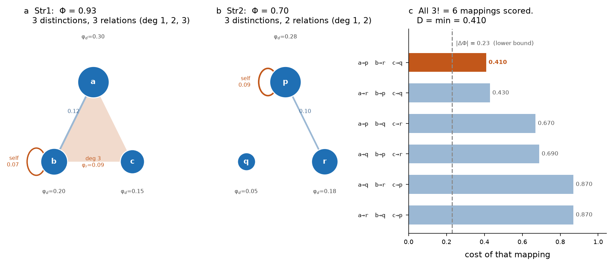

Str1 has 2 distinctions, a pairwise relation {a,b}, and a self-relation {b}.
Str2 has 2 distinctions and a self-relation {p}. With 2 distinctions there are
2! = 2 bijections:

| term | M1 (a→p, b→q) | M2 (a→q, b→p) |
|---|---|---|
| distinctions | \|0.30−0.28\| = 0.02 | \|0.30−0.05\| = 0.25 |
| | \|0.20−0.05\| = 0.15 | \|0.20−0.28\| = 0.08 |
| relation {a,b} | \|0.12−0\| = 0.12 | \|0.12−0\| = 0.12 |
| relation {b} | \|0.07−0\| = 0.07 | \|0.07−0.09\| = 0.02 |
| unmatched in Str2 | 0.09 (self-relation {p}) | — |
| **total** | **0.45  ← minimum** | 0.47 |

**D(Str1, Str2) = 0.45.** Note M2 matches the self-relation almost perfectly
(0.02) and still loses: the minimum is over the *total*, so the terms cannot be
optimised separately. [Vector PDF](figures/fig07_algorithm.pdf)

### Verified properties

Empirical, not proofs:

| property | result |
|---|---|
| identity, *D*(X, X) = 0 | exact, 50/50 |
| symmetry, \|*D*(X,Y) − *D*(Y,X)\| | 0 violations / 200 random pairs |
| triangle inequality | 0 violations / 200 random triples |
| *D* = 0 ⟺ isomorphic | 0 false identities, 0 false differences / 400 random pairs |
| bounds \|ΔΦ\| ≤ *D* ≤ Φ₁+Φ₂ | holds on every pair tested |

### Cost, and when it stops being practical

The search is over bijections between **distinctions** — *n*! where
*n* = max(N_dist₁, N_dist₂). It is **not** over 2ⁿ mechanisms, and not over
relations: relations come along free once *M* is fixed.

| N_dist | bijections | time (one distance) |
|---|---|---|
| 3 | 6 | <0.001 s |
| 4 | 24 | 0.0002 s |
| 6 | 720 | 0.013 s |
| 8 | 40,320 | 1.7 s |
| 9 | 362,880 | 22 s |
| 10 | 3.6 M | ~8 min |
| 12 | 479 M | ~18 h |

Measured single-core in pure Python by `notebooks/03`; the last two rows are
extrapolated. Practical ceiling: *n* ≈ 9 for a single distance, *n* ≈ 8 for a
full pairwise matrix.

The factorial search **cannot** be replaced by optimal assignment. Assignment is
exact only for a cost that is **linear** in the pairing, and the relation term
is not: relation {a, b} is scored against {M(a), M(b)}, so its contribution
depends on two assignment decisions at once. Measured over 400 random pairs,
Hungarian on the distinction term alone overshoots the exact distance in **50%**
of cases (mean excess 0.27, max 1.11).

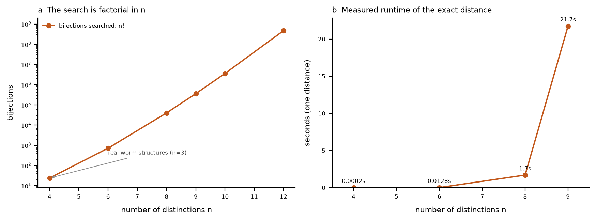

Bijections searched against distinction count (a) and measured runtime of one
exact distance (b). [Vector PDF](figures/fig06_scaling.pdf)

### Using it

```python
from src.gold_standard import gold_standard_distance, phi_of

# a Φ-structure: (φ_d by distinction, φ_r by SET of distinctions)
S1 = ({"a": 0.30, "b": 0.20},
      {frozenset({"a", "b"}): 0.12, frozenset({"b"}): 0.07})
S2 = ({"p": 0.28, "q": 0.05},
      {frozenset({"p"}): 0.09})

gold_standard_distance(S1, S2)                       # -> 0.44999999999999996
gold_standard_distance(S1, S2, return_mapping=True)  # -> (0.45, {'a': 'p', 'b': 'q'})
phi_of(S1)                                           # -> 0.69  (Σφ_d + Σφ_r)
```

---

## Why not a simpler measure

Two simpler candidates, tested against cases where the correct answer is known.
**0.0 means the measure cannot tell the two structures apart.**

| Test | \|ΔΦ\| | pairwise-only | gold standard |
|---|---|---|---|
| Same Φ, different content | **0.0** | 0.4 | 0.4 |
| One extra degree-3 relation | 0.1 | **0.0** | 0.1 |
| Degree-2 → degree-3, Φ preserved | **0.0** | 0.1 | 0.2 |

* **\|ΔΦ\| is blind whenever Φ is preserved.** Not hypothetical: two 5-unit toy
  structures with *exactly* equal Φ (2.1779535637765157) and 10 distinctions
  each differ only in which units carry them.
* **A pairwise-only representation is blind to higher-order structure by
  construction.** Keying relations by ordered *pairs* leaves nowhere to put a
  relation binding three distinctions — nor a self-relation.

Both are retained in `src/ces_hypergraph.py` purely so `notebooks/03` can
reproduce these tests; nothing in the analysis path uses them.

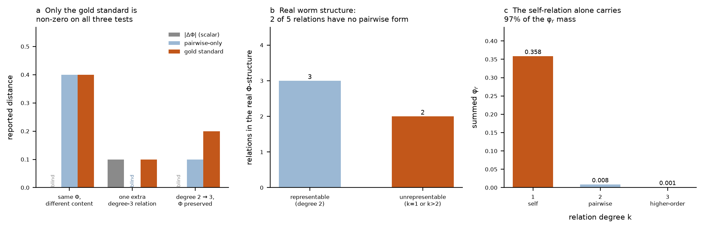

Reported distance per test (a) — bars marked "blind" are exactly zero. A real
worm Φ-structure counted in relations (b), and its φ_r mass by degree (c): in
that structure 2 of 5 relations have no pairwise form, and they carry 98% of the
relational mass. [Vector PDF](figures/fig05_measure_failures.pdf)

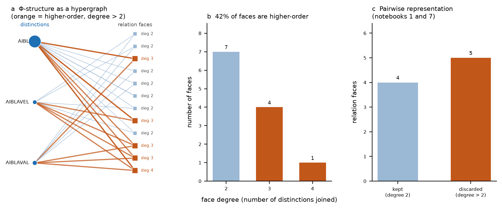

That structure drawn at the relation level (a): node area ∝ φ_d, blue lines are
pairwise relations, the orange loop is a self-relation and the orange fill a
degree-3 relation. Relations by degree (b), and what a pairwise keying can hold
(c). [Vector PDF](figures/fig04_phi_structure.pdf)

---

## The result

Run in [`notebooks/06`](notebooks/06_celegans_pooled.ipynb).

**The data.** Eight isogenic hermaphrodites, whole-brain NeuroPAL 2-photon
imaging at 2.667 Hz, 4979 frames (~31 min) each, from
[chemosensory-data.worm.world](https://chemosensory-data.worm.world/index.html).
Ten stimuli × 3 repeats per animal: four attractants (100 mM NaCl, e-2 IAA,
e-6 IAA, OP50), four repellents (450 mM NaCl, 1 µM ascr#3, 10 mM CuSO₄, 800 mM
sorbitol), two controls (buffer, fluorescein).

Two decisions made the analysis possible, both deliberate trade-offs.

### No connectivity matrix

PyPhi is given the TPM alone and assumes full connectivity. The functional
connectivity matrix previously used made the system not strongly connected — one
neuron was a sink under either edge orientation — which short-circuits PyPhi to
`NullSystemIrreducibilityAnalysis` and forces φ_s = 0. Omitting `cm` removes
that failure and Φ is well defined for every stimulus. The cost is that the
structures no longer encode anatomical constraint; that is a modelling choice to
revisit, not a bug.

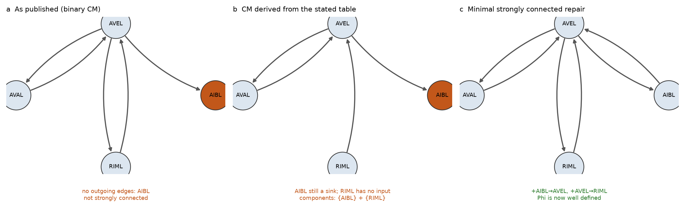

The published binary matrix (a) and one derived from the stated table (b) are
both not strongly connected — AIBL is a sink either way. A minimal repair (c)
would make Φ well defined, but omitting the matrix entirely is the simpler
choice taken here. [Vector PDF](figures/fig03_connectivity.pdf)

### Epochs pooled across animals

Each stimulus gets one TPM built from all 8 recordings × 3 repeats = **24
epochs, 960 frames**.

**Why this was necessary.** A 4-unit system has a 16 × 16 TPM: **256
parameters**. One stimulus epoch in one animal supplies 3 repeats × ~40 samples
= **120 frames**, or 0.47 frames per parameter, and visits a mean of **5.0 of 16
states** — with *controls* scoring higher (6.1) than attractants (4.7), the
signature of noise rather than biology. Any per-stimulus Φ-structure built that
way is mostly an artefact of states never observed. Pooling raises this to 3.75
frames per parameter and **11–16 of 16 states visited** (mean 13.4).

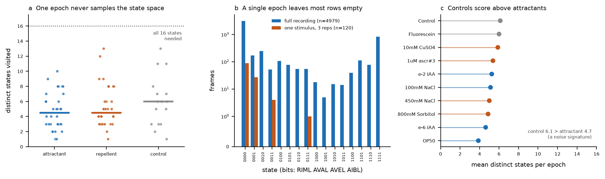

States visited per single epoch, by class (a); how much of the state space one
epoch leaves empty (b); and the mean per class (c), where controls score above
attractants. [Vector PDF](figures/fig02_epoch_budget.pdf) ·
[raw traces and a full-recording TPM](figures/fig01_traces_and_tpm.pdf)

**What it assumes.** That the 8 animals are interchangeable replicates of one
system. They are isogenic hermaphrodites imaged under one protocol, which is the
strongest available version of that assumption — but it is still an assumption.
It discards genuine between-animal variation, cannot be checked from within the
pooled data, and **removes the within-class variance estimate that repeated
animals would have provided**: the only replication left is across the 4 stimuli
in each class. A stopgap that makes the question computable, not a solution.

### On the distance used here

All ten pooled structures have **14–15 distinctions**. The exact search is
15! = 1.3 × 10¹² bijections — far past the *n* ≈ 9 ceiling.

It is not needed. Every structure is built over the **same four neurons**, so a
distinction labelled `AIBL·AVEL` denotes the same mechanism in all ten. The
correspondence is given by the data rather than searched for, and the identity
mapping is exactly the term the exact distance would evaluate. What is given up
is the guarantee that no *other* mapping scores lower — a guarantee that matters
only when comparing structures on different substrates.

Φ spans 92 to 734 across stimuli, so distances are also reported after scaling
each structure to unit Φ, which compares **shape** independent of magnitude. Raw
distance correlates with |ΔΦ| at r = 0.745; shape distance at r = 0.550.

### The answer

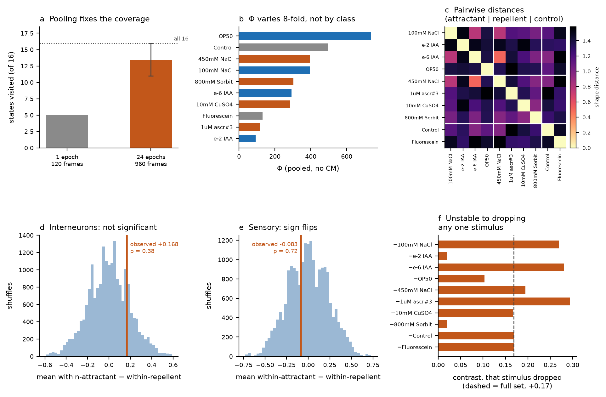

**The hypothesis is not supported.**

| neuron set | within-attractant | within-repellent | difference | p |
|---|---|---|---|---|
| interneurons (AIBL/AVEL/AVAL/RIML) | 1.335 | 1.167 | **+0.168** | 0.38 |
| sensory (ASEL/ASER/AWAL/AWCL) | 1.497 | 1.579 | **−0.083** | 0.72 |

The hypothesis predicts a *negative* difference. In the interneurons the effect
runs the wrong way and is not significant; in the sensory neurons it runs the
predicted way but is further still from significance. **The sign is not stable
between neuron sets**, and it is not stable within one either — dropping any
single stimulus moves the interneuron contrast between +0.02 and +0.29.

Φ itself does not separate the classes: it varies eight-fold across stimuli,
with OP50 (attractant, Φ = 734) and Control (Φ = 494) at the top.

Both neuron sets were run because they answer different questions. AIB/AVE/AVA/
RIM are interneurons and premotor/ring interneurons — the locomotor command
circuit. ASEL/ASER (salt) and AWAL/AWCL (attractant odour) are the amphid
chemosensory neurons the project's aim names. Both are present at full
identification confidence in all 8 recordings.

**This is a null result, not evidence of absence.** Four stimuli per class give
six within-class pairs, and the permutation null has a standard deviation
comparable to the observed effect — only a very large effect could have reached
significance. The design is underpowered for this contrast.

### What would raise the power

1. **More stimuli per class.** The binding constraint is 4 stimuli, not 8 animals. Six to eight per class would roughly double the within-class pairs.
2. **Per-animal structures.** Pooling was forced by state coverage. Longer recordings, or a binarization visiting more states per epoch, would allow one structure per animal per stimulus — restoring a real within-class variance estimate and a far larger permutation space.
3. **A deliberately chosen state.** Every pooled TPM is evaluated at its most-occupied state, which is all-off for all ten stimuli. A state reflecting the *response* rather than the baseline may separate classes better. Cheapest to try first.
4. **Restore a connectivity constraint.** A strongly connected matrix — anatomical rather than functional — would let the structures encode circuit topology again.

---

## Validation on structures PyPhi actually produces

### Nine real Φ-structures

[`notebooks/04`](notebooks/04_toy_examples.ipynb) unfolds nine Φ-structures from
five 3-unit networks (AND-OR-XOR, all-XOR, all-AND, all-OR, majority).

**Higher-order relations are common, not exotic.** 10 of the 25 states surveyed
contain a relation of degree ≥ 3, and degree-4 relations appear throughout.
Across the nine structures used: 217 relations, of which **86 are degree > 2**
and **126 have no pairwise form** at all.

Two controlled perturbations isolate higher-order content. `all-XOR[000]` has
4 distinctions and 15 relations, exactly one of degree 4 (φ_r = 0.5):

| test | \|ΔΦ\| | pairwise-only | gold standard |
|---|---|---|---|
| **A** delete the degree-4 relation | 0.5 | **0.0** | 0.5 |
| **B** move its φ_r to a degree-2 relation (Φ preserved) | **0.0** | 0.5 | 1.0 |
| **C** all-XOR[000] vs all-XOR[101] | 2.5 | 0.375 | 2.5 |
| **D** all-XOR[000] vs all-XOR[011] — *isomorphic* | 0.0 | 0.0 | **0.0** |
| **E** AND-OR-XOR[101] vs [111] | 0.223 | 1.703 | 3.129 |

Test **A** is the clean demonstration of the pairwise blind spot: the
representation has nowhere to store a degree-4 relation, so deleting it changes
nothing it can see. Test **B** is sharper — the same φ_r is *moved* from degree
4 to degree 2, so Φ is unchanged and |ΔΦ| reports 0, while the exact distance
charges the loss at one degree and the gain at the other.

Over the full 9 × 9 matrix (7 distinctions max, 5040 bijections per pair, 2.8 s):
the diagonal is zero, the matrix symmetric, the triangle inequality holds on all
**729** ordered triples, and **every** off-diagonal zero was confirmed a genuine
isomorphism by an independent brute-force test.

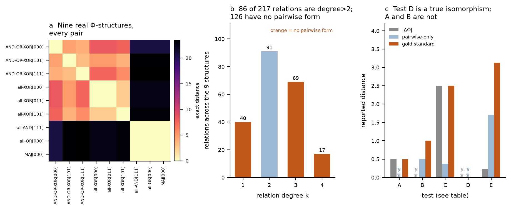

All nine structures against each other (a); the relation degrees they contain
(b); the three measures on the five tests (c).
[Vector PDF](figures/fig10_toy_examples.pdf)

### A single comparison, end to end on PyPhi 2.0

[`notebooks/05`](notebooks/05_pyphi2_example.ipynb) does one comparison
completely from scratch: two update rules in, one distance out, with every
intermediate step drawn.

**On PyPhi 2.0.** It is not on PyPI — the latest release there is 1.2.0 — so the
notebook installs from the `2.0` branch. It needs Python ≥ 3.13, drops the
`graphillion` dependency, and replaces `Network`/`Subsystem`/`phi_structure()`
with `Substrate` → `System` → `.ces()`. Its installed default formalism is
`IIT_4_0_2023`, matching the rest of this repo, and it **reproduces the pinned
branch's numbers exactly**. (The 2026 refinement, `pyphi.iit4_2026`, adds an
intrinsic-information requirement under which deterministic systems give
φ_s = 0 — relevant when comparing against published values.)

| | rule | state | Φ | distinctions | relations |
|---|---|---|---|---|---|
| Structure 1 | A=OR(B,C), B=AND(A,C), C=XOR(A,B) | 101 | 4.792 | 4 | 15 (degrees 1–4) |
| Structure 2 | each unit = XOR of the other two | 011 | 7.000 | 4 | 11 (degrees 2–4) |

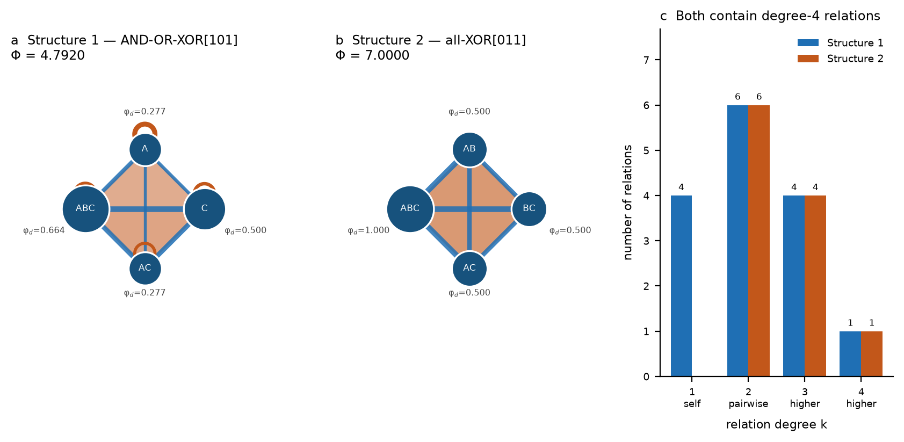

Node area is φ_d, edge and loop width are φ_r, orange shading marks a relation
of degree ≥ 3. [Vector PDF](figures/fig11_two_structures.pdf)

All 4! = 24 bijections are scored and the smallest is the distance. Their costs
genuinely differ — the minimisation is doing work, not picking among ties.

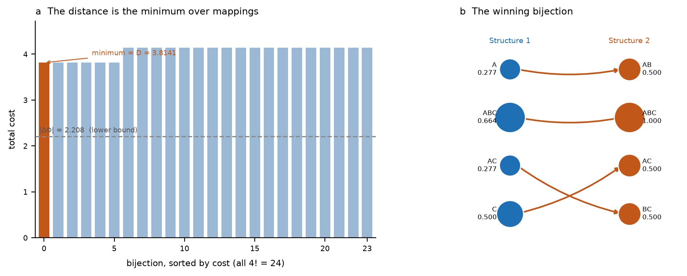

*D* = **3.8141**, via `A→AB, C→AC, AC→BC, ABC→ABC`. This is not the mapping that
best matches φ_d values pairwise: relations are carried along by the distinction
mapping, so a locally worse pairing can win by placing the relations better.
[Vector PDF](figures/fig12_mapping_search.pdf)

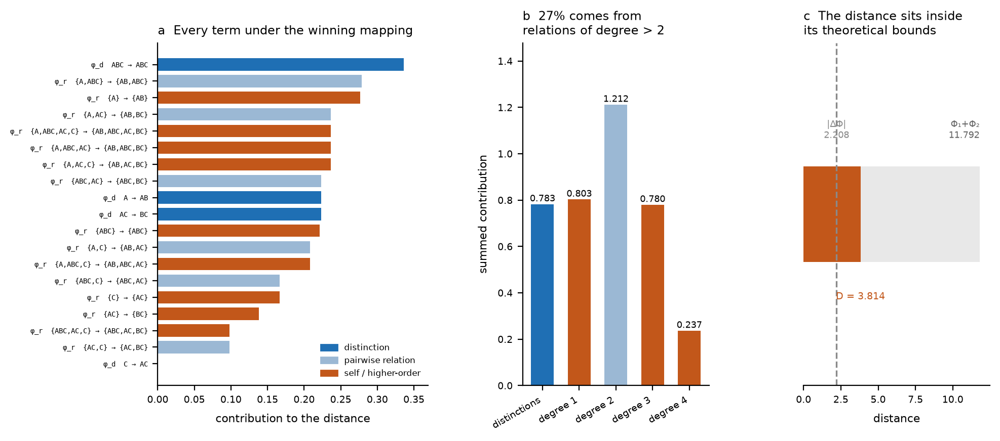

Of the total 3.8141: **0.783** from distinctions and **3.032** from relations,
splitting by degree as 0.803 (self), 1.212 (pairwise), 0.780 (degree 3), 0.237
(degree 4). **27% comes from relations of degree > 2** — content no pairwise
representation could hold. |ΔΦ| = 2.208 would understate the difference by 42%.
[Vector PDF](figures/fig13_cost_breakdown.pdf)

---

## Scaling beyond the exact distance

Past ~9 distinctions the exact search must be replaced by an estimate. The
project's parallel line of work does this with **optimal transport**, which
brackets the exact value:

$$d_{\mathrm{OT}} \;\le\; d_{\mathrm{exact}} \;\le\; \Delta_{\mu^*}$$

Both bounds are cheap even when the exact search is intractable.

That approach folds each relation's φ_r onto its participating distinctions
(**Φ-folds**: divide φ_r by the number of distinctions the relation joins, add
each share to those distinctions) so the hypergraph becomes a flat vector OT can
consume. The exact distance never needs this step — which is why higher-order
relations require no special handling there.

**Two versions of Φ-folds exist, and the difference matters.**

* A **scalar fold** — one value per distinction — is degenerate: a filled
  triangle (three pairwise relations at 0.1 plus a degree-3 at 0.3) and an empty
  triangle (three pairwise at 0.2) fold to the *identical* vector, distance 0
  where the exact distance gives 0.6. Solving symbolically, folds coincide
  whenever each pairwise φ_r in the empty structure equals `e + t/3`. Every
  member of that family also has identical Φ, so |ΔΦ| is blind to it too.
* The **per-degree fold (manuscript Eq 40–43)** folds separately for each
  relation degree *k*, giving a vector of per-degree contributions. This
  resolves the degeneracy: the same filled/empty pair scores **0.6000**,
  matching the exact distance.

Only the per-degree version should be used. Measured over 800 random pairs, it
is a genuine **lower bound** — never above the exact distance — and tight:
**74.8% of pairs agree exactly**, r = 0.991, mean ratio 0.973. Residual loss
comes from discarding *which* distinctions a relation joins; recovering that
would need Gromov–Wasserstein.

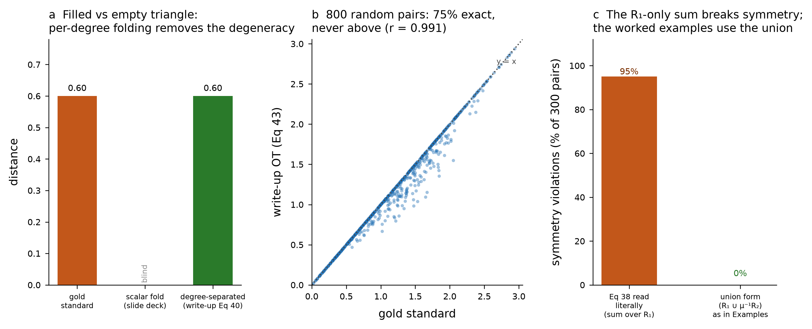

Per-degree folding scores the filled/empty pair correctly (a); across 800 random
pairs it is exact on 75% and never exceeds the exact distance (b).
[Vector PDF](figures/fig09_writeup_check.pdf) ·
[scalar-fold diagnostics](figures/fig08_phi_folds.pdf)

### One equation to amend

Manuscript Eq 38 writes the relation term as a sum over *r* ∈ R₁ only. Read
literally that makes the distance **asymmetric** — 285 of 300 random pairs —
because relations present in R₂ with no preimage in R₁ are never charged. It
also contradicts the manuscript's own worked examples: Example 1 charges
|φ_r − φ′_r| when one side has no relation, and Eq 10 explicitly includes
φ_r⁽²⁾(p). The examples use the **union** R₁ ∪ μ⁻¹(R₂), which is what
`src/gold_standard.py` implements and what reproduces Eq 10's 0.4500 exactly.

### What upstream PyPhi already provides

PyPhi has a `feature/ces-distance` branch. Its HEAD is from **December 2020** —
it predates IIT 4.0 — and it registers two CES measures:

* `EMD` — earth-mover's distance in **concept space**, expanding each concept's
  cause and effect repertoires onto a shared purview and summing the two
  repertoire EMDs.
* `SUM_SMALL_PHI` — the signed scalar difference of summed φ.

Neither is a Φ-structure distance in the sense used here. Both operate on
**distinctions only** — the word "relation" does not appear in that module — so
all the higher-order content this repo concerns is invisible to them. Both
survive into the `2.0` branch under a renamed module (`pyphi/metrics/` →
`pyphi/measures/`), still typed over `Distinctions`, with `SUM_SMALL_PHI` the
configured default.

The `EMD` measure is worth noting as prior art for the transport route: it is
optimal transport over concepts with a repertoire-based ground metric, which is
the shape a Gromov–Wasserstein estimate would take with a ground metric defined
over distinctions *and* relations.

### Other candidate directions

* **Topological.** Treat the CES as a filtered simplicial complex and compare
  persistence diagrams. Handles all degrees natively, relabeling-invariant.
* **Gromov–Wasserstein** directly between hypergraphs, preserving *which*
  distinctions each relation joins.
* **Hypergraph kernels.** Weisfeiler–Leman-style refinement on the incidence
  structure, yielding a positive-definite similarity.

---

## Repository layout

```
notebooks/     01–06 as both .ipynb (Colab) and .py (paired via jupytext)
src/
  gold_standard.py    THE DISTANCE — exact min-over-bijections, verified
  ces_hypergraph.py   data loading, TPM construction, PyPhi extraction
figures/       fig01–fig14 as vector PDF + preview PNG
results/       TPMs, extracted hypergraphs (JSON), distance matrices and
               permutation tests (CSV)
data/          downloaded recordings (gitignored)
```

## Reproducibility

* PyPhi is pinned to commit **`b78d0e3`** on the `feature/iit-4.0` branch for
  notebooks 01–04 and 06; notebook 05 uses the `2.0` branch. Each notebook
  installs what it needs.
* Figures are vector PDF with editable text (`pdf.fonttype = 42`).
* Every numeric claim in this README is recomputed from the committed notebooks
  before being written here.
* **macOS/Apple Silicon note:** the `graphillion` wheel the pinned branch
  depends on is linked against Homebrew GCC's `libgomp`. If `import pyphi` fails
  with a `libgomp.1.dylib` error, rebuild from source — `CC=clang CXX=clang++
  pip install --no-binary :all: --force-reinstall graphillion` — which drops
  OpenMP cleanly. Colab and Linux are unaffected. PyPhi 2.0 drops this
  dependency entirely.

## Where to start reading

| you want to… | go to |
|---|---|
| see the result | [The result](#the-result) or [`notebooks/06`](notebooks/06_celegans_pooled.ipynb) |
| understand the distance | [The distance algorithm](#the-distance-algorithm) |
| use the distance | [`src/gold_standard.py`](src/gold_standard.py) |
| see one comparison drawn step by step | [`notebooks/05`](notebooks/05_pyphi2_example.ipynb) |
| see the distance validated on real structures | [`notebooks/04`](notebooks/04_toy_examples.ipynb) |
| reproduce every figure | `notebooks/01` → `02` → … → `06` |

## Sources

* IIT 4.0: Albantakis et al. (2023), *PLOS Comput Biol* 19(10): e1011465
* PyPhi: Mayner et al. (2018), *PLOS Comput Biol* 14(7): e1006343
* Data: [chemosensory-data.worm.world](https://chemosensory-data.worm.world/index.html)
* Functional connectivity: [funconn.princeton.edu](https://funconn.princeton.edu/)
